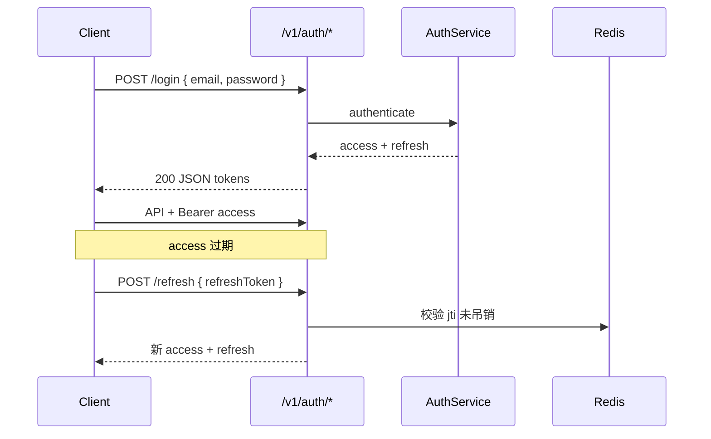

# 鉴权与安全（JWT + RBAC + 多租户）

## 目标（对齐 auth-rbac.md）

| 能力 | Platform Admin | Tenant Admin | Member | Viewer |
| --- | --- | --- | --- | --- |
| 管理所有租户 | Yes | — | — | — |
| 邀请成员 | — | Yes | — | — |
| Web 核心功能 | — | Yes | Yes | Read-only |

前端 `@repo/auth` 期望：access token + refresh；401 时 `refreshAccessToken()` 重试。

## 架构选型

| 组件 | 推荐 |
| --- | --- |
| 认证 | **JWT**（access 15min + refresh 7d） |
| 框架 | Spring Security 6 `SecurityFilterChain` |
| 密码 | BCrypt（`PasswordEncoder`） |
| Refresh | Redis 存 refresh jti 白名单 / 黑名单 |
| 权限 | RBAC：`ROLE_*` + 可选 `@PreAuthorize` |
| 租户 | JWT claim `tenant_id` + `TenantContext` ThreadLocal |

OAuth2/OIDC 为 **后期** 选项；首期 Email/Password + JWT 即可跑通前端迁移。

## SecurityFilterChain 骨架

```java
@Configuration
@EnableMethodSecurity
public class SecurityConfig {

  @Bean
  SecurityFilterChain filterChain(HttpSecurity http, JwtAuthFilter jwtFilter) throws Exception {
    return http
        .csrf(csrf -> csrf.disable())
        .sessionManagement(s -> s.sessionCreationPolicy(SessionCreationPolicy.STATELESS))
        .authorizeHttpRequests(auth -> auth
            .requestMatchers("/actuator/health", "/v3/api-docs/**", "/swagger-ui/**").permitAll()
            .requestMatchers(HttpMethod.POST, "/v1/auth/login", "/v1/auth/refresh").permitAll()
            .requestMatchers("/v1/admin/**").hasRole("PLATFORM_ADMIN")
            .anyRequest().authenticated())
        .exceptionHandling(e -> e
            .authenticationEntryPoint((req, res, ex) -> res.sendError(401))
            .accessDeniedHandler((req, res, ex) -> res.sendError(403)))
        .addFilterBefore(jwtFilter, UsernamePasswordAuthenticationFilter.class)
        .build();
  }
}
```

## JWT Claims 设计

```json
{
  "sub": "user-uuid",
  "iss": "yunyan-saas",
  "tenant_id": "tenant-uuid",
  "roles": ["TENANT_ADMIN"],
  "iat": 1710000000,
  "exp": 1710000900
}
```

| Claim | 说明 |
| --- | --- |
| `sub` | 用户 ID |
| `tenant_id` | 当前租户 UUID（[ADR-0004](../../docs/adr/0004-tenant-isolation-strategy.md) Accepted；登录请求体 `tenantId` 为 slug） |
| `roles` | `PLATFORM_ADMIN`、`TENANT_ADMIN`、`MEMBER`、`VIEWER` |

密钥：`saas.jwt.secret` 环境变量，**禁止**硬编码进仓库。

## 登录 / 刷新流程



`AuthService` 职责：

1. `login` — `AuthenticationManager` 校验 → 签发双 token → refresh jti 写入 Redis
2. `refresh` — 校验 refresh 签名与 Redis → 轮换 refresh（推荐 rotation）
3. `logout` — refresh jti 加入黑名单

## RBAC 实现

**数据库**（Flyway 见 java-persistence）：

- `sys_user`、`sys_role`、`sys_user_role`
- `sys_permission`（可选细粒度）、`sys_role_permission`

**运行时**：

```java
@PreAuthorize("hasRole('TENANT_ADMIN')")
public void inviteMember(InviteRequest req) { ... }
```

`JwtAuthFilter` 解析 token → `UsernamePasswordAuthenticationToken` + `GrantedAuthority`。

角色映射与前端 `SaaSRole` 枚举保持一致（`packages/auth`）。

## 多租户隔离

默认策略：[multi-tenancy.md](../../docs/architecture/multi-tenancy.md) — 共享库 + `tenant_id` + RLS。

**应用层**（MyBatis-Plus 拦截器）：

```java
// 自动为 SELECT/UPDATE/DELETE 追加 WHERE tenant_id = ?
public class TenantLineHandler implements TenantLineHandler {
  @Override
  public Expression getTenantId() {
    return new StringValue(TenantContext.require());
  }
}
```

**规则**：

- 写操作：从 JWT / `SecurityContext` 取 `tenant_id`，禁止客户端 header 覆盖；Platform Admin impersonation（`act_as_tenant`）未实现
- 读操作：Mapper 层强制租户条件
- 跨租户：仅 `PLATFORM_ADMIN` + 审计日志

## 与 RuoYi 的边界

| 事项 | RuoYi（当前） | 本 Skill（目标） |
| --- | --- | --- |
| 登录路径 | `/login` | `/v1/auth/login` |
| Token | RuoYi 自定义 | JWT Bearer |
| 菜单 | `/getRouters` | `/v1/menus` |
| 前端包 | `@repo/ruoyi-api` | `@repo/api-client` |

**不要**在 `ruoyi-api` 或 RuoYi 代理上扩展新接口。新功能只走 `services/saas-api`。

## 工作流检查清单

```
- [ ] POST /v1/auth/login、/refresh 免认证且返回 camelCase JSON
- [ ] 其它 /v1/** 需 Bearer，401/403 语义正确
- [ ] JWT 密钥来自环境变量
- [ ] Refresh 存 Redis，logout 吊销
- [ ] 角色与 auth-rbac 矩阵一致
- [ ] 业务表查询带 tenant_id
- [ ] MockMvc 覆盖 login + 受保护 401/200（java-backend-testing）
```

## 下一步

- 业务 API → `java-rest-api`
- 用户/角色表 → `java-persistence`
- 前端切换 → `saas-fsd-feature` 配置 `VITE_API_URL` + `shared/api/client.ts`
