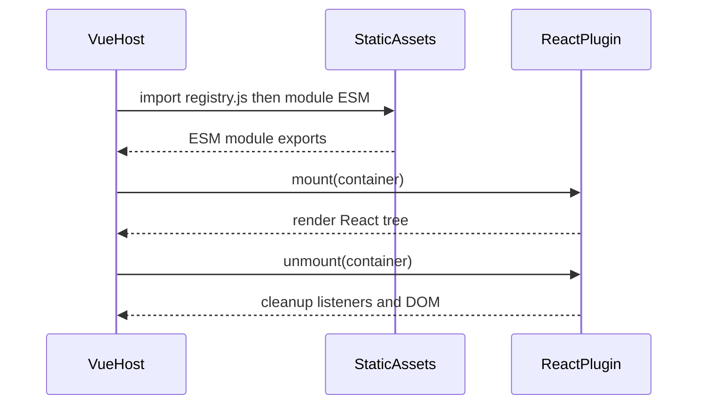
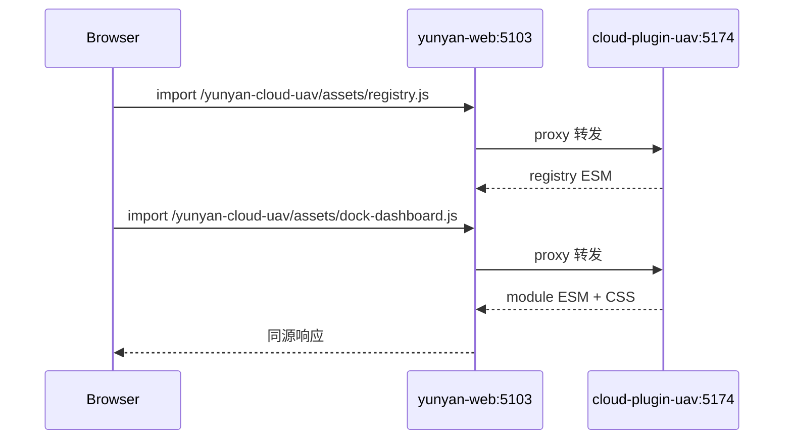

# 机库云插件（YunYan Cloud Plugin — UAV Dock）

> **状态：脚手架已就绪** — 已实现 `mount` / `unmount` 与 FSD 目录骨架；业务功能待实现。

面向云眼平台的可独立部署、按需加载的机库（Dock）业务 UI 远程模块。基于 Vite + React 构建为 ESM 静态资源，由 Vue 宿主通过动态 `import()` 加载，以 `mount` / `unmount` 挂载到指定 DOM 容器。API、鉴权等由插件内部处理（构建 env、同源 Cookie），宿主无需传参。

## 架构

轻量 **ESM Remote Plugin**：原生 `import()` + 自研 `mount` / `unmount`，无额外微前端运行时。



- React 岛嵌入 Vue 宿主，仅通过 DOM 挂载
- 静态资源可独立部署与版本回滚
- Tailwind 样式自包含，挂载根 class：`.yunyan-cloud-uav`

## 技术栈

| 类别    | 选型                                                                                     |
| ------- | ---------------------------------------------------------------------------------------- |
| UI 框架 | React 19.2.6、TypeScript                                                                 |
| 构建    | Vite **8.0.13**（Rolldown），ESM 多入口（`assets/registry.js` + `assets/{moduleId}.js`） |
| 样式    | Tailwind CSS v4（`@tailwindcss/vite`）                                                   |
| 组件    | shadcn/ui + Base UI（`@haoxuan/ui`，style: `base-vega`，源码位于 `packages/ui-react`）   |

### 构建与 UI 配置

`vite.config.ts` 已落地，关键配置如下：

- **`@haoxuan/ui`**：dev 通过 alias 指向 `packages/ui-react` 源码；`@/lib/*` 解析到 ui-react 内部路径，避免与插件 `@/` 冲突
- **`esbuild.jsx: 'automatic'`**：不用 `@vitejs/plugin-react`（外部宿主无法注入 Refresh preamble）
- **`Drawer` 默认 `autoFocus`**：打开抽屉时焦点移入内容区，避免微前端场景下 `aria-hidden` 与焦点冲突

### UI 组件（`@haoxuan/ui`）

在 **`packages/ui-react`** 维护 shadcn Base UI 组件，插件侧直接 import：

```tsx
import { Button, Drawer, DrawerCloseButton } from "@haoxuan/ui"
```

| 场景                              | 推荐写法                                                          | 说明                                                           |
| --------------------------------- | ----------------------------------------------------------------- | -------------------------------------------------------------- |
| Drawer 关闭按钮（带 Button 样式） | `<DrawerCloseButton variant="outline">Cancel</DrawerCloseButton>` | 单 `<button>`，无嵌套                                          |
| 纯文本关闭                        | `<DrawerClose>Cancel</DrawerClose>`                               | —                                                              |
| ❌ 避免                           | `<DrawerClose asChild><Button /></DrawerClose>`                   | vaul + Base UI 下 `asChild` 不可靠，会触发嵌套 `<button>` 警告 |

添加新组件：

```bash
pnpm --filter @haoxuan/ui ui:add button drawer
```

## 部署

| 项            | 值                                                                 |
| ------------- | ------------------------------------------------------------------ |
| Base URL      | `/yunyan-cloud-uav/`                                               |
| Registry 入口 | `/yunyan-cloud-uav/assets/registry.js`                             |
| 子模块入口    | `/yunyan-cloud-uav/assets/{moduleId}.js`（如 `dock-dashboard.js`） |

模块清单见 [`src/shared/config/module-manifest.ts`](./src/shared/config/module-manifest.ts)。

```nginx
location /yunyan-cloud-uav/ {
  alias /var/www/yunyan-cloud-uav/;
  try_files $uri $uri/ =404;
}
```

| 资源                                      | 缓存策略              |
| ----------------------------------------- | --------------------- |
| `registry.js`、`{moduleId}.js`（无 hash） | 短缓存或 `no-cache`   |
| `assets/*-[hash].js` / `.css`             | 长缓存（`immutable`） |

## 宿主集成

推荐通过 yunyan-web 封装加载（[`apps/yunyan-web/src/shared/cloud-plugin-uav/loadCloudPluginUav.ts`](../../apps/yunyan-web/src/shared/cloud-plugin-uav/loadCloudPluginUav.ts)）：

```typescript
import { loadCloudPluginUavModule } from "@/shared/cloud-plugin-uav/loadCloudPluginUav"

const plugin = await loadCloudPluginUavModule("dock-dashboard")
await plugin.mount(containerEl)
await plugin.unmount(containerEl)
// dev 热更新
await plugin.reload?.(containerEl)
```

底层流程：先 `import registry.js`，再按 `moduleId` 动态 `import` 子模块 ESM。

```javascript
const registry = await import("/yunyan-cloud-uav/assets/registry.js")
const plugin = await registry.loadModule("dock-dashboard")

await plugin.mount("#uav-dock-root")
await plugin.unmount("#uav-dock-root")
```

宿主页面示例：[`apps/yunyan-web/src/views/cloud-plugin-uav.vue`](../../apps/yunyan-web/src/views/cloud-plugin-uav.vue)（含 dev SSE 热更新 remount）。

集成要点：路由离开须在 **`onBeforeUnmount`** 中 `unmount`；传 `HTMLElement` 而非选择器；同一容器重复挂载前先 `unmount`；网关/proxy 配置静态路径；CSP 放行 `script-src`。

## 公共 API

```typescript
export interface CloudPluginUavModule {
  mount(container: string | HTMLElement): Promise<void>
  unmount(container: string | HTMLElement): Promise<void>
  /** dev：热更新时复用 React root 重渲染 */
  reload?(container: string | HTMLElement): Promise<void>
  version?: string
}

export interface CloudPluginUavRegistry {
  listModules(): { id: string; title: string; entry: string }[]
  resolveModuleEntry(moduleId: string): string
  loadModule(moduleId: string, options?: { bust?: number }): Promise<CloudPluginUavModule>
}
```

| 方法                      | 说明                                                      |
| ------------------------- | --------------------------------------------------------- |
| `registry.loadModule(id)` | 按 moduleId 加载子模块 ESM                                |
| `mount`                   | 创建 React root，初始化内部 API（构建 env / 同源 Cookie） |
| `unmount`                 | 卸载 React 树，断开 WebSocket/MQTT，清理监听              |
| `reload`                  | dev 专用：复用 root 重渲染，配合 SSE 热更新               |
| `version`                 | 构建时注入的 SemVer，供宿主兼容性检查                     |

## 错误处理

| 场景            | 插件行为       | 宿主建议              |
| --------------- | -------------- | --------------------- |
| `import()` 失败 | 抛出异常       | fallback UI，支持重试 |
| 容器不存在      | `mount` reject | 确保 DOM 已渲染       |
| 鉴权 / 业务错误 | 插件内部提示   | 无需额外处理          |
| 重复 mount      | reject         | 先 `unmount`          |

## 安全

- HTTPS 加载远程模块
- 鉴权共享同源 Cookie，mount 不传 Token
- CSP 放行插件脚本域
- 无人机操控须二次确认与操作审计（实现阶段落地）

## 开发与构建

```bash
pnpm install
pnpm --filter @taiyi/cloud-plugin-uav dev    # Vite 8.0.13 dev server，端口 5174
pnpm --filter @taiyi/cloud-plugin-uav build
```

本包固定使用 **Vite 8.0.13**（Rolldown 打包），与 workspace catalog 中的 Vite 6 独立，便于与 yunyan-web 宿主对齐。

版本遵循 SemVer：`mount` / `unmount` 签名变更 → MAJOR；新增导出方法 → MINOR；修复 → PATCH。

### 本地联调

#### 主流方案对比（国外生态）

| 方案                         | 代表                                                          | dev 下 remote 如何提供                                                                                  | 适用场景                             |
| ---------------------------- | ------------------------------------------------------------- | ------------------------------------------------------------------------------------------------------- | ------------------------------------ |
| **Module Federation**        | `@module-federation/vite`、`@originjs/vite-plugin-federation` | remote 端通常仍需 `vite build --watch` + `preview`（Vite dev 是 bundleless，无法生成 `remoteEntry.js`） | 多应用共享依赖、运行时编排           |
| **build --watch + preview**  | MF 社区 issue 共识方案                                        | 与生产一致，改代码后刷新宿主                                                                            | 验收/CI，HMR 弱                      |
| **Virtual entry + Vite dev** | 轻量 ESM 插件（本项目）                                       | 单 `vite` dev server，middleware 将 `/assets/{entry}.js` 映射到源码入口                                 | `mount`/`unmount` 契约、无 MF 运行时 |
| **Playground**               | 组件库常见做法                                                | `index.html` 直接 import 源码；宿主联调另测                                                             | 纯 UI 开发                           |

Vite 官方与 Module Federation 维护者均指出：**remote 侧在 dev 无法像 host 一样纯 bundleless 暴露打包入口**。  
本项目不走 MF，采用 **Virtual entry**：生产仍 `build.lib` 出单文件 ESM；开发用 Vite 原生 transform 管道编译源码，并配置 `server.origin` 让经宿主 proxy 加载的子模块/CSS 路径正确。

#### 开发模式要点

- **`pnpm dev`**：单 Vite dev server（5174），无需 `build --watch`
- **`vite-plugin-dev-remote-entry`**：将 `/yunyan-cloud-uav/assets/{entry}.js`（`registry`、`dock-dashboard` 等）重写到对应源码入口
- **`vite-plugin-dev-reload`**：监听 `cloud-plugin-uav/src` 与 **`packages/ui-react/src`** 变更，经 SSE 通知宿主 remount
- **`esbuild.jsx: 'automatic'`**：不用 `@vitejs/plugin-react`（外部宿主无法注入 Refresh preamble）
- **`server.hmr: false`**：禁止插件 dev 向宿主浏览器推送 Vite full-reload（否则改 TSX 会刷新整页）
- **`server.origin`**：默认 `http://localhost:5103`（yunyan-web dev 端口）；宿主端口不同可设 `CLOUD_PLUGIN_UAV_DEV_ORIGIN`
- **`index.html`**：同端口可独立预览 UI（`/yunyan-cloud-uav/`），保存后整页刷新

宿主通过**同源**路径加载插件（先 `registry.js`，再 `loadModule`），联调目标是：浏览器请求仍打到宿主域名，由宿主把 `/yunyan-cloud-uav/*` 转发到插件 dev server。



#### 方式 A：宿主 Proxy + 插件 Dev（推荐）

**1. 插件 dev 配置**（已实现于 [`vite.config.ts`](./vite.config.ts) + [`vite-plugin-dev-remote-entry.ts`](./vite-plugin-dev-remote-entry.ts)）

**2. 宿主 proxy**（已配置于 [`apps/yunyan-web/vite.config.js`](../../apps/yunyan-web/vite.config.js)）

**3. 启动**

```bash
# 终端 1：插件 dev（5174，源码热编译，无需先 build）
pnpm --filter @taiyi/cloud-plugin-uav dev

# 终端 2：宿主
pnpm --filter @taiyi/yunyan-web dev
```

宿主 dev 端口若不是 5103：

```bash
CLOUD_PLUGIN_UAV_DEV_ORIGIN=http://localhost:YOUR_HOST_PORT pnpm --filter @taiyi/cloud-plugin-uav dev
```

**4. 验证**

- 浏览器访问宿主 `/cloud-plugin-uav`，Network 中 `registry.js`、`dock-dashboard.js` 均为 200
- 响应为 ESM（dev 下经 Vite transform，非 production 压缩 bundle）
- 修改插件或 **`packages/ui-react`** 源码后宿主页**自动 remount**（SSE + `reload`，不刷新整页）；失败时仅控制台报错
- 若仍看到旧 UI，硬刷新（`Ctrl+Shift+R`）或重启插件 dev server
- 也可手动刷新宿主页

#### 方式 B：Watch 构建 + 宿主托管 `dist/`

适用于不启插件 dev server、仅验证构建产物。

```bash
# 终端 1：监听构建
cd cloud-plugin/cloud-plugin-uav
pnpm build --watch
```

将 `dist/` 内容同步到宿主可访问的静态目录，任选其一：

- 复制到 `apps/yunyan-web/public/yunyan-cloud-uav/`
- 或在宿主 proxy 指向本地 `dist` 目录（需静态文件服务，如 `npx serve dist -p 5174` 再配合方式 A 的 proxy）

刷新宿主页面验证 `mount` 是否正常。

#### 方式 C：仅预览插件 UI（不联调宿主）

访问 `http://localhost:5174/yunyan-cloud-uav/`（`index.html` + `src/dev/main.tsx`）。  
集成与 `mount` 契约须在方式 A 下验证。

#### 联调注意

| 项          | 说明                                                                                  |
| ----------- | ------------------------------------------------------------------------------------- |
| 同源 Cookie | 插件 API 依赖宿主登录态，须通过宿主域名访问，不要单独打开 `localhost:5174` 测接口     |
| `base` 一致 | 插件 `base`、宿主 `import` 路径、proxy 前缀均为 `/yunyan-cloud-uav/`                  |
| 端口冲突    | 插件默认 `5174`，与宿主 `5103` 分离；冲突时改插件 `server.port` 并同步 proxy `target` |
| CSP         | 开发环境若启用 CSP，需允许加载 `/yunyan-cloud-uav/` 脚本                              |

## 目录结构（FSD）

采用 [Feature-Sliced Design](https://feature-sliced.design/) 分层；依赖方向：`app` → `pages` → `widgets` → `features` → `entities` → `shared`，低层不得引用高层。

```
cloud-plugin-uav/
├── README.md
├── package.json
├── vite.config.ts
├── vite-plugin-dev-remote-entry.ts
├── vite-plugin-dev-reload.ts
├── vite-plugin-dev-stub-client.ts
├── index.html                  # 独立 UI 预览（/src/dev/main.tsx）
├── src/
│   ├── app/                    # 兼容 re-export（→ modules/dock-dashboard）
│   │   ├── index.tsx
│   │   ├── App.tsx
│   │   └── providers/
│   ├── modules/                # 远程 ESM 入口（build.lib 多入口）
│   │   ├── registry/           # assets/registry.js
│   │   └── dock-dashboard/     # assets/dock-dashboard.js
│   ├── pages/                  # 页面级视图
│   │   └── dock-dashboard/ui/
│   ├── widgets/
│   ├── features/
│   ├── entities/
│   ├── shared/
│   │   ├── api/
│   │   ├── config/             # module-manifest、version
│   │   ├── lib/                # create-module-runtime 等
│   │   ├── styles/             # Tailwind 入口 index.css
│   │   └── types/
│   └── dev/                    # index.html 本地预览入口
└── dist/
    └── assets/
        ├── registry.js
        ├── dock-dashboard.js
        └── dock-dashboard.css

packages/ui-react/              # 共享 React UI（shadcn Base UI）
└── src/components/ui/
```

切片内约定：`ui/` 展示组件，`model/` 状态与 hooks，`api/` 接口封装，对外经 `index.ts` 导出 Public API。

## 后续步骤

1. 在 `packages/ui-react` 按需 `pnpm ui:add` 添加组件
2. 在 `module-manifest.ts` 注册新远程模块入口
3. 按 FSD 分层实现业务功能
4. `pnpm build` 部署至 `/yunyan-cloud-uav/`
