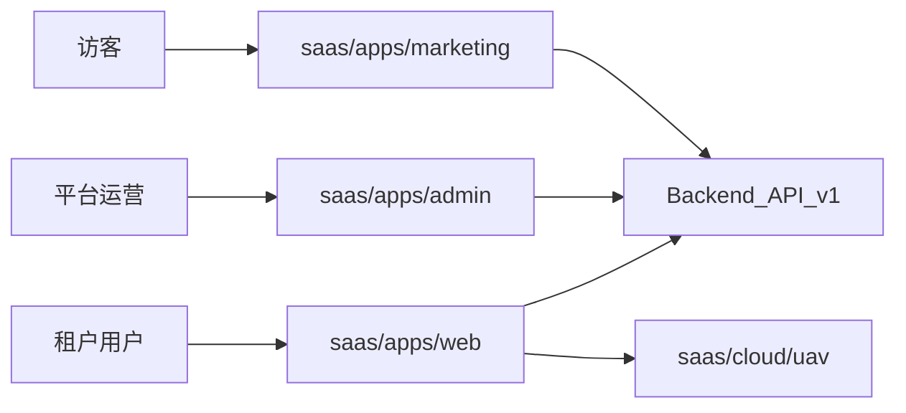

# SaaS 总架构

SaaS 产品线采用独立顶层 [`saas/`](../../) 目录，与遗留 `apps/yunyan-*` 隔离。

## 产品概览

| App | 域名 | 用户 | 职责 |
| --- | --- | --- | --- |
| Marketing | `www.example.com` | 访客 | 官网、定价、注册 |
| Web | `app.example.com` | 租户用户 | 工作台、核心业务 |
| Admin | `admin.example.com` | 平台运营 | 租户、计费、审计 |

## 系统上下文

## Monorepo 布局

见 [`../../README.md`](../../README.md#目标-monorepo-结构)。

## 多租户

默认：**共享 DB + Row-Level Security + `tenant_id`**。详见 [multi-tenancy.md](./multi-tenancy.md)。

## 认证与授权

OAuth2/OIDC + Email/Password；Web / Admin 独立 Client ID。详见 [auth-rbac.md](./auth-rbac.md)。

## API

REST + OpenAPI，版本前缀 `/v1`。客户端封装位于 `saas/packages/api-client`（规划）。

## 安全基线

- OWASP Top 10 对照
- CSP、CSRF（Cookie 模式时）
- 审计日志（Admin 操作、impersonation）
- PII 最小化采集

## 可观测性

- OpenTelemetry trace
- Sentry 错误（按 `tenantId` 分组）
- 结构化日志字段：`tenantId`、`userId`、`traceId`

## 环境

| 环境 | 用途 |
| --- | --- |
| development | 本地 dev |
| staging | 预发 / PR 预览 |
| production | 生产 |

## 部署

三 App 独立静态/CDN 部署 + API 网关。详见 [../runbooks/deployment.md](../runbooks/deployment.md)。

## 子文档

- [apps.md](./apps.md) — 三 App 规范
- [frontend.md](./frontend.md) — 前端工程
- [map-workspace-ui.md](./map-workspace-ui.md) — 地图工作台侧栏菜单与 UI 载体（Dock / 浮层 / Drawer）
- [auth-rbac.md](./auth-rbac.md) — 权限
- [multi-tenancy.md](./multi-tenancy.md) — 多租户
