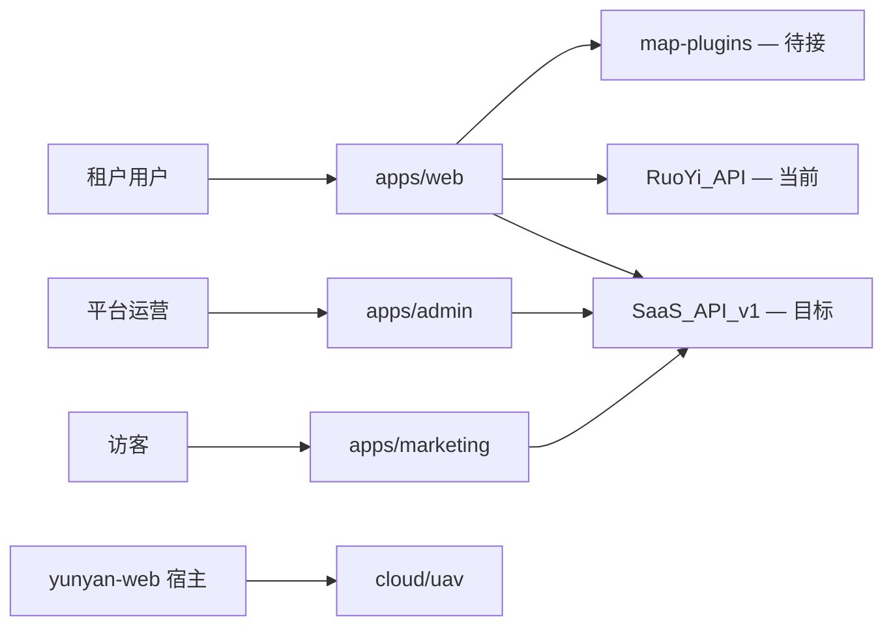

# SaaS 总架构

SaaS 产品线前端 monorepo，本仓库（`map-design`）根目录即产品线根，与遗留 `apps/yunyan-*`（Vue 栈）隔离。若嵌入父 monorepo，则置于 `saas/` 子目录（见 [ADR-0001](../adr/0001-saas-top-level-directory.md)）。

## 产品概览

| App | 域名 | 用户 | 职责 | 状态 |
| --- | --- | --- | --- | --- |
| Marketing | `www.example.com` | 访客 | 官网、定价、注册 | 占位 |
| Web | `app.example.com` | 租户用户 | 工作台、核心业务 | **活跃开发** |
| Admin | `admin.example.com` | 平台运营 | 租户、计费、审计 | 占位 |

## 系统上下文

## Monorepo 布局

见 [monorepo.md](./monorepo.md) 与 [../../README.md](../../README.md)。

## 多租户

默认：**共享 DB + Row-Level Security + `tenant_id`**（[ADR-0004](../adr/0004-tenant-isolation-strategy.md) Accepted）。前端 `@repo/auth` 已提供 `TenantProvider`，导航层有 mock 过滤。详见 [multi-tenancy.md](./multi-tenancy.md)。

## 认证与授权

**当前**：RuoYi 登录 + `@repo/auth` Session 管理。  
**目标**：OAuth2/OIDC + SaaS `/v1` API。详见 [auth-rbac.md](./auth-rbac.md) 与 [backend-integration.md](./backend-integration.md)。

## API 双轨

| 阶段 | 客户端 | 用途 |
| --- | --- | --- |
| 当前 | `@repo/ruoyi-api` | 登录、用户、菜单 |
| 目标 | `@repo/api-client` | SaaS REST `/v1` |

## 安全基线

- OWASP Top 10 对照
- CSP、CSRF（Cookie 模式时）
- 审计日志（Admin 操作、impersonation）
- PII 最小化采集

## 可观测性（规划）

- OpenTelemetry trace
- Sentry 错误（按 `tenantId` 分组）
- 结构化日志字段：`tenantId`、`userId`、`traceId`

## 环境

| 环境 | 用途 |
| --- | --- |
| development | 本地 dev |
| staging | 预发 / PR 预览 |
| production | 生产 |

## 部署

三 App 独立静态/CDN 部署 + API 网关。详见 [../runbooks/deployment.md](../runbooks/deployment.md)。

## 子文档

| 文档 | 说明 |
| --- | --- |
| [monorepo.md](./monorepo.md) | 工程结构、包依赖、workspace |
| [apps.md](./apps.md) | 三 App + Cloud UAV |
| [frontend.md](./frontend.md) | 前端规范、FSD |
| [packages.md](./packages.md) | 共享 packages API |
| [backend-integration.md](./backend-integration.md) | RuoYi / SaaS API 集成 |
| [services-development-plan.md](./services-development-plan.md) | `services/` 后端开发计划与迭代任务 |
| [map-workspace-ui.md](./map-workspace-ui.md) | 地图工作台 UI 载体 |
| [map-plugin-integration.md](./map-plugin-integration.md) | 地图插件桥接 |
| [map-plugins-catalog.md](./map-plugins-catalog.md) | 地图插件 Skill 能力目录（52 个） |
| [auth-rbac.md](./auth-rbac.md) | 认证权限 |
| [multi-tenancy.md](./multi-tenancy.md) | 多租户 |

## 实现状态

| 模块 | 状态 |
| --- | --- |
| saas-web FSD 骨架 + 地图工作台 UI | 已完成 |
| RuoYi 登录 + 菜单 + profile | 已完成 |
| packages（ui/auth/api-client/ruoyi-api） | 已完成 |
| cloud-uav ESM 远程插件脚手架 | 已完成 |
| map-plugin-bridge 真实接入 | 待接 MapProvider |
| SaaS `/v1` API 迁移 | Auth MVP 已完成，见 [services-development-plan.md](./services-development-plan.md) |
| Marketing / Admin scaffold | 待建 |
| settings / :orgSlug 路由 | 规划中（feature 已有，路由未注册） |
