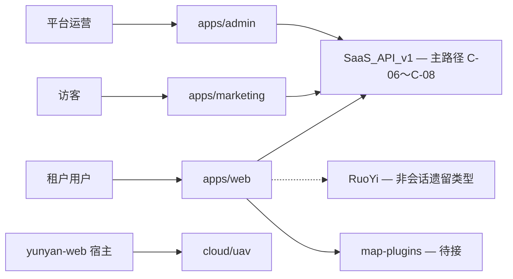

# SaaS 总架构

SaaS 产品线前端 monorepo，本仓库（`map-design`）根目录即产品线根，与遗留 `apps/yunyan-*`（Vue 栈）隔离。若嵌入父 monorepo，则置于 `saas/` 子目录（见 [ADR-0001](../adr/0001-saas-top-level-directory.md)）。

## 产品概览

| App | 域名 | 用户 | 职责 | 状态 |
| --- | --- | --- | --- | --- |
| Marketing | `www.example.com` | 访客 | 官网、定价、注册 | 占位 |
| Web | `app.example.com` | 租户用户 | 工作台、核心业务 | **活跃开发** |
| Admin | `admin.example.com` | 平台运营 / 租户管理员 | 租户、用户、成员、能力 | **P0～P3 已交付** |

## 系统上下文

## Monorepo 布局

见 [monorepo.md](./monorepo.md) 与 [../../README.md](../../README.md)。

## 多租户

默认：**共享 DB + Row-Level Security + `tenant_id`**（[ADR-0004](../adr/0004-tenant-isolation-strategy.md) Accepted）。前端 `@repo/auth` 已提供 `TenantProvider`；侧栏 `mock-nav-items` 经 **C-09 ✅** `filterNavMainItemsForTenant` 按 tenant features 过滤。详见 [multi-tenancy.md](./multi-tenancy.md)；RLS 原理见 [tenant-rls-b05.md](./supplements/tenant-rls-b05.md)（saas-api）、[billing-tenant-rls.md](./supplements/billing-tenant-rls.md)（billing-api）。

## 认证与授权

**当前**：登录/注册/bootstrap/Account 已走 SaaS（C-06～C-12 ✅）。  
**路线图**：Sprint D 权限与后台 ✅ → Admin P0～P3 ✅ → **Sprint F 平台计费（含 sec/RLS）✅** → **FND-* 基础完善** → Sprint E 业务域（Later）。详见 [services-development-plan.md](./services-development-plan.md)（§七 FND-*、[platform-foundation-backlog.md](./supplements/platform-foundation-backlog.md)）。

## API 双轨

| 阶段 | 客户端 | 用途 |
| --- | --- | --- |
| 主路径 | `@repo/api-client` | 登录、注册、bootstrap、`users/me` |
| 遗留 | `@repo/ruoyi-api` | 菜单类型等非会话引用（会话路径已清理 C-12） |

## 安全基线

- OWASP Top 10 对照
- CSP、CSRF（Cookie 模式时）
- 审计日志（Admin 操作、impersonation）
- PII 最小化采集

## 可观测性（规划）

- OpenTelemetry trace
- Sentry 错误（按 `tenantId` 分组）
- 结构化日志字段：`tenantId`、`userId`、`traceId`

## 环境

| 环境 | 用途 |
| --- | --- |
| development | 本地 dev |
| staging | 预发 / PR 预览 |
| production | 生产 |

## 部署

三 App 独立静态/CDN 部署 + API 网关。详见 [../runbooks/deployment.md](../runbooks/deployment.md)。

## 子文档

| 文档 | 说明 |
| --- | --- |
| [monorepo.md](./monorepo.md) | 工程结构、包依赖、workspace |
| [apps.md](./apps.md) | 三 App + Cloud UAV |
| [frontend.md](./frontend.md) | 前端规范、FSD |
| [packages.md](./packages.md) | 共享 packages API |
| [backend-integration.md](./backend-integration.md) | RuoYi / SaaS API 集成 |
| [services-development-plan.md](./services-development-plan.md) | `services/` 后端开发计划与迭代任务 |
| [billing-service.md](./billing-service.md) | 平台计费 billing-api 微服务（Sprint F） |
| [map-workspace-ui.md](./map-workspace-ui.md) | 地图工作台 UI 载体 |
| [map-plugin-integration.md](./map-plugin-integration.md) | 地图插件桥接 |
| [map-plugins-catalog.md](./map-plugins-catalog.md) | 地图插件 Skill 能力目录（52 个） |
| [auth-rbac.md](./auth-rbac.md) | 认证权限 |
| [multi-tenancy.md](./multi-tenancy.md) | 多租户 |

## 实现状态

| 模块 | 状态 |
| --- | --- |
| saas-web FSD 骨架 + 地图工作台 UI | 已完成 |
| Sprint C：登录·注册·bootstrap（C-06～C-08） | ✅ 已完成 |
| Sprint C：侧栏 filterNavMainItemsForTenant（C-09） | ✅ 已完成 |
| Sprint C：Account（C-10） | ✅ |
| Sprint C：TeamSwitcher（C-11） | ✅ |
| Sprint C：RuoYi 会话清理（C-12） | ✅ |
| Sprint D：权限模型（D-01） | ✅ |
| Sprint D：用户 permissions（D-02） | ✅ |
| Sprint D：权限配置 API（D-03） | ✅ |
| Sprint D：租户 admin API（D-04） | ✅ |
| Sprint D：用户 admin API（D-05） | ✅ |
| Sprint D：租户成员 admin API（D-06） | ✅ |
| Sprint D：apps/admin 脚手架（D-07） | ✅ |
| Sprint D：Admin CRUD 页（D-08） | ✅ |
| Sprint D：saas-web 权限门控（D-09） | ✅ |
| Sprint D：Docker 全栈部署（D-10） | ✅ |
| Admin 功能完善 P0：概览统计、筛选、租户管理员落点 | ✅ |
| Admin 功能完善 P1：租户详情、跨租户成员、能力管理 | ✅ |
| Admin 功能完善 P2：列表分页、`/account`、TeamSwitcher | ✅ |
| Admin 功能完善 P3：Skeleton、404、Vitest/MockMvc | ✅ |
| Sprint F：billing-api 平台计费（F-0～F-6 + sec/RLS） | ✅；[billing-service.md](./billing-service.md)、[billing-credits-prd.md](../product/billing-credits-prd.md) |
| Sprint E：地图/机库等业务 API | Later，C/D 不做 |
| packages（ui/auth/api-client/ruoyi-api） | 已完成 |
| SaaS `/v1` 后端 | Auth MVP + 租户 API ✅ |
| map-plugin-bridge 真实接入 | Sprint E 前可并行 UI |
| settings / :orgSlug 路由 | 规划中（feature 已有，路由未注册） |
