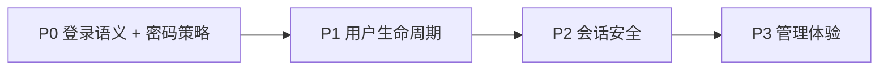

# Auth 基础深化计划

> **方向（2026-06）**：暂缓计费、审计扩展、MFA、impersonation 等业务向能力；先把**用户注册 / 登录 / 会话 / 管理**做深做精，作为后续所有 SaaS 功能的底座。

关联文档：[auth-rbac.md](./auth-rbac.md)、[services-development-plan.md](./services-development-plan.md)。

## 现状摘要

| 层 | 已有能力 |
| --- | --- |
| 后端 | `POST /v1/auth/register\|login\|refresh\|logout`；`GET/PUT /v1/users/me`；`POST /v1/users/me/password` |
| Admin | `/v1/admin/users`、`/v1/admin/tenants/*/members` CRUD + 角色；审计首期 |
| Web | 登录/注册、Account、TeamSwitcher、记住密码（Cookie 加密） |
| 包 | `@repo/auth` 会话、RBAC、API 映射 |
| 测试 | MockMvc 集成 + Vitest 表单/权限 |

## 已知缺口（按优先级）

### P0 · 身份与会话语义 ✅

| 项 | 问题 | 目标 |
| --- | --- | --- |
| A-01 | 停用租户登录与错误账号同为 401 | ✅ **403** + `Tenant is suspended` |
| A-02 | 禁用账号与密码错误同为 401 | ✅ 密码正确时 **403** + `Account is disabled` |
| A-03 | 前端 403 被通用文案覆盖 | ✅ RFC 7807 `detail` 优先 + `@repo/auth` 中文映射 |
| A-04 | 密码规则分散在多处 `min(8)` | ✅ `@repo/auth` 统一常量与 Zod schema |
| A-05 | Admin 登录无「记住密码」选项 | ✅ 与 Web 行为对齐 |

### P1 · 用户生命周期管理

| 项 | 说明 |
| --- | --- |
| B-01 | 邀请/注册/改密密码策略一致（长度、不能与旧密码相同） | ✅ |
| B-02 | 禁用用户后 refresh token 立即失效 | ✅ `UserSessionRevoker` + MockMvc |
| B-03 | 用户资料字段扩展（头像、手机） | 暂缓 |
| B-04 | 邮箱规范化（trim、lower-case） | ✅ `EmailNormalizer` 全路径 + MockMvc |
| B-05 | 注册冲突错误体全覆盖 | ✅ 409 detail + 前端 `formatRegisterError` |
| — | Admin 用户列表 `status` 服务端筛选 | ✅ `GET /v1/admin/users?status=` |
| — | `last_login_at` 字段与列表展示 | ✅ V9 迁移 + 登录写入 |

### P2 · 会话与安全加固

| 项 | 说明 |
| --- | --- |
| C-01 | Refresh 轮换边界：并发 refresh、过期 access 仍可用 `/users/me` | ✅ 30s 宽限期幂等 refresh；未登出 access JWT 在 TTL 内仍可用 |
| C-02 | 登出后 access token 短期可用窗口 | ✅ logout 将 access jti 写入 Redis denylist；未登出 token 仍 stateless（默认 15m） |
| C-03 | 多租户同邮箱：无 `tenantId` 登录策略 | ✅ 多租户时 **400** `Tenant slug is required` |
| C-04 | Rate limit / 登录失败计数（Redis） | ✅ 登录/注册/重置限流 + 失败锁定；测试 profile 默认关闭 |
| C-05 | 密码强度（大小写+数字）可选升级，与产品确认后启用 |

### P3 · 管理体验深化

| 项 | 说明 |
| --- | --- |
| D-01 | Admin 用户列表：状态筛选、最近登录 | ✅ 服务端 status + `lastLoginAt` 列 |
| D-02 | 成员邀请：发送邮件 | ✅ M1 见 [auth-email-module.md](./auth-email-module.md) |
| D-05 | 自助密码重置（邮件链接） | ✅ M3 见 [auth-email-module.md](./auth-email-module.md) |
| D-06 | 注册邮箱验证 | ✅ M2 见 [auth-email-module.md](./auth-email-module.md) |
| D-07 | 安全通知邮件（改密/禁用） | ✅ M4 见 [auth-email-module.md](./auth-email-module.md) |
| D-03 | 跨租户成员操作审计可读性 | ✅ action / crossTenant 筛选 + Admin UI |
| D-04 | Account 页 Web/Admin 组件复用 | ✅ `@repo/auth` schema + `formatAuthApiError` |

## 明确不做（本阶段）

- P4 计费、系统配置、MFA、impersonation
- 地图/机库/专题等业务 API
- B-03 头像/手机等资料扩展（下一批）

## 交付节奏

每批独立 commit，验证：

- `mvn test`（`AuthControllerTest` 等）
- `pnpm --filter @repo/saas-web validate`
- `pnpm --filter @repo/saas-admin validate`
- `pnpm smoke:saas-api`（可选）

## P0 实现清单（当前批次）

- [x] 本文档
- [x] `LoginLookupResult`：停用租户 / 禁用账号语义
- [x] `auth-test-seed.sql` 补充 suspended / disabled 夹具
- [x] `@repo/auth` `AUTH_PASSWORD_MIN_LENGTH` + `authPasswordFieldSchema`
- [x] Web 注册、Account 改密、Admin 邀请表单引用共享 schema
- [x] `@repo/auth` `formatAuthApiError` + `AUTH_API_DETAIL_LOCALIZATIONS`（Web/Admin 共用）
- [x] `@repo/auth` `authProfileFormSchema` / `authResetPasswordSchema`（Account Web/Admin）
- [x] Admin 登录：加载/可选保存记住密码

## 验收场景（P0）

| 场景 | 期望 |
| --- | --- |
| 正确账号 + 停用租户 slug | HTTP 403，文案「该租户已停用…」 |
| 禁用账号 + 正确密码 | HTTP 403，文案「账号已禁用…」 |
| 禁用账号 + 错误密码 | HTTP 401（不泄露状态） |
| 注册密码 &lt; 8 位 | 前端拦截；后端 400 |
| Admin 勾选记住密码后刷新 | 表单自动填充 |

## 后续可选（非阻塞）

| 项 | 说明 |
| --- | --- |
| C-05 | 密码强度（大小写+数字），产品确认后启用 `@repo/auth` schema 开关 |
| B-03 | 用户资料：头像 URL、手机号 |
| — | `pnpm smoke:saas-api` 全链路（需 Docker Postgres + API） |
