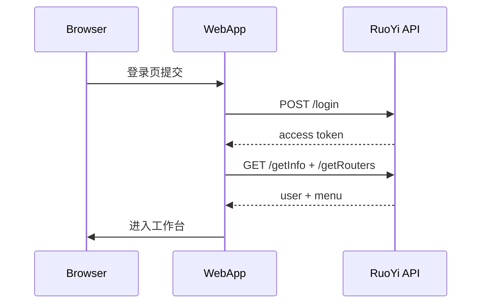
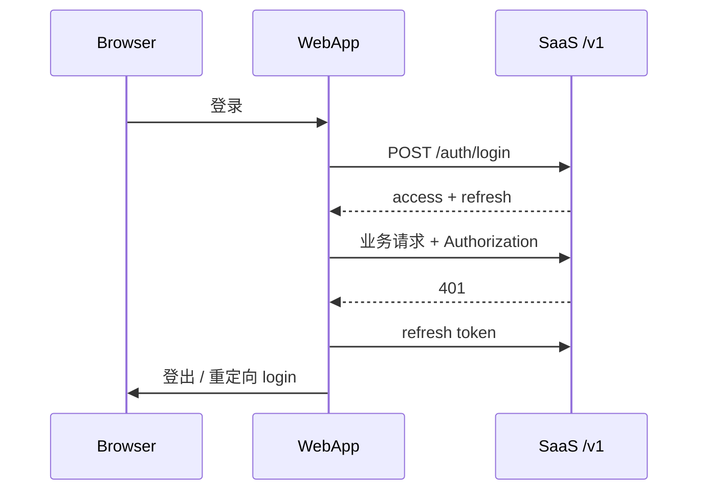

# 认证与 RBAC

## 角色矩阵（目标）

| 能力 | Platform Admin | Tenant Admin | Member | Viewer |
| --- | --- | --- | --- | --- |
| 访问 Admin App | Yes | No | No | No |
| 管理所有租户 | Yes | No | No | No |
| 邀请成员 | — | Yes | No | No |
| Web 核心功能 | — | Yes | Yes | Read-only |

## 当前实现

### 登录

- **后端**：RuoYi（`@repo/ruoyi-api`）
- **流程**：验证码 → RSA 加密密码 → `/login` → access token
- **存储**：`@repo/auth` + localStorage（`storageKeyPrefix: 'saas-web'`）
- **页面**：`routes/login.tsx`

### Session 守卫

`layouts/app-layout.tsx` 的 `clientLoader`：

1. `auth.requireAuthenticated(redirect)` — 无 token 跳转 `/login`
2. `bootstrapAuthenticatedApp()` — 拉 RuoYi userInfo + menuRouters
3. 失败（401/403）→ `clearAppSession()` → 跳转 `/login`

### 租户

- `@repo/auth` 提供 `TenantProvider` / `useTenant()` / `setTenant()`
- `TenantSessionSync` 监听租户切换 → invalidate queries → re-bootstrap
- 登录时 `tenant: null`；TeamSwitcher UI 就绪，后端 tenant API **未接通**
- 导航 mock 层有 `filterNavByTenant`（基于 `MockModuleMeta.tenantFeature`）

### RBAC

- `@repo/auth` 导出 `requireRole()`、`hasRole()`、`SaaSRole` 枚举
- RuoYi 角色/权限经 `entities/ruoyi-user/lib/permissions.ts` 转换
- **权限以服务端为准**，前端仅 UX 隐藏

## 目标架构（规划）

- OAuth2/OIDC + Email/Password
- SaaS `/v1/auth/login`、`/v1/auth/refresh`
- `@repo/api-client` 接管 token 刷新
- Web / Admin 独立 OAuth Client ID / Cookie 域（`app.` vs `admin.`）
- 租户上下文：[ADR-0004](../adr/0004-tenant-isolation-strategy.md) — JWT `tenant_id`（UUID）；登录 `tenantId` 传 slug；切换租户 = 重新登录

## Session 流对比

### 当前（RuoYi）

### 目标（SaaS API）

## 相关文档

- [backend-integration.md](./backend-integration.md) — RuoYi 集成细节
- [packages.md](./packages.md) — `@repo/auth` API
- [ADR-0005](../adr/0005-ruoyi-transitional-backend.md) — 过渡策略
- `.cursor/rules/saas-auth-ruoyi.mdc` — Cursor 自动规则
- Skill `.cursor/skills/saas-auth-ruoyi/` — 完整 Agent 工作流
