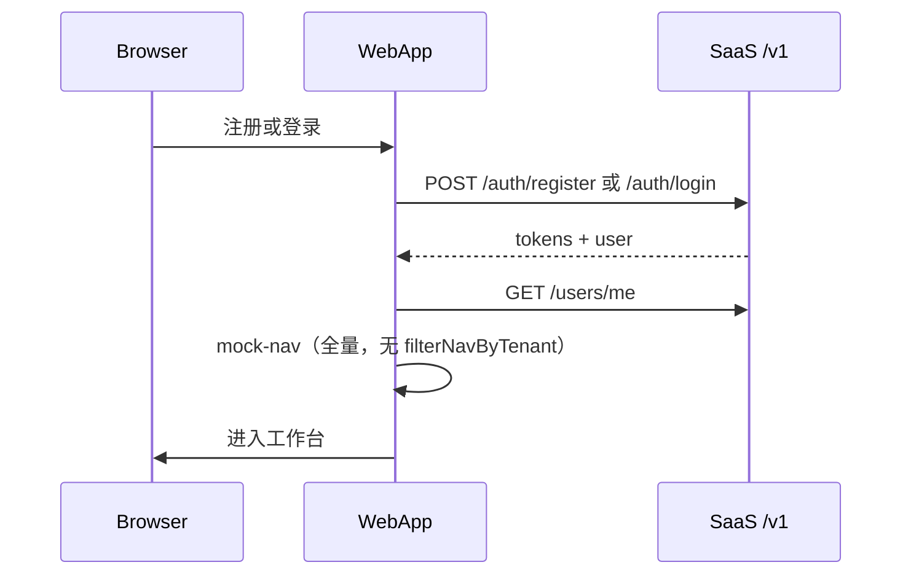

# 认证与 RBAC

## 角色矩阵（目标）

| 能力 | Platform Admin | Tenant Admin | Member | Viewer |
| --- | --- | --- | --- | --- |
| 访问 Admin App | Yes | No | No | No |
| 管理所有租户 | Yes | No | No | No |
| 邀请成员 | — | Yes | No | No |
| Web 核心功能 | — | Yes | Yes | Read-only |

细粒度**权限码**（`sys_permission`）与后台配置见 **Sprint D**；Sprint C 仅用 **角色码**（`SessionDto.user.roles`）。

## 当前实现（saas-web · 2026-06）

### 已完成（C-01～C-08）

| 能力 | 实现 |
| --- | --- |
| 注册 | `POST /v1/auth/register` + `routes/register.tsx` |
| 登录 | `POST /v1/auth/login` + `routes/login.tsx` |
| 刷新 / 登出 | `/v1/auth/refresh`、`/logout`（`@repo/auth`） |
| Bootstrap 用户 | `GET /v1/users/me`（**不再** RuoYi `getUserInfo` / `getMenuRouters`） |
| 侧栏导航 | `mock-nav-items` **全量静态**（C-09 `filterNavByTenant` **暂缓**） |
| Mock 开发 | `MOCK_ACCESS_TOKEN` + `devLogin` 跳过网络 |

### 已完成（C-10）

| 能力 | 实现 |
| --- | --- |
| Account 读/写/改密 | `AccountSheet` → `GET/PUT /v1/users/me`、`POST /v1/users/me/password` |
| 资料字段 | 首版仅 `name`（显示名）；邮箱只读 |

### 已完成（C-11）

| 能力 | 实现 |
| --- | --- |
| TeamSwitcher | 侧栏 `GET /v1/tenants`；切换 = 目标 slug 重新登录（记住密码时静默切换） |

### 已完成（C-12）

| 能力 | 实现 |
| --- | --- |
| 顶栏/账号用户展示 | `useWorkspaceSession` + `sessionToNavUserData` |
| 会话桥接 | 已移除 `ruoyi-profile-store`、`menu-queries`、`user-queries` |

### Session 守卫

`layouts/app-layout.tsx` 的 `clientLoader`：

1. `auth.requireAuthenticated(redirect)`
2. `bootstrapAuthenticatedApp()` → mock 或 `GET /v1/users/me`
3. 失败 → `clearAppSession()` → `/login`

### RBAC（本期）

- JWT / `SessionDto.user.roles`：`PLATFORM_ADMIN` | `TENANT_ADMIN` | `MEMBER` | `VIEWER`
- 过渡期组件仍可读 `entities/ruoyi-user` 映射后的 `permissions`（admin → `*:*:*`）
- **Sprint D**：`sys_permission` + Admin 配置 + saas-web 门控

## Sprint C 任务状态

| 编号 | 状态 | 说明 |
| --- | --- | --- |
| C-01～C-05 | ✅ | 后端 auth + `users/me` |
| C-06～C-08 | ✅ | 登录、注册、bootstrap 去 RuoYi |
| C-09 | ⏸ 暂缓 | 菜单 `filterNavByTenant` / features 门控 |
| C-10 | ✅ | Account UI → `users/me*` |
| C-11 | ✅ | TeamSwitcher → `GET /v1/tenants` |
| C-12 | ✅ | RuoYi 会话桥接清理 |

**Sprint C 不做**：`sys_permission` 细粒度、 `/v1/admin/*`、apps/admin（→ Sprint D）。  
**Sprint C/D 不做**：地图/机库/专题等业务 API（→ Sprint E）。

## Sprint D · 权限与后台

### 已完成（D-01）

| 表 | 说明 |
| --- | --- |
| `sys_permission` | 权限码目录（`code` 唯一；`scope`: platform / tenant / workspace） |
| `sys_role_permission` | 角色 ↔ 权限多对多 |

种子权限码（节选）：`admin:tenants:*`、`admin:users:*`、`admin:roles:*`、`admin:members:*`、`workspace:*`。  
`PermissionRepository` + `PermissionCodes`（Java 常量）供 D-02+ 使用。

| 角色 | 默认权限范围 |
| --- | --- |
| PLATFORM_ADMIN | 全部 `platform` 权限 |
| TENANT_ADMIN | `tenant` + `workspace` |
| MEMBER | `workspace:use`、`workspace:map:read/write` |
| VIEWER | `workspace:use`、`workspace:map:read` |

### 已完成（D-02）

| 能力 | 实现 |
| --- | --- |
| 权限解析 | `PermissionResolver`：角色码 → `sys_role_permission` 并集 |
| JWT | access/refresh 含 `permissions` claim |
| 会话 API | `GET /v1/users/me`、login 响应 `user.permissions[]` |
| 运行时鉴权 | `SaasPrincipal` authorities = `ROLE_*` + 权限码；`@PreAuthorize("hasAuthority('admin:tenants:read')")` |
| Admin 门控 | `/v1/admin/**` 需 platform 或 `admin:members:*` 权限；`GET /v1/admin/ping` 匿名可达 |

### 已完成（D-03）

| 能力 | 实现 |
| --- | --- |
| 角色列表 | `GET /v1/admin/roles`（`admin:roles:read`） |
| 权限目录 | `GET /v1/admin/permissions` |
| 角色权限读 | `GET /v1/admin/roles/{id}/permissions` |
| 角色权限写 | `PUT /v1/admin/roles/{id}/permissions`（全量替换；按角色 scope 校验） |

### 已完成（D-04）

| 能力 | 实现 |
| --- | --- |
| 租户列表 | `GET /v1/admin/tenants`（`admin:tenants:read`） |
| 创建租户 | `POST /v1/admin/tenants`（name、slug、plan） |
| 更新租户 | `PATCH /v1/admin/tenants/{id}`（name、plan、status） |
| 启停 | `status`: `active` / `suspended`；停用租户无法登录 |

### 已完成（D-05）

| 能力 | 实现 |
| --- | --- |
| 用户列表 | `GET /v1/admin/users`（`admin:users:read`；可选 `tenantId` 过滤） |
| 邀请成员 | `POST /v1/admin/users`（tenantId、email、password；默认角色 `MEMBER`） |
| 更新用户 | `PATCH /v1/admin/users/{id}`（displayName、status） |
| 禁用 | `status`: `active` / `disabled`；禁用后无法登录 |

### 已完成（D-06）

| 能力 | 实现 |
| --- | --- |
| 成员列表 | `GET /v1/admin/tenants/{id}/members`（`admin:members:read`） |
| 邀请成员 | `POST /v1/admin/tenants/{id}/members` |
| 更新成员 | `PATCH /v1/admin/tenants/{id}/members/{userId}` |
| 角色分配 | `PUT /v1/admin/tenants/{id}/members/{userId}/roles`（全量替换） |
| 租户隔离 | `TENANT_ADMIN` 仅可操作 JWT 当前租户；Security 门控含 `admin:members:*` |

### 待做（D-07～D-10）

| 能力 | 产出 |
| --- | --- |
| ~~用户权限~~ | ✅ D-02：JWT / `users/me` permissions；`@PreAuthorize` |
| ~~权限配置~~ | ✅ D-03：`GET/PUT /v1/admin/roles/{id}/permissions` 等 |
| ~~租户管理~~ | ✅ D-04：`GET/POST/PATCH /v1/admin/tenants` |
| ~~用户管理~~ | ✅ D-05：`GET/POST/PATCH /v1/admin/users` |
| ~~租户成员~~ | ✅ D-06：`/v1/admin/tenants/{id}/members` |
| Admin App | `apps/admin` 脚手架 + 基础 CRUD 页 |
| saas-web 门控 | `requireRole` / 权限码对齐 SaaS，去掉 RuoYi 转换 |

## 目标架构（远期）

- OAuth2/OIDC（C/D 用 Email/Password + JWT）
- Web / Admin 独立 Cookie 域（`app.` vs `admin.`）
- 租户：[ADR-0004](../adr/0004-tenant-isolation-strategy.md)

## Session 流（当前主路径）

## 相关文档

- [services-development-plan.md](./services-development-plan.md) — Sprint C/D/E 任务与 **§十 执行指引**
- [backend-integration.md](./backend-integration.md)
- [apps.md](./apps.md) — web / admin 路由
- [ADR-0005](../adr/0005-ruoyi-transitional-backend.md)
