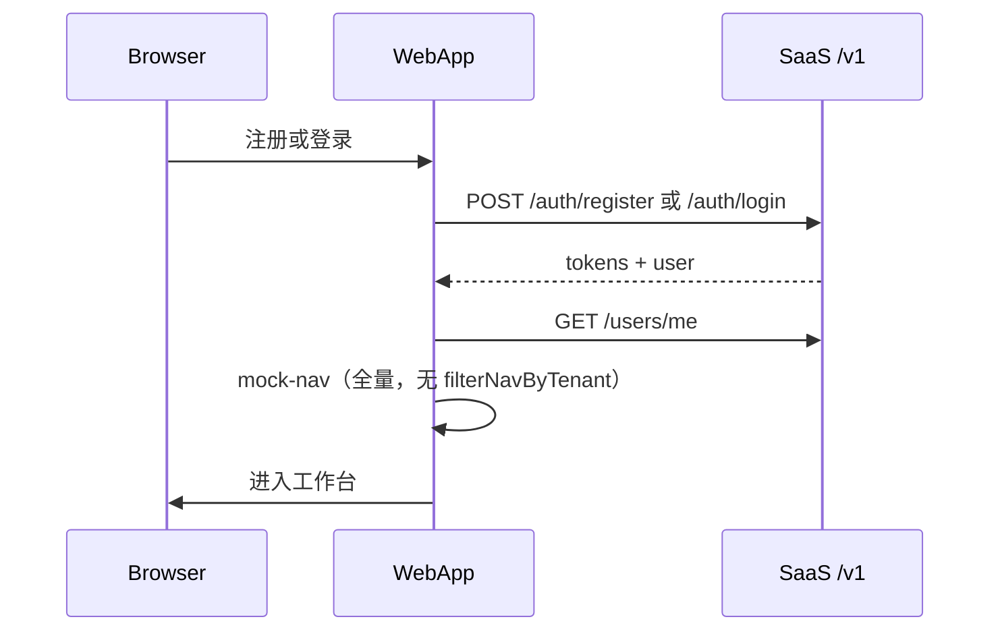

# 认证与 RBAC

## 角色矩阵（目标）

| 能力 | Platform Admin | Tenant Admin | Member | Viewer |
| --- | --- | --- | --- | --- |
| 访问 Admin App | Yes | No | No | No |
| 管理所有租户 | Yes | No | No | No |
| 邀请成员 | — | Yes | No | No |
| Web 核心功能 | — | Yes | Yes | Read-only |

细粒度**权限码**（`sys_permission`）与后台配置见 **Sprint D**；Sprint C 仅用 **角色码**（`SessionDto.user.roles`）。

## 当前实现（saas-web · 2026-06）

### 已完成（C-01～C-08）

| 能力 | 实现 |
| --- | --- |
| 注册 | `POST /v1/auth/register` + `routes/register.tsx` |
| 登录 | `POST /v1/auth/login` + `routes/login.tsx` |
| 刷新 / 登出 | `/v1/auth/refresh`、`/logout`（`@repo/auth`） |
| Bootstrap 用户 | `GET /v1/users/me`（**不再** RuoYi `getUserInfo` / `getMenuRouters`） |
| 侧栏导航 | `mock-nav-items` **全量静态**（C-09 `filterNavByTenant` **暂缓**） |
| Mock 开发 | `MOCK_ACCESS_TOKEN` + `devLogin` 跳过网络 |

### 已完成（C-10）

| 能力 | 实现 |
| --- | --- |
| Account 读/写/改密 | `AccountSheet` → `GET/PUT /v1/users/me`、`POST /v1/users/me/password` |
| 资料字段 | 首版仅 `name`（显示名）；邮箱只读 |

### 仍待迁移（C-11～C-12）

| 能力 | 当前 | 目标 |
| --- | --- | --- |
| 顶栏用户展示 | 过渡期 `ruoyi-profile-store`（由 Session 映射） | 直接 `useSession()` |
| TeamSwitcher | 占位 | `GET /v1/tenants`（C-11） |

### Session 守卫

`layouts/app-layout.tsx` 的 `clientLoader`：

1. `auth.requireAuthenticated(redirect)`
2. `bootstrapAuthenticatedApp()` → mock 或 `GET /v1/users/me`
3. 失败 → `clearAppSession()` → `/login`

### RBAC（本期）

- JWT / `SessionDto.user.roles`：`PLATFORM_ADMIN` | `TENANT_ADMIN` | `MEMBER` | `VIEWER`
- 过渡期组件仍可读 `entities/ruoyi-user` 映射后的 `permissions`（admin → `*:*:*`）
- **Sprint D**：`sys_permission` + Admin 配置 + saas-web 门控

## Sprint C 任务状态

| 编号 | 状态 | 说明 |
| --- | --- | --- |
| C-01～C-05 | ✅ | 后端 auth + `users/me` |
| C-06～C-08 | ✅ | 登录、注册、bootstrap 去 RuoYi |
| C-09 | ⏸ 暂缓 | 菜单 `filterNavByTenant` / features 门控 |
| C-10 | ✅ | Account UI → `users/me*` |
| C-11～C-12 | 待做 | TeamSwitcher、RuoYi 清理 |

**Sprint C 不做**：`sys_permission` 细粒度、 `/v1/admin/*`、apps/admin（→ Sprint D）。  
**Sprint C/D 不做**：地图/机库/专题等业务 API（→ Sprint E）。

## Sprint D · 权限与后台

| 能力 | 产出 |
| --- | --- |
| 权限模型 | `sys_permission`、`sys_role_permission` + 种子 |
| 用户权限 | JWT / `users/me` 返回 permissions；`@PreAuthorize` |
| 权限配置 | `GET/PUT /v1/admin/roles/{id}/permissions` 等 |
| 后台管理 | `/v1/admin/tenants`、`/users`、租户成员与角色 |
| Admin App | `apps/admin` 脚手架 + 基础 CRUD 页 |
| saas-web 门控 | `requireRole` / 权限码对齐 SaaS，去掉 RuoYi 转换 |

## 目标架构（远期）

- OAuth2/OIDC（C/D 用 Email/Password + JWT）
- Web / Admin 独立 Cookie 域（`app.` vs `admin.`）
- 租户：[ADR-0004](../adr/0004-tenant-isolation-strategy.md)

## Session 流（当前主路径）

## 相关文档

- [services-development-plan.md](./services-development-plan.md) — Sprint C/D/E 任务与 **§十 执行指引**
- [backend-integration.md](./backend-integration.md)
- [apps.md](./apps.md) — web / admin 路由
- [ADR-0005](../adr/0005-ruoyi-transitional-backend.md)
