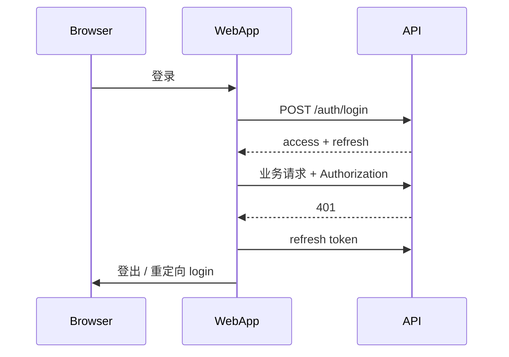

# 认证与 RBAC

## 角色矩阵

| 能力 | Platform Admin | Tenant Admin | Member | Viewer |
| --- | --- | --- | --- | --- |
| 访问 Admin App | Yes | No | No | No |
| 管理所有租户 | Yes | No | No | No |
| 邀请成员 | — | Yes | No | No |
| Web 核心功能 | — | Yes | Yes | Read-only |

## 实现约定（规划）

- `saas/packages/auth` 提供 `requireRole()`、`useSession()`、`TenantProvider`
- Web / Admin 使用 `clientLoader` 校验；Admin 需 `platform_admin` claim
- **权限以服务端为准**，前端仅 UX 隐藏

## Session 流

## Web vs Admin

- 独立 OAuth Client ID / Cookie 域（`app.` vs `admin.`）
- 可选 SSO 统一身份，权限域仍分离
