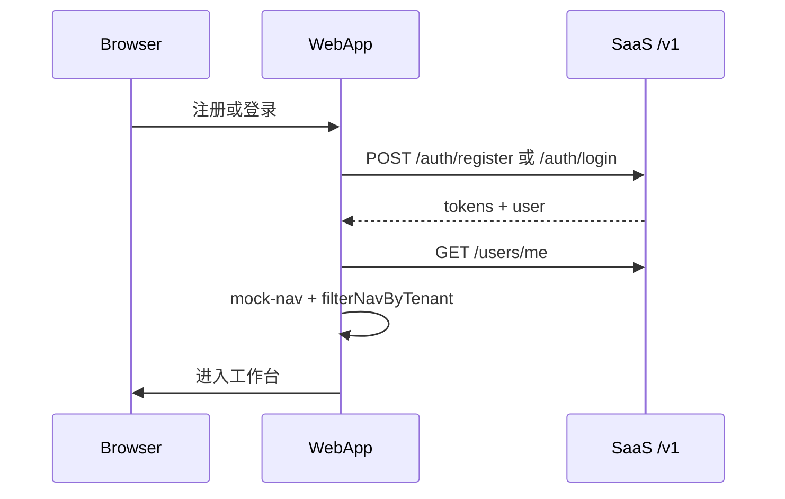

# 认证与 RBAC

## 角色矩阵（目标）

| 能力 | Platform Admin | Tenant Admin | Member | Viewer |
| --- | --- | --- | --- | --- |
| 访问 Admin App | Yes | No | No | No |
| 管理所有租户 | Yes | No | No | No |
| 邀请成员 | — | Yes | No | No |
| Web 核心功能 | — | Yes | Yes | Read-only |

细粒度**权限码**（`sys_permission`）与后台配置见 **Sprint D**；Sprint C 仅用 **角色码**（`SessionDto.user.roles`）。

## 当前实现（迁移前 · 仍临时存在）

### 登录

- **后端**：RuoYi（`@repo/ruoyi-api`）
- **流程**：验证码 → RSA 加密密码 → `/login` → access token
- **页面**：`routes/login.tsx`（**无** SaaS 注册页接通）

### Session 守卫

`layouts/app-layout.tsx` 的 `clientLoader`：

1. `auth.requireAuthenticated(redirect)`
2. `bootstrapAuthenticatedApp()` — RuoYi `getUserInfo` + `getMenuRouters`
3. 失败 → `clearAppSession()` → `/login`

### RBAC

- RuoYi 权限经 `entities/ruoyi-user/lib/permissions.ts` 转换
- **Sprint D 目标**：权限来自 SaaS JWT / `users/me` + `sys_permission`，Admin 可配置

## Sprint C · 身份与会话（不留 RuoYi）

| 能力 | 迁移前 | Sprint C |
| --- | --- | --- |
| 注册 | 无 / Marketing 占位 | `POST /v1/auth/register` + `routes/register.tsx` |
| 登录 | RuoYi `login()` | `POST /v1/auth/login` |
| 刷新 / 登出 | — | `/v1/auth/refresh`、`/logout` |
| 用户信息 | `getUserProfile()` / `getUserInfo()` | `GET/PUT /v1/users/me`、改密 |
| Bootstrap 菜单 | `getMenuRouters()` | mock-nav + `filterNavByTenant` |
| RBAC（本期） | RuoYi 权限串 | **角色码** `SessionDto.user.roles` |

**Sprint C 不做**：`sys_permission` 细粒度、 `/v1/admin/*`、apps/admin（→ Sprint D）。  
**Sprint C/D 不做**：地图/机库/专题等业务 API（→ Sprint E）。

## Sprint D · 权限与后台

| 能力 | 产出 |
| --- | --- |
| 权限模型 | `sys_permission`、`sys_role_permission` + 种子 |
| 用户权限 | JWT / `users/me` 返回 permissions；`@PreAuthorize` |
| 权限配置 | `GET/PUT /v1/admin/roles/{id}/permissions` 等 |
| 后台管理 | `/v1/admin/tenants`、`/users`、租户成员与角色 |
| Admin App | `apps/admin` 脚手架 + 基础 CRUD 页 |
| saas-web 门控 | `requireRole` / 权限码对齐 SaaS，去掉 RuoYi 转换 |

## 目标架构（远期）

- OAuth2/OIDC（C/D 用 Email/Password + JWT）
- Web / Admin 独立 Cookie 域（`app.` vs `admin.`）
- 租户：[ADR-0004](../adr/0004-tenant-isolation-strategy.md)

## Session 流（Sprint C 目标）

## 相关文档

- [services-development-plan.md](./services-development-plan.md) — Sprint C/D/E 任务与 **§十 执行指引**
- [backend-integration.md](./backend-integration.md)
- [apps.md](./apps.md) — web / admin 路由
- [ADR-0005](../adr/0005-ruoyi-transitional-backend.md)
