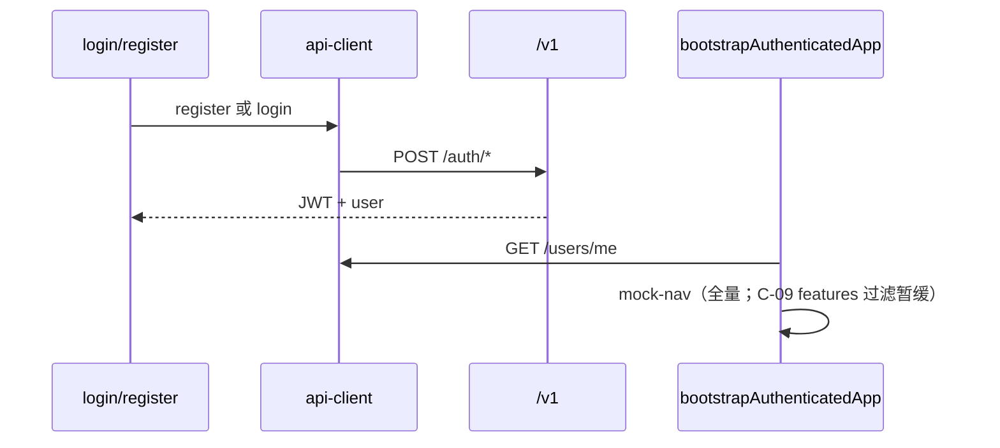

# 后端集成

## 策略总览

| 阶段 | saas-web / admin | 客户端 | 说明 |
| --- | --- | --- | --- |
| **当前（C-06～C-10）** | 登录/注册/bootstrap/Account → SaaS | `@repo/api-client` | C-11～C-12 清理 |
| 遗留 | `ruoyi-profile-store` 桥接 | `@repo/ruoyi-api`（仅非 SaaS 路径） | C-12 清理 |
| **Sprint C** | 身份与会话 | `@repo/api-client` | C-01～C-08 ✅；C-09 暂缓 |
| **Sprint D** | 权限与后台 | `@repo/api-client` | `/v1/admin/*`、apps/admin |
| **Sprint E** | 业务工作台 | `@repo/api-client` | 地图、机库等 — **C/D 不做** |

详见 [services-development-plan.md](./services-development-plan.md)、[ADR-0005](../adr/0005-ruoyi-transitional-backend.md)。

## API 选用（Sprint C/D 目标）

| 场景 | 路径 | Sprint |
| --- | --- | --- |
| 注册 | `POST /v1/auth/register` | C |
| 登录、刷新、登出 | `/v1/auth/login`、`/refresh`、`/logout` | C |
| 用户信息 | `GET/PUT /v1/users/me`、`POST .../password` | C |
| 租户、能力 | `/v1/tenants`、`/features` | B（已就绪） |
| 侧栏导航 | 前端 `mock-nav-items` 全量 | C（无 `/v1/menus`；**C-09 filterNavByTenant 暂缓**） |
| 权限配置、后台 | `/v1/admin/*` | D |
| 地图 / 机库 / 专题 | `/v1/layers`、`/v1/uav/*` 等 | **E（Later）** |

App 层：`shared/queries/` + TanStack Query；UI 不直接调 client。

## RuoYi（saas-web 下线进度）

| 方法 | saas-web 状态 |
| --- | --- |
| `login()`、`getCodeImg()` | ✅ 已下线（C-06） |
| `getUserInfo()`、`getMenuRouters()` | ✅ bootstrap 已下线（C-08） |
| `users/me*` | ✅ Account UI（C-10） |

`@repo/ruoyi-api` 包保留；**禁止**新增 RuoYi 会话/bootstrap 调用。

## 环境

- `VITE_API_URL=/v1` → vite 代理 → `saas-api :8082`
- Sprint C 起工作台主路径**必须**配置上述变量

## Sprint C 数据流



## Sprint D 数据流（概要）

- `PLATFORM_ADMIN` / `TENANT_ADMIN` → `apps/admin` → `/v1/admin/tenants|users|roles|permissions`
- saas-web：`requireRole` / 权限码与 `users/me` 或 JWT claims 一致

## 菜单与导航

**当前（C-09 暂缓）：**

```
mock-nav-items + registry → AppSidebar（全量展示）
```

**规划（C-09 恢复时）：**

```
mock-nav-items + registry
  → filterNavByTenant(/v1/tenants/{id}/features)
  → AppSidebar
```

不经过 RuoYi `getRouters`；不提供 `/v1/menus`（Sprint C/D）。

## 业务域（Sprint E）

地图图层、机库、专题等 API **不在** [services-development-plan.md](./services-development-plan.md) Sprint C/D 范围内；单独 PRD 后排期。
