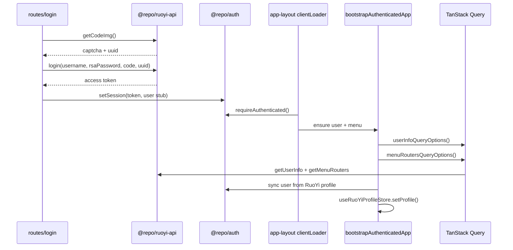

# 后端集成

## 双轨 API 策略

当前处于 **RuoYi 过渡阶段**，目标为 SaaS 统一 REST API（`/v1`）。前端同时维护两套客户端：

| 客户端 | 包 | 状态 | 用途 |
| --- | --- | --- | --- |
| **RuoYi** | `@repo/ruoyi-api` | **当前主用** | 登录、验证码、用户信息、菜单路由 |
| **SaaS REST** | `@repo/api-client` | 已封装，待接通 | 未来 `/v1` 业务 API |

选用规则：

- 登录、菜单、用户 profile → `@repo/ruoyi-api`
- 新 SaaS 业务接口 → `@repo/api-client`（后端就绪后）
- App 层通过 `shared/queries/` 封装 TanStack Query，不直接在 UI 调 client

详见 [ADR-0005](../adr/0005-ruoyi-transitional-backend.md)。

## RuoYi 请求约定

`@repo/ruoyi-api` 封装 RuoYi 后端 envelope 协议：

```json
{ "code": 200, "msg": "...", "data": { ... } }
```

- `code !== 200` 抛出 `RuoYiApiError`
- 响应体经 Zod schema 校验（`userInfoSchema`、`menuRouteSchema` 等）
- 401/403 时 App 层调用 `clearAppSession()` 并重定向登录

### 主要 API

| 方法 | 路径 | 说明 |
| --- | --- | --- |
| `getCodeImg()` | `/captchaImage` | 验证码图片 + uuid |
| `login()` | `/login` | RSA 加密密码 + 验证码 |
| `getUserInfo()` | `/getInfo` | 用户 + 角色 + 权限 |
| `getMenuRouters()` | `/getRouters` | 动态菜单树 |
| `getUserProfile()` | `/system/user/profile` | 个人资料 |
| `updateUserProfile()` | `/system/user/profile` | 更新资料 |
| `updateUserPassword()` | `/system/user/profile/updatePwd` | 修改密码 |

## 代理与 Base URL

`apps/web/vite.config.ts` 开发代理：

```ts
proxy: {
  '/YunYanApi': {
    target: env.VITE_APP_BASE_HOST || 'https://www.airace.com.cn',
    changeOrigin: true,
  },
}
```

RuoYi client 在 `shared/queries/ruoyi-client.ts` 中创建，base 指向 `/YunYanApi`。

环境变量见 [../runbooks/local-dev.md](../runbooks/local-dev.md#环境变量)。

## 认证数据流（当前实现）



### 关键模块

| 模块 | 路径 | 职责 |
| --- | --- | --- |
| RuoYi client 工厂 | `shared/queries/ruoyi-client.ts` | 创建 `createRuoYiClient` 实例 |
| Query 封装 | `shared/queries/user-queries.ts`、`menu-queries.ts` | TanStack Query options |
| Session 启动 | `shared/session/bootstrap-authenticated-app.ts` | 拉取 user/menu，同步 auth store |
| Profile store | `entities/ruoyi-user/model/ruoyi-profile-store.ts` | RuoYi 用户详情 Zustand |
| 菜单转换 | `entities/menu/lib/build-nav-tree.ts` | `MenuRoute[]` → 导航树 |
| 登出清理 | `shared/session/clear-app-session.ts` | 清 token + query cache |

## SaaS REST 客户端（规划）

`@repo/api-client` 提供通用 REST 封装：

- Bearer Token 自动注入
- 401 时调用 `authHandlers.refresh()` 重试
- 抛出 `ApiError` 含 status / body

`apps/web/shared/api/client.ts` 已创建实例，但 `@repo/auth` 的 `refresh()` 需 `apiBaseUrl`，**当前未配置**，token 刷新暂不可用。

目标迁移路径：

1. 后端提供 `/v1/auth/login`、`/v1/auth/refresh`
2. 配置 `VITE_API_URL`，接通 `createApiClient`
3. 逐步将 user/menu 查询从 `ruoyi-api` 切换到 SaaS API
4. 保留 `ruoyi-api` 直至 RuoYi 后端完全下线

## 菜单与导航

RuoYi 菜单经以下链路进入 UI：

```
getMenuRouters() → MenuRoute[] (Zod)
  → buildNavTree() (entities/menu)
  → buildNavMapSections() (entities/navigation)
  → filterNavByTenant() (MockModuleMeta.tenantFeature)
  → AppSidebar → map-workspace store
```

当前 `filterNavByTenant` 基于 mock meta，待后端 tenant API 接通后替换。
