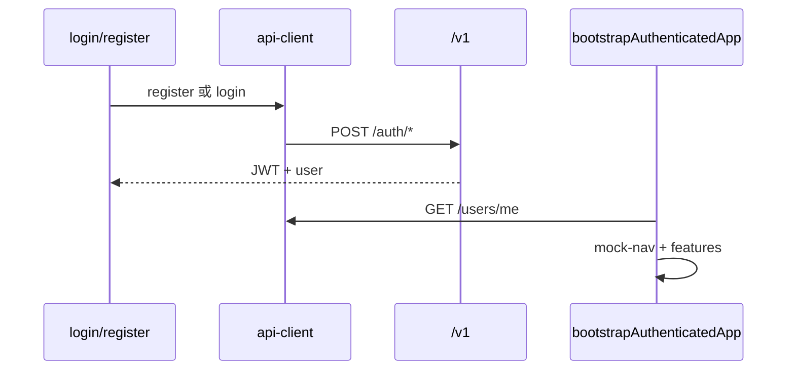

# 后端集成

## 策略总览

| 阶段 | saas-web / admin | 客户端 | 说明 |
| --- | --- | --- | --- |
| 当前（迁移前） | 临时 RuoYi 会话 | `@repo/ruoyi-api` | 待 Sprint C 移除 |
| **Sprint C** | 身份与会话 | `@repo/api-client` | 登录、**注册**、用户信息、bootstrap |
| **Sprint D** | 权限与后台 | `@repo/api-client` | `/v1/admin/*`、apps/admin |
| **Sprint E** | 业务工作台 | `@repo/api-client` | 地图、机库等 — **C/D 不做** |

详见 [services-development-plan.md](./services-development-plan.md)、[ADR-0005](../adr/0005-ruoyi-transitional-backend.md)。

## API 选用（Sprint C/D 目标）

| 场景 | 路径 | Sprint |
| --- | --- | --- |
| 注册 | `POST /v1/auth/register` | C |
| 登录、刷新、登出 | `/v1/auth/login`、`/refresh`、`/logout` | C |
| 用户信息 | `GET/PUT /v1/users/me`、`POST .../password` | C |
| 租户、能力 | `/v1/tenants`、`/features` | B（已就绪） |
| 侧栏导航 | 前端 mock-nav | C（无 `/v1/menus`） |
| 权限配置、后台 | `/v1/admin/*` | D |
| 地图 / 机库 / 专题 | `/v1/layers`、`/v1/uav/*` 等 | **E（Later）** |

App 层：`shared/queries/` + TanStack Query；UI 不直接调 client。

## RuoYi（迁移前 · saas-web 将下线）

| 方法 | Sprint C/D 后 |
| --- | --- |
| `login()`、`getCodeImg()` | **下线** |
| `getUserInfo()`、`getMenuRouters()` | **下线** |
| profile 系列 | **下线** → `/v1/users/me*` |

`@repo/ruoyi-api` 包保留；saas-web **不再**新增 RuoYi 调用。

## 环境

- `VITE_API_URL=/v1` → vite 代理 → `saas-api :8082`
- Sprint C 起工作台主路径**必须**配置上述变量

## Sprint C 数据流



## Sprint D 数据流（概要）

- `PLATFORM_ADMIN` / `TENANT_ADMIN` → `apps/admin` → `/v1/admin/tenants|users|roles|permissions`
- saas-web：`requireRole` / 权限码与 `users/me` 或 JWT claims 一致

## 菜单与导航

```
mock-nav-items + registry
  → filterNavByTenant(/v1/tenants/{id}/features)
  → AppSidebar
```

不经过 RuoYi `getRouters`；不提供 `/v1/menus`（Sprint C/D）。

## 业务域（Sprint E）

地图图层、机库、专题等 API **不在** [services-development-plan.md](./services-development-plan.md) Sprint C/D 范围内；单独 PRD 后排期。
