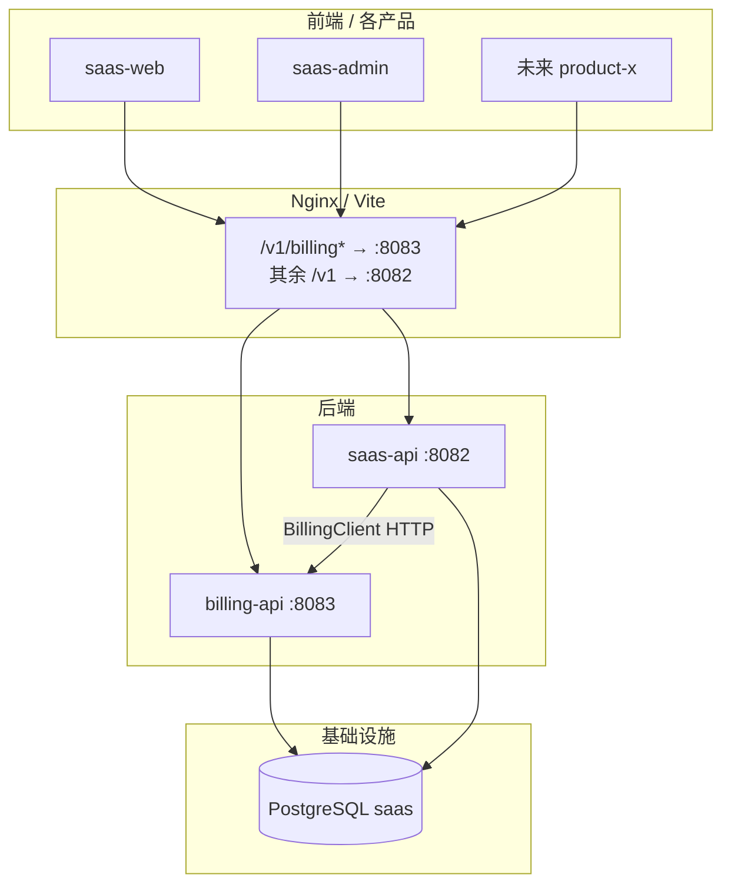

# 平台计费服务（billing-api）

> 状态：F-1～F-6 骨架、F-5 SDK **已落地**（2026-06-15）；**安全/限流/观测加固** ✅；billing **可选独立 DB 骨架** ✅ · 产品细节见 [billing-credits-prd.md](../product/billing-credits-prd.md)

## 定位

map-design **多产品共用**的预付费积分计费服务：统一钱包、按 `product_code` 归因消费，**F-1 起独立微服务**（`:8083`）。

| 项 | 决策 |
| --- | --- |
| 部署 | `billing-api :8083` + `billing-core` Java library |
| 数据 | 首期与 saas-api **共用 PostgreSQL**；`billing_*` 表由 billing-api Flyway 独占 |
| 鉴权 | 用户 JWT（与 saas-api 同 secret + `perm_epoch`）；内部 API `BILLING_INTERNAL_TOKEN` |
| 权限种子 | **saas-api** `V18__billing_permissions.sql`（非 billing-api） |
| Hold | 默认 TTL **30min**；5min 扫描自动 cancel |
| 网关 | Nginx/Vite：`/v1/billing*`、`/v1/admin/billing*` → billing-api；其余 `/v1` → saas-api |

## 服务拓扑



## Maven 模块

```
services/
├── billing-core/     # BillingClient 接口 + DTO
├── billing-api/      # Spring Boot :8083
└── saas-api/         # RestBillingClient 消费者
```

## 新产品接入（4 步）

1. Admin 登记 `billing_product` + `billing_consumption_rule`
2. 后端 Maven 依赖 `billing-core`，配置 `billing.api.base-url`
3. 业务扣费：`BillingClient.hold(productCode, ruleCode, …)` → confirm/cancel
4. 前端：`GET /v1/billing/wallet` 等（网关分流，路径不变）

## 内部 API（saas-api / 未来产品）

| 方法 | 路径 |
| --- | --- |
| POST | `/internal/v1/billing/hold` |
| POST | `/internal/v1/billing/hold/{id}/confirm` |
| POST | `/internal/v1/billing/hold/{id}/cancel` |
| GET | `/internal/v1/billing/estimate` |
| POST | `/internal/v1/billing/signup-bonus` | 邮箱验证后；幂等 `signup-bonus:{tenantId}:{userId}` |

## 租户侧补充（billing-api）

| 方法 | 路径 | 说明 |
| --- | --- | --- |
| GET | `/v1/billing/team/usage` | **TENANT_ADMIN**；本租户成员消费汇总 |
| GET | `/v1/billing/estimate` | 扣费预估（F-3+） |
| POST | `/v1/billing/transfer` | **TENANT_ADMIN**；从操作人钱包向成员划拨（F-5） |

## Platform Admin（billing-api `/v1/admin/billing`）

| 方法 | 路径 | 权限 |
| --- | --- | --- |
| GET | `/stats` | `admin:billing:read` |
| GET | `/usage` | `admin:billing:read`；跨租户消费汇总 |
| GET | `/packages` | `admin:billing:read` |
| POST | `/packages` | `admin:billing:packages:write` |
| PATCH | `/packages/{code}` | `admin:billing:packages:write` |
| GET | `/wallets` | `admin:billing:read` |
| GET | `/tenants/{tenantId}/ledger` | `admin:billing:read`；`?userId&entryType&page` |
| GET | `/recharge-orders` | `admin:billing:read` |
| GET | `/adjust-records` | `admin:billing:read` |
| POST | `/tenants/{tenantId}/adjust` | `admin:billing:adjust` |
| POST | `/recharge-orders/{orderNo}/refund` | `admin:billing:refund` |

调账与 SKU 变更写入共用 PG 的 `sys_admin_audit_log`（`billing.wallet.adjust`、`billing.package.write`），由 saas-api `GET /v1/admin/audit-logs` 统一查询。

## 前端 SDK

| 包 | 用途 |
| --- | --- |
| `@repo/billing-client` | `/v1/billing` REST + zod schema（saas-web 已接入） |
| `@repo/api-client` | 401/402/perm_epoch 通用拦截 |

## 非功能要点

- **signup-bonus 失败**：pending 重试 Job（见 PRD §1.2）
- **Platform 调账审计**：`sys_admin_audit_log`（billing-api 共用 PG 写入）
- **冒烟扣费**：rule `billing.smoke.consume`（dev/staging）
- **Webhook 安全**：Token + 可选 HMAC / 微信 V3 / 支付宝 RSA；IP 限流（见 PRD §2.4～2.5）
- **Internal API**：`X-Billing-Caller-Service` 白名单（默认 `saas-api`）
- **错误体**：RFC 7807 `application/problem+json`（401/403/402/422/429）
- **观测**：Micrometer 业务计数器 + 低余额 crossing 告警（`billing.low-balance.threshold`）
- **saas-api 调用**：`RestBillingClient` 对 502/503/504 退避重试
- **冒烟脚本**：`pnpm smoke:billing-api` — [billing-api-smoke.md](../runbooks/billing-api-smoke.md)

## 独立 PostgreSQL（可选）

默认与 saas-api **共用** `postgres/saas`（Flyway 表 `flyway_schema_history_billing` 隔离迁移）。生产可分库：

| 项 | 说明 |
| --- | --- |
| 数据源 | `BILLING_DATASOURCE_URL` / `USERNAME` / `PASSWORD`（见 `application-docker.yml`） |
| 成员校验 | Flyway **V9** `sys_user` 镜像 + 已有 `sys_tenant_feature` 镜像 |
| 同步 | 首次：`pnpm sync:billing-membership`；持续：`source=copy` + `BILLING_MEMBERSHIP_SYNC_ENABLED=true`；**`source=api`** 实时校验；**`source=cdc`** 事件 outbox 拉取（`billing_membership_sync_event`） |
| Compose | `docker compose -f deploy/docker-compose.yml -f deploy/docker-compose.billing-db.yml up -d` |
| 内网 API | membership 校验 + sync-events pull/ack（`X-Billing-Internal-Token`） |
| 待办 | 实时推送/Webhook 替代 billing 轮询 pull |

## 部署变更（F-1）

| 文件 | 变更 |
| --- | --- |
| [deploy/docker-compose.yml](../../deploy/docker-compose.yml) | `billing-api` + 验签/限流 env；默认 `BILLING_API_PORT=8085` |
| [deploy/nginx/saas-web.conf.template](../../deploy/nginx/saas-web.conf.template) | `location ^~ /v1/billing` → billing-api |
| [deploy/.env.docker.example](../../deploy/.env.docker.example) | `BILLING_INTERNAL_TOKEN`、Webhook 验签、限流、mock-pay |
| [docs/runbooks/docker-deployment.md](../runbooks/docker-deployment.md) | §4.3 billing 运行时环境变量 |
| apps/web、apps/admin vite.config | `/v1/billing` 代理 → 8083 |

## 迭代索引

| 阶段 | 内容 |
| --- | --- |
| F-0 | 个人版（saas-api，`tenant_kind=personal`） |
| F-1 | billing-api 脚手架 + 钱包账本 + billing-core |
| F-2 | 微信/支付宝 + Webhook |
| F-2.5 | live SDK 下单/查单、payScene、saas-web 轮询与 JSAPI OAuth、联调 SOP | ✅ 2026-06-15 |
| F-3 | 跨服务 hold/confirm + 402 弹窗 + team/usage + estimate | ✅ |
| F-3+ | BillingCostPreview + 低余额样式 | ✅ |
| F-5 | `packages/billing-client` TS SDK | ✅ |
| F-4 | 退款/对账/通知/发票 | 退款 ✅；日对账 ✅；站内通知 ✅；发票申请骨架 ✅（无电子票对接） |
| F-5 | 优惠券/用户间划拨 | 划拨 API + UI ✅；members_can_recharge ✅；优惠券兑换骨架 ✅ |
| F-6 | 可选 billing 独立 DB + 对公转账 | 对公预付申请骨架 ✅；独立 DB compose ✅；membership api/cdc ✅ |
| sec | Webhook 验签/限流、Caller 白名单、RFC7807、Micrometer、Admin ledger | ✅ 2026-06-15 |

完整 PRD、API 契约、前端组件：[billing-credits-prd.md](../product/billing-credits-prd.md)

## 参考

- [services-development-plan.md](./services-development-plan.md) — Sprint F 索引
- Skill：`java-spring-boot-scaffold`、`java-rest-api`、`java-auth-security`
