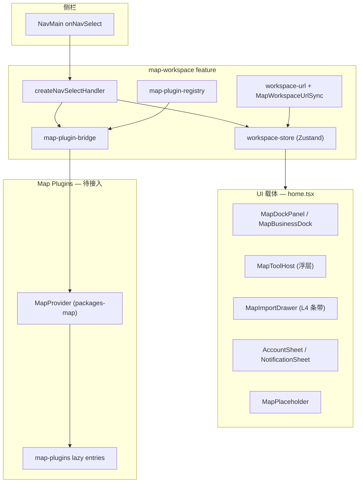

# 地图插件集成

地图工作台涉及两类「插件」概念，职责不同，不可混用。

## 两类插件

| 类型 | 位置 | 加载方式 | 宿主 |
| --- | --- | --- | --- |
| **Map Tool Plugin** | `packages-map/map-plugins`（父 monorepo） | `map-plugin-bridge` 注入 | `@repo/saas-web` 地图画布 |
| **Cloud Remote Module** | `cloud/uav` | 动态 `import()` ESM | `yunyan-web` Vue 宿主 |

本文描述 **Map Tool Plugin** 集成；Cloud UAV 见 [apps.md](./apps.md#cloud-模块) 与 [ADR-0006](../adr/0006-esm-remote-plugin-over-mf.md)。

## Map Tool Plugin 架构



## 状态机

`features/map-workspace/model/workspace-store.ts`（Zustand）管理工作台 UI 状态：

| 状态字段 | 含义 |
| --- | --- |
| `activeDockTool` | Dock 列面板（机库、业务等） |
| `activeMapTool` | 地图浮层工具（测量、标绘等） |
| `activeDrawerTool` | L4 右侧条带 |
| `panelOffset` | 浮层拖动偏移 |

菜单点击经 `createNavSelectHandler` 按 `NavMainItemKind` 分发到不同 setter。详见 [map-workspace-ui.md](./map-workspace-ui.md)。

## Plugin Bridge 契约

`features/map-workspace/lib/map-plugin-bridge.ts` 定义地图引擎与 UI 状态的桥接：

```ts
interface MapPluginBridge {
  startMapTool: (tool: ActiveMapTool) => void
  stopMapTool: () => void
  showDrawerTool: (tool: ActiveDrawerTool) => void
  hideDrawerTool: () => void
}
```

| 方法 | 触发时机 |
| --- | --- |
| `startMapTool` | 侧栏选中 `mapTool` 类菜单 |
| `stopMapTool` | 关闭浮层 / 切换工具 |
| `showDrawerTool` | 侧栏选中 `drawerTool` 类菜单 |
| `hideDrawerTool` | 关闭 L4 条带 |

### 当前状态

- 默认 **noop bridge**（DEV 下 console.debug）
- `setMapPluginBridge()` 供 MapProvider 注入真实实现
- `map-plugin-registry.ts` 维护已知 `pluginToolId` 列表（DEV 校验用）

### 接入步骤（Phase C）

1. 在 `home.tsx` 或 MapProvider 初始化时调用 `setMapPluginBridge(realBridge)`
2. `realBridge.startMapTool` 内部 lazy import 对应 map-plugin entry
3. 插件通过 MapProvider API 在地图上绘制/交互
4. `stopMapTool` 清理插件状态与地图 overlay
5. URL 深链：`workspace-url.ts` 已支持 `?tool=` 参数，bridge 需响应 restore

## Plugin Registry

`features/map-workspace/lib/map-plugin-registry.ts`：

- `isKnownPluginToolId(id)` — DEV 警告未知 ID
- 未来扩展：lazy entry 映射、版本兼容性检查

## URL 同步

`features/map-workspace/lib/workspace-url.ts` + `MapWorkspaceUrlSync` 组件：

- Store 变更 → 更新 URL search params
- 页面加载 / 浏览器前进后退 → 恢复 store 状态
- 单测覆盖：`workspace-url.test.ts`、`workspace-store.test.ts`

## UI 载体与 Bridge 的关系

| NavMainItemKind | UI 载体 | 是否调 bridge |
| --- | --- | --- |
| `collapsible` | 侧栏内展开 | 否 |
| `dockTool` | MapDockPanel | 否（纯 React UI） |
| `mapTool` | MapToolHost 浮层 | **是** — `startMapTool` |
| `drawerTool` | MapImportDrawer | **是** — `showDrawerTool` |
| `sheetTool` | Vaul Drawer | 否（Account/Notification） |

## Cloud UAV 与 Map Tool 的区别

| 维度 | Map Tool Plugin | Cloud UAV |
| --- | --- | --- |
| 运行时 | saas-web 同页 React | Vue 宿主 iframe 式 DOM 挂载 |
| 加载 | 同步/懒加载 JS bundle | 远程 ESM `import()` |
| 地图 | 共享 MapProvider 画布 | 插件自有 UI，不共用 saas-web 地图 |
| 场景 | 测量、标绘、分析 | 机库管控、直播 |

## 相关文档

- [map-workspace-ui.md](./map-workspace-ui.md) — UI 载体详细规范
- [frontend.md](./frontend.md) — FSD 分层
- `.cursor/rules/saas-map-workspace-ui.mdc` — Cursor 编辑规则
