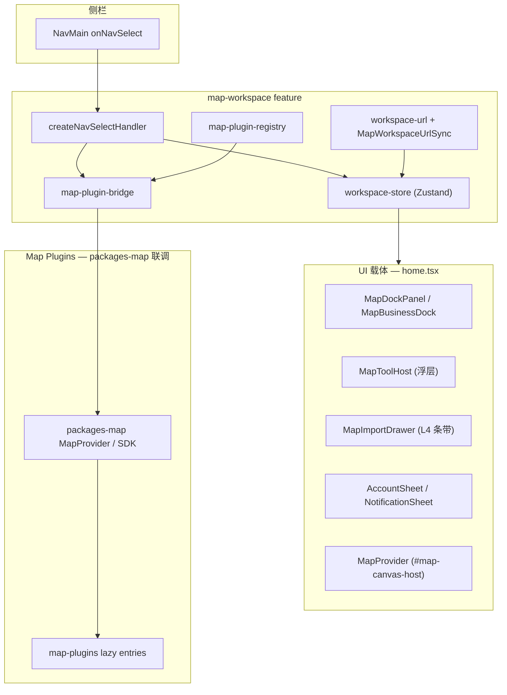

# 地图插件集成

地图工作台涉及两类「插件」概念，职责不同，不可混用。

## 两类插件

| 类型 | 位置 | 加载方式 | 宿主 |
| --- | --- | --- | --- |
| **Map Tool Plugin** | `packages-map/map-plugins`（父 monorepo） | `map-plugin-bridge` 注入 | `@repo/saas-web` 地图画布 |
| **Cloud Remote Module** | `cloud/uav` | 动态 `import()` ESM | `yunyan-web` Vue 宿主 |

本文描述 **Map Tool Plugin** 集成；Cloud UAV 见 [apps.md](./apps.md#cloud-模块) 与 [ADR-0006](../adr/0006-esm-remote-plugin-over-mf.md)。

## Map Tool Plugin 架构



## 状态机

`features/map-workspace/model/workspace-store.ts`（Zustand）管理工作台 UI 状态：

| 状态字段 | 含义 |
| --- | --- |
| `activeDockTool` | Dock 列面板（机库、业务等） |
| `activeMapTool` | 地图浮层工具（测量、标绘等） |
| `activeDrawerTool` | L4 右侧条带 |
| `panelOffset` | 浮层拖动偏移 |

菜单点击经 `createNavSelectHandler` 按 `NavMainItemKind` 分发到不同 setter。详见 [map-workspace-ui.md](./map-workspace-ui.md)。

## Plugin Bridge 契约

`features/map-workspace/lib/map-plugin-bridge.ts` 定义地图引擎与 UI 状态的桥接：

```ts
interface MapPluginBridge {
  startMapTool: (tool: ActiveMapTool) => void
  stopMapTool: () => void
  showDrawerTool: (tool: ActiveDrawerTool) => void
  hideDrawerTool: () => void
}
```

| 方法 | 触发时机 |
| --- | --- |
| `startMapTool` | 侧栏选中 `mapTool` 类菜单 |
| `stopMapTool` | 关闭浮层 / 切换工具 |
| `showDrawerTool` | 侧栏选中 `drawerTool` 类菜单 |
| `hideDrawerTool` | 关闭 L4 条带 |

### 当前状态（Phase C 宿主壳 ✅ · packages-map SDK 待联调）

| 组件 | 路径 | 说明 |
| --- | --- | --- |
| `MapProvider` | `widgets/map-canvas/ui/map-provider.tsx` | 暴露 `#map-canvas-host` 挂载点；内嵌 `MapPlaceholder` HUD |
| `MapPluginBridgeProvider` | `features/map-workspace/ui/map-plugin-bridge-provider.tsx` | 注入 `createRegistryMapPluginBridge` |
| `MapToolLifecycleSync` | 同上 feature | store → bridge 同步，不重复注入 |
| `modify-panels.ts` | `createModifyPanelsHost().closeSiblingExcept` | Modify 互斥组 |
| `map-plugin-tool-loaders.ts` | `VITE_MAP_PLUGIN_LOADERS=true` 时 lazy import | `@haoxuan/map-plugins/{slug}/lazyEntry` |
| `mock-workspace-content` | `entities/mock-workspace-content/` | 侧栏 module / mapTool / drawer / 机库 Dock **高保真 mock 已全覆盖** |

**Bridge 与 SDK 就绪分离：**

| API | 含义 |
| --- | --- |
| `setMapPluginBridge()` | 注入 bridge（插件启停分发） |
| `markMapSdkMounted()` | packages-map 在 canvas 挂载完成后调用；触发 `map-engine-ready` |
| `isMapEngineReady()` | `mapSdkMounted \|\| VITE_MAP_ENGINE_READY=true` |
| `isMapPluginBridgeAttached()` | bridge 已注入（≠ SDK 已挂载） |

未启用 loader 时：registry bridge 在 DEV 下 `console.debug`；未知 `pluginToolId` 警告。

**packages-map 联调环境变量：**

| 变量 | 默认 | 说明 |
| --- | --- | --- |
| `VITE_MAP_PLUGIN_LOADERS` | （未设） | `true` 启用 registry lazy loader |
| `VITE_MAP_PLUGINS_BASE` | `@haoxuan/map-plugins` | lazyEntry 模块前缀 |
| `VITE_MAP_ENGINE_READY` | （未设） | `true` 跳过 SDK 挂载信号（本地 DEV 隐藏 HUD） |

### 接入步骤（packages-map 联调）

1. 在父 monorepo 将 `packages-map` 依赖链入 `apps/web`
2. packages-map `MapProvider` 初始化 `#map-canvas-host`（`MAP_CANVAS_MOUNT_ID`）后调用 `markMapSdkMounted()`
3. 设 `VITE_MAP_PLUGIN_LOADERS=true`；按需覆盖 `VITE_MAP_PLUGINS_BASE`
4. `realBridge.startMapTool` 经 lazy loader import 对应 map-plugin entry
5. `stopMapTool` / `hideDrawerTool` 清理 overlay 与插件 runtime
6. URL 深链：`workspace-url.ts` 已支持 `?tool=`；bridge 须能 restore 同一 `pluginToolId`

## Plugin Registry

`features/map-workspace/lib/map-plugin-registry.ts`：

- `isKnownPluginToolId(id)` — DEV 警告未知 ID
- 未来扩展：lazy entry 映射、版本兼容性检查

**完整能力目录**（52 个插件 Skill、类型、接入状态）：[map-plugins-catalog.md](./map-plugins-catalog.md)。

当前 registry 仅登记侧栏 mock 中出现的 11 个 `pluginToolId`；其余插件在 Skill 包中有产品契约，接入 MapProvider 时再扩展登记。

## 宿主契约与插件 Skill

Map Tool 的真实运行依赖 **宿主能力**（Coordinator、Modify 槽位、lazyEntry），由 Skill `map-workspace-host-react` 定义：

| 主题 | 文档 / Skill |
| --- | --- |
| 宿主接口、生命周期、Modify 互斥 | `.cursor/skills/map-plugins-pack/map-workspace-host-react/` |
| 全部插件分类与 toolId | [map-plugins-catalog.md](./map-plugins-catalog.md) |
| 单插件产品契约 | `.cursor/skills/map-plugin-{name}/` |
| 索引 | `.cursor/skills/map-plugins-index/` |

Phase C 接入时：MapProvider 实现 HostCapabilities 语义 → `setMapPluginBridge(realBridge)` → 按 registry / Skill 中的 toolId lazy import。

## URL 同步

`features/map-workspace/lib/workspace-url.ts` + `MapWorkspaceUrlSync` 组件：

- Store 变更 → 更新 URL search params
- 页面加载 / 浏览器前进后退 → 恢复 store 状态
- 单测覆盖：`workspace-url.test.ts`、`workspace-store.test.ts`

## UI 载体与 Bridge 的关系

| NavMainItemKind | UI 载体 | 是否调 bridge |
| --- | --- | --- |
| `collapsible` | 侧栏内展开 | 否 |
| `dockTool` | MapDockPanel | 否（纯 React UI） |
| `mapTool` | MapToolHost 浮层 | **是** — `startMapTool` |
| `drawerTool` | MapImportDrawer | **是** — `showDrawerTool` |
| `sheetTool` | Vaul Drawer | 否（Account/Notification） |

## Cloud UAV 与 Map Tool 的区别

| 维度 | Map Tool Plugin | Cloud UAV |
| --- | --- | --- |
| 运行时 | saas-web 同页 React | Vue 宿主 iframe 式 DOM 挂载 |
| 加载 | 同步/懒加载 JS bundle | 远程 ESM `import()` |
| 地图 | 共享 MapProvider 画布 | 插件自有 UI，不共用 saas-web 地图 |
| 场景 | 测量、标绘、分析 | 机库管控、直播 |

## 相关文档

- [map-workspace-ui.md](./map-workspace-ui.md) — UI 载体详细规范
- [map-plugins-catalog.md](./map-plugins-catalog.md) — **52 个 map-plugin Skill 能力目录与接入状态**
- [frontend.md](./frontend.md) — FSD 分层
- `.cursor/rules/saas-map-workspace-ui.mdc` — 地图 UI 载体
- `.cursor/rules/saas-map-plugin-integration.mdc` — bridge / registry
- Skill `.cursor/skills/map-plugin-integration/` — Cursor 桥接编辑规则
- Skill `.cursor/skills/map-plugins-index/` — 插件 Skill 索引
- Skill `.cursor/skills/map-plugins-pack/map-workspace-host-react/` — 宿主契约
