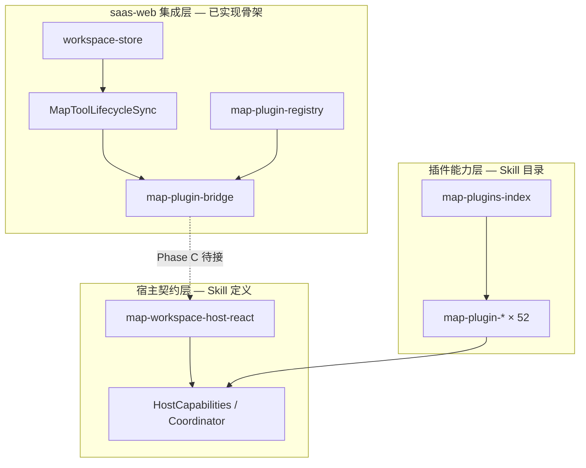

# 地图插件能力目录

> 本文汇总 `.cursor/skills/map-plugin-*` 与 `map-plugins-index` 所描述的产品能力，**不含具体实现代码**。  
> saas-web 侧桥接与 store 边界见 [map-plugin-integration.md](./map-plugin-integration.md)；UI 载体见 [map-workspace-ui.md](./map-workspace-ui.md)。

## Skill 包结构

| 路径 | 用途 |
| --- | --- |
| `.cursor/skills/map-plugin-integration/` | saas-web **bridge / registry / lifecycle** 集成规则 |
| `.cursor/skills/map-plugins-index/` | **52 个**地图插件 Skill 的分类索引（v1.3.1） |
| `.cursor/skills/map-plugin-{name}/` | 单插件产品契约 + React 实现指南 + `reference.md` |
| `.cursor/skills/map-plugins-pack/` | 可移植打包副本（与根目录 `map-plugin-*` 内容一致） |
| `.cursor/skills/map-plugins-pack/map-workspace-host-react/` | **宿主契约**（MapHostCapabilities、Coordinator、Modify 槽位） |

生成 / 打包脚本（Skill 内说明，非本仓库必跑）：

```bash
node scripts/generate-map-plugin-skills.mjs [--mode=portable|monorepo|both]
node scripts/pack-map-plugin-skills.mjs
```

## 三层模型



| 层 | 职责 | map-design 现状 |
| --- | --- | --- |
| **集成层** | 菜单 → store → bridge → lazy import | bridge 默认 noop / dev；registry 登记 11 个 ID |
| **宿主层** | 多 mapId、Coordinator、Modify 互斥、图层槽位 | Skill 已拷贝；MapProvider 真实能力 **待接** |
| **插件层** | 各 toolId 的产品契约与 React 目录建议 | 52 个 Skill 齐全；packages-map 源码在父 monorepo |

**不要混用**：Cloud UAV ESM 远程模块（`cloud/uav`）不属于本目录，见 [apps.md](./apps.md#cloud-模块) 与 Skill `cloud-uav-esm-plugin`。

## 插件类型

来自 `map-plugins-index` 与 `map-workspace-host-react`：

| 类型 | 互斥行为 | 典型 UI | saas-web 载体映射（规划） |
| --- | --- | --- | --- |
| **tool** | Coordinator 互斥 | 工具栏 + 地图交互 + 右 Modify | `activeMapTool` → `startMapTool` |
| **display** | 无 | 工具栏/卡片 + 地图图层 | 工具栏或 panel；一般不抢 Coordinator |
| **map-chrome** | 无 | 地图角落控件（指北针、比例尺） | 画布 overlay，常开 |
| **modify-panel** | Modify 互斥组 | 右栏 **420px** 抽屉 | `activePanelTools` 或 drawer 扩展 |
| **parallel-panel** | 无 | 右栏 + 地图叠加，可与 tool 并存 | `activePanelTools` 并行 |
| **hybrid** | 通常无 | Entry 内实例化 Core（如下拉期数） | Entry 内 lazy Core |
| **cesium-toolkit** | 组内互斥 | 三维工具条 | Cesium 宿主分支 |
| **tool-template** | 同 tool | demo 模板 | 新 tool 开发参考 |

### Modify 互斥组

打开下列任一面板前，应关闭同组其它面板（`closeSiblingModifyPanelsExcept`）：

- `do-analysis-plugin`
- `property-view-plugin`
- `favorites-plugin`
- `import-file-plugin`
- `goto-report-plugin`

**例外**：`special-topic-layer-plugin` ↔ `do-analysis-plugin` 互不强制关闭。

### 并行面板（不与 Coordinator 互斥）

- `special-topic-layer-plugin`
- `flight-data-plugin`
- `high-speed-warning-plugin`
- `uav-plugin`（行业工作台，见 `uav-workspace-react` Skill）

## 宿主契约摘要

实现任意 `map-plugin-*` 前必读 `map-workspace-host-react`（当前位于 `map-plugins-pack/` 内）。

| 概念 | 说明 |
| --- | --- |
| **mapId** | 多地图实例隔离键；状态/图层按 mapId 分 |
| **HostCapabilities** | 宿主注入：`mapView`、`coordinator`、`pluginsManage`、`modifyPanels`、`catalogPlotLayer` 等 |
| **Coordinator** | 同一 mapId 仅一个绘制/测量/标绘 tool 激活 |
| **pluginsManage** | `ensureLoaded` → lazyEntry → `getPlugins(toolId)` |
| **Modify 槽位** | 右栏 420px；卷帘对比等用左栏 ~40% |

完整 toolId 常量表与云眼 `@haoxuan/map-core` 对照见 Skill `reference.md`。

### 与 saas-web 的对应关系（Phase C）

| Host 契约 | saas-web 目标落点 |
| --- | --- |
| `MapHostProvider` | MapProvider 初始化 + `setMapPluginBridge` |
| `coordinator.register` | `realBridge.startMapTool` 内激活插件 |
| `modifyPanels.closeSiblingExcept` | panel / drawer 互斥（store 或宿主实现） |
| `pluginsManage.ensureLoaded` | lazy import `packages-map/map-plugins` entry |
| 菜单 `pluginToolId` | `mock-nav-items` + `map-plugin-registry.ts` |

## saas-web 接入状态

当前 **仅登记与导航 mock**，未接 MapProvider 真实 bridge：

| pluginToolId | 菜单 mock | registry | 插件 Skill |
| --- | --- | --- | --- |
| `measure-distance-plugin` | ✓ | ✓ | [map-plugin-measure-distance](../../.cursor/skills/map-plugin-measure-distance/SKILL.md) |
| `measure-area-plugin` | ✓ | ✓ | [map-plugin-measure-area](../../.cursor/skills/map-plugin-measure-area/SKILL.md) |
| `interest-point-plugin` | ✓ | ✓ | [map-plugin-interest-point](../../.cursor/skills/map-plugin-interest-point/SKILL.md) |
| `pick-map-point-plugin` | ✓ | ✓ | [map-plugin-pick-map-point](../../.cursor/skills/map-plugin-pick-map-point/SKILL.md) |
| `locate-map-point-plugin` | ✓ | ✓ | [map-plugin-locate-map-point](../../.cursor/skills/map-plugin-locate-map-point/SKILL.md) |
| `import-file-plugin` | ✓ | ✓ | [map-plugin-import-file](../../.cursor/skills/map-plugin-import-file/SKILL.md) |
| `comparison-plugin` | ✓ | ✓ | [map-plugin-comparison](../../.cursor/skills/map-plugin-comparison/SKILL.md) |
| `ortho-imagery-comparison-plugin` | ✓ | ✓ | [map-plugin-ortho-imagery-comparison](../../.cursor/skills/map-plugin-ortho-imagery-comparison/SKILL.md) |
| `region-navigator-plugin` | ✓ | ✓ | [map-plugin-region-navigator](../../.cursor/skills/map-plugin-region-navigator/SKILL.md) |
| `map-search-plugin` | ✓ | ✓ | [map-plugin-map-search](../../.cursor/skills/map-plugin-map-search/SKILL.md) |

**侧栏模块（registry 已登记，bridge 未接）**：

| pluginToolId | 侧栏段 | moduleId | registry |
| --- | --- | --- | --- |
| `special-topic-layer-plugin` | 图层 | thematic | ✓ |
| `scenic-spots-plugin` | 图层 | scenic-spots | ✓ |
| `legend-plugin` | 图层 | legend | ✓ |
| `do-analysis-plugin` | 分析 | spatial-analysis | ✓ |
| `property-view-plugin` | 分析 | property-view | ✓ |
| `favorites-plugin` | 分析 | my-favorites | ✓ |
| `view-project-plugin` | 运营 | view-project | ✓ |
| `flight-data-plugin` | 运营 | flight-ledger | ✓ |
| `events-plugin` | 运营 | flight-ai-alerts | ✓ |
| `high-speed-warning-plugin` | 运营 | custom-highway-alert | ✓ |
| `share-list-plugin` | 运营 | custom-live-share | ✓ |
| `video-monitor` | 运营 | video-monitor | ✓ |

当前 **registry 共 22 项**（工具 10 + 模块 12）；MapProvider 真实 bridge 仍待 Phase C。

## 侧栏分段（saas-web mock）

| 侧栏段 | catalog 分类 | 菜单项 → pluginToolId |
| --- | --- | --- |
| **图层** | parallel-panel / display | 专题图层 → `special-topic-layer-plugin`；景点聚类 → `scenic-spots-plugin`；图例 → `legend-plugin` |
| **分析** | modify-panel 互斥组 | 做分析 → `do-analysis-plugin`；属性查看 → `property-view-plugin`；我的收藏 → `favorites-plugin` |
| **运营** | display / 业务 | 看项目 → `view-project-plugin`；飞行数据 → `flight-data-plugin`；事件 → `events-plugin`；高速预警 → `high-speed-warning-plugin`；地图分享 → `share-list-plugin`；视频监控 → `video-monitor` |
| **机库** | uav-workspace | 机库 Dock 三项 |
| **快捷工具条** | 量测 / 标绘 / 对比 / 工具 | 测距、测面、绘点、卷帘、导入、搜索等（见 `quick-toolbar-catalog.ts`） |

段顺序与 rationale：[2026-06-workspace-nav-ia.md](../product/2026-06-workspace-nav-ia.md)。

实现文件：`apps/web/app/entities/navigation/model/mock-nav-items.tsx`。

## 按能力分类

以下表格来自 `map-plugins-index` v1.3.1。Skill 路径均为 `.cursor/skills/map-plugin-{slug}/`。

### 底图与控件（map-chrome）

| pluginToolId | 说明 |
| --- | --- |
| `base-map-switcher-cesium-plugin` | Cesium 三维底图切换面板 |
| `base-map-switcher-plugin` | 右下角底图切换：正射/电子/全景漫游与区划路网复选 |
| `base-map-vec-plugin` | 电子地图与影像底图互斥切换 |
| `compass-cesium-plugin` | Cesium 三维指北针 |
| `compass-plugin` | 二维指北针/罗盘 |
| `region-navigator-plugin` | 行政区划 Popover 与围栏图层 |
| `restore-map-view-extent-plugin` | 恢复初始视图范围 |
| `scale-bar-plugin` | 数字比例尺（1:N） |
| `zoom-control-cesium-plugin` | Cesium 缩放控件 |
| `zoom-control-plugin` | 二维缩放 +/- |

### 量测与绘制（tool）

| pluginToolId | 说明 |
| --- | --- |
| `brush-plugin` | 画笔：按住拖拽自由路径 |
| `comparison-plugin` | 卷帘/分屏对比（左栏参数抽屉） |
| `demo-plugin` | 打点标绘开发模板（tool-template） |
| `draw-circle-plugin` | 画圆：圆心 + 圆上一点 |
| `draw-ellipse-plugin` | 画椭圆：圆心 + 长轴 + 短轴 |
| `draw-fanshape-plugin` | 画扇形：圆心 + 两半径边 |
| `interest-point-plugin` | 兴趣点标绘 + Panel + Modify 五 Tab |
| `locate-map-point-plugin` | 输入坐标定点定位 |
| `measure-angle-plugin` | 测夹角（度） |
| `measure-area-plugin` | 测面：多边形面积 |
| `measure-azimuth-angle-plugin` | 测方位角 + 东南西北 |
| `measure-distance-plugin` | 测距：折线地理距离 |
| `pick-map-point-plugin` | 地图选点拾取坐标 |

### 业务面板（modify-panel / tool）

| pluginToolId | 类型 | 说明 |
| --- | --- | --- |
| `do-analysis-plugin` | modify-panel | 做分析：工具栏 + 分析抽屉壳 |
| `favorites-plugin` | modify-panel | 收藏夹：目录树、标绘预览、联动编辑 |
| `goto-report-plugin` | modify-panel | 跳转报表 / 附件上传 |
| `import-file-plugin` | modify-panel | 导入矢量到目录标绘层 |
| `map-search-plugin` | tool | POI/地址搜索与定位 |
| `project-plot-plugin` | tool | 工程标绘：正射瓦片、期数切换 |
| `property-view-plugin` | modify-panel | 属性查看 + 专题图叠加 |
| `special-topic-layer-plugin` | parallel-panel | 专题目录树、勾选、透明度 |
| `view-project-plugin` | modify-panel | 看项目：项目列表壳 |

### 图层与展示（display / hybrid / tool）

| pluginToolId | 类型 | 说明 |
| --- | --- | --- |
| `event-heatmap-mvt-ol-plugin` | display | 事件热力图 MVT（OpenLayers） |
| `events-plugin` | display | 事件点位 + 列表面板 |
| `flight-data-plugin` | display | 飞行数据右侧面板（OL/Cesium 双宿主） |
| `high-speed-warning-plugin` | display | 高速预警图层与面板 |
| `legend-plugin` | display | 右下角图例，联动专题勾选 |
| `newpolicy-zone-plugin` | display | 新政区域图层 |
| `ortho-imagery-comparison-plugin` | tool | 正射两期对比（工具互斥 + 卷帘 UI） |
| `ortho-imagery-plugin` | hybrid | 高清正射：期数下拉、TyLayer 瓦片 |
| `plugin-overlay-toggle-plugin` | display | 目录标绘一键清除 |
| `region-map-plugin` | display | 行政区划边界图层 |
| `road-map-plugin` | display | 地名路网 WMTS 注记 |
| `scenic-spots-plugin` | display | 全景点位聚类与详情 |
| `share-list-plugin` | display | 地图分享列表 |
| `video-monitor` | display | 视频监控点位与播放 |

### 三维工具（cesium-toolkit）

| pluginToolId | 说明 |
| --- | --- |
| `scene-cesium-plugin` | 场景特效（雨/雪/雾等） |
| `spatial-analysis-cesium-plugin` | 空间分析（可视域/通视） |
| `spatial-measure-cesium-plugin` | 三维空间量测 |

### 行业工作台

| 名称 | Skill | 说明 |
| --- | --- | --- |
| UAV 机库工作台 | `uav-workspace-react` | 并行 panel + 双宿主范例；**非**单个 `map-plugin-*` |

---

## 单插件 Skill 文档结构

每个 `map-plugin-{name}/SKILL.md` 通常包含：

| 章节 | 内容 |
| --- | --- |
| **产品契约** | 定位、边界规则（Coordinator / Modify / 目录标绘） |
| **功能要点** | 用户可见行为、必选能力 checklist |
| **React 实现指南** | feature 目录、`useXxx` hook、lazyEntry 映射 |
| **宿主依赖** | 需要的 HostCapabilities 字段 |
| **插件协作** | toolId 常量、跨插件 `getPlugins` 约定 |
| **不要做的事** | 禁止跨 feature import、硬编码 toolId 等 |
| **reference.md** | 文件路径、API 细目、云眼源码对照 |

**开发模板**：新 tool 类插件以 `map-plugin-interest-point` + `map-plugin-demo` 为参考。

## Agent / 开发工作流

1. **改 bridge / registry / URL** → `/map-plugin-integration` + 本文「接入状态」  
2. **新接一个 toolId** → `@map-workspace-host-react` + `@map-plugin-{name}` + Phase C checklist  
3. **选型不确定** → `@map-plugins-index` 按分类查表  
4. **改侧栏 / 浮层载体** → [map-workspace-ui.md](./map-workspace-ui.md) + `/map-workspace-ui`  
5. **写 PRD** → `/pm-write-spec`，引用本文 pluginToolId 与类型  

## 相关文档与 Skill

| 资源 | 路径 |
| --- | --- |
| Bridge 集成 | [map-plugin-integration.md](./map-plugin-integration.md) |
| UI 载体 | [map-workspace-ui.md](./map-workspace-ui.md) |
| Cursor Rule | `.cursor/rules/saas-map-plugin-integration.mdc` |
| 集成 Skill | `.cursor/skills/map-plugin-integration/SKILL.md` |
| 索引 Skill | `.cursor/skills/map-plugins-index/SKILL.md` |
| 宿主 Skill | `.cursor/skills/map-plugins-pack/map-workspace-host-react/SKILL.md` |
| Registry 源码 | `apps/web/app/features/map-workspace/lib/map-plugin-registry.ts` |
| 导航 mock | `apps/web/app/entities/navigation/model/mock-nav-items.tsx` |
