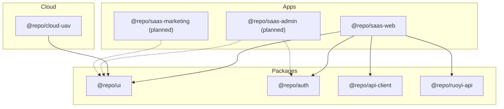
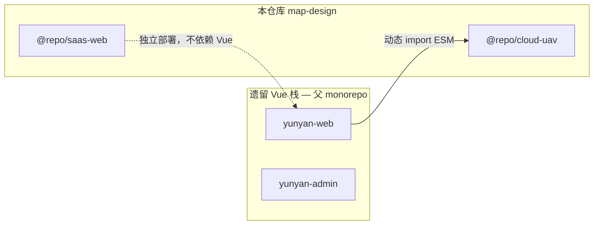

# Monorepo 工程结构

## 仓库定位

本仓库（`map-design`）是 **SaaS 产品线前端 monorepo**，包含租户工作台、共享 packages 与 cloud 远程插件。

| 场景 | 说明 |
| --- | --- |
| **独立仓库**（当前） | 仓库根即产品线根：`apps/`、`packages/`、`cloud/`、`docs/` 直接在根下 |
| **嵌入父 monorepo** | 可将本仓库内容置于父仓 `saas/` 子目录，见 [ADR-0001](../adr/0001-saas-top-level-directory.md) |

历史文档中的 `saas/` 前缀指**产品线逻辑根**，在本仓库中对应**仓库根目录**，而非嵌套子文件夹。

## 目录树

```
map-design/                    # @repo/saas（Biome 根）
├── apps/
│   ├── web/                   # @repo/saas-web — 租户工作台（活跃）
│   ├── marketing/             # @repo/saas-marketing — 占位
│   └── admin/                 # @repo/saas-admin — 占位
├── packages/
│   ├── ui/                    # @repo/ui
│   ├── auth/                  # @repo/auth
│   ├── api-client/            # @repo/api-client
│   └── ruoyi-api/             # @repo/ruoyi-api
├── cloud/
│   └── uav/                   # @repo/cloud-uav
├── docs/
│   ├── architecture/
│   ├── adr/
│   └── runbooks/
├── biome.json                 # lint/format 覆盖 apps/packages/cloud
├── pnpm-workspace.yaml
└── package.json
```

## 包依赖关系



**依赖规则**：

- App 可依赖 `packages/*`，不可反向依赖 App
- `packages/*` 之间保持单向：如 `auth` 不依赖 `ruoyi-api`（App 层组装）
- `cloud/*` 可依赖 `packages/ui`，不依赖 `apps/*`
- **禁止** SaaS 代码 import 遗留 `@taiyi/*` 业务包（cloud 宿主联调除外）

## Workspace 与 Catalog

`pnpm-workspace.yaml` 声明 workspace 包与 `catalog:` 版本集中管理：

```yaml
packages:
  - "apps/*"
  - "packages/*"
  - "cloud/*"
```

子包通过 `workspace:*` 引用内部包，通过 `catalog:` 引用共享版本（TypeScript、Zod 等）。

## npm Scope

| 包名 | 路径 | 职责 |
| --- | --- | --- |
| `@repo/saas` | 根 | Biome lint/format |
| `@repo/saas-web` | `apps/web` | 租户工作台 SPA |
| `@repo/saas-marketing` | `apps/marketing` | 官网（待建） |
| `@repo/saas-admin` | `apps/admin` | 平台运营（待建） |
| `@repo/ui` | `packages/ui` | shadcn + Base UI 组件库 |
| `@repo/auth` | `packages/auth` | Session / Tenant / RBAC |
| `@repo/api-client` | `packages/api-client` | 通用 REST 客户端 |
| `@repo/ruoyi-api` | `packages/ruoyi-api` | RuoYi 后端封装 |
| `@repo/cloud-uav` | `cloud/uav` | 机库远程 ESM 插件 |

## 工具链

| 工具 | 范围 | 说明 |
| --- | --- | --- |
| **Biome** | `apps/**`、`packages/**`、`cloud/**` | 统一 lint/format，根脚本 `@repo/saas check` |
| **Turborepo** | 全 workspace | 构建/类型检查/测试并行与缓存，见 [turbo.md](../runbooks/turbo.md) |
| **TypeScript** | 各包独立 `tsconfig.json` | 无根 tsconfig，Vite alias 指向 UI 源码 |
| **Vitest** | web、packages | 单元测试；Playwright E2E 规划中 |
| **Vite 8** | web、cloud-uav | React Router 7 Framework + Tailwind 4 |

## 与遗留栈的关系



- `@repo/saas-web` 与 `yunyan-web` **独立**，不共享路由或组件
- `@repo/cloud-uav` 作为远程 ESM 插件嵌入 `yunyan-web` 宿主
- 后端当前共用 RuoYi API（`/YunYanApi` 代理）

## 规划中的 packages

README 目标结构尚待 scaffold：

| 包 | 用途 |
| --- | --- |
| `@repo/config` | 共享 env schema、常量 |
| `@repo/types` | 跨 App 类型定义 |
| `@repo/utils` | 纯函数工具 |
