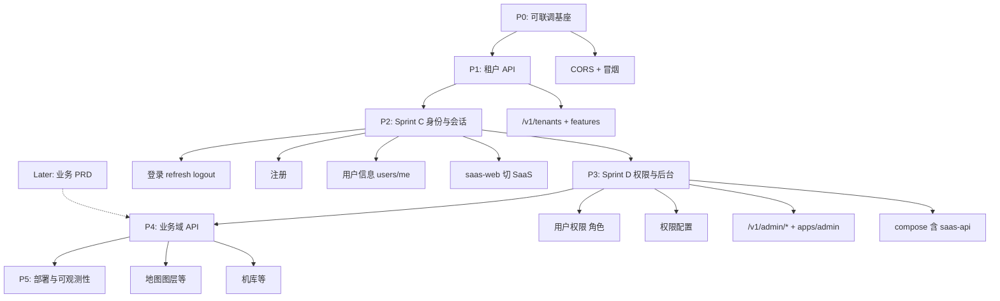

# services/ 后端开发计划

> 状态：Living doc · 2026-06-15（更新：Sprint C/D/F 基座 ✅；**平台基础完善 backlog** 见 [platform-foundation-backlog.md](./supplements/platform-foundation-backlog.md)）  
> 关联：[backend-integration.md](./backend-integration.md)、[auth-rbac.md](./auth-rbac.md)、[java-backend-index](../../.cursor/skills/java-backend-index/SKILL.md)

## 范围说明

**Sprint C / D 范围：平台基础能力，不设计具体业务模块**（地图图层、机库、专题等一律后移）。

| 阶段 | 主题 | 包含 |
| --- | --- | --- |
| **Sprint C** | 身份与会话 | 登录、**注册**、用户信息（读/写/改密）、saas-web 切 SaaS 会话 |
| **Sprint D** | 权限与后台 | 用户权限、权限配置、**`/v1/admin/*` 后台管理**、部署基座 |

**Sprint C 起 saas-web 不再依赖 RuoYi 会话：**

- **登录 / 注册 / 刷新 / 登出** → `/v1/auth/*`
- **用户信息** → `GET/PUT /v1/users/me`、`POST /v1/users/me/password`
- **Bootstrap** → `GET /v1/users/me`（**非** RuoYi `getInfo`/`getRouters`）✅
- **侧栏** → `mock-nav-items` + **`filterNavMainItemsForTenant`**（C-09 ✅）

**仍不做（Sprint C/D 内）：**

- **`/v1/menus`**、RuoYi 动态菜单
- **业务域 API**：`/v1/layers`、`/v1/uav/*`、地图/机库/专题等（单独 Sprint，待基础盘稳定后）

后续业务模块按产品 PRD 排期，不挤占 C/D 容量。

---

## 一、总体定位

`services/` 是 map-design 的 **SaaS 目标后端**，与前端 `@repo/api-client`（`/v1`、Bearer JWT、标准 HTTP 响应）对接，**不**走 RuoYi envelope。

**Sprint C 进度（2026-06）**：后端 C-01～C-05 ✅；前端 C-06～C-12 ✅；**C-09 租户 features 门控 ✅**。

**Sprint D 进度**：**D-01 ✅** … **D-09 ✅** saas-web 权限门控；**D-10 ✅** Docker 全栈部署。**暂不启动**地图/机库等业务 API。

```
map-design/
├── services/
│   ├── pom.xml                 # Maven 父工程（仅 saas-api 模块）
│   ├── docker-compose.dev.yml  # PostgreSQL 16 + Redis 7
│   ├── saas-api/               # 主 API 服务 (:8082)
│   ├── billing-api/            # 平台计费 (:8083) — Sprint F 规划
│   └── billing-core/           # BillingClient 共享 jar
```

---

## 二、已完成能力（Phase 0 · Auth MVP）


| 维度         | 状态    | 说明                                                           |
| ---------- | ----- | ------------------------------------------------------------ |
| 脚手架        | ✅     | Java 21、Spring Boot 3.3.6、Maven 多模块                          |
| 数据库        | ✅     | Flyway V1–V3：基线表、auth 表、4 角色种子                               |
| 认证接口       | ✅     | `POST /v1/auth/login`、`/register`、`/refresh`、`/logout`      |
| 用户会话       | ✅     | `GET/PUT /v1/users/me`、`POST /v1/users/me/password`         |
| 安全         | ✅     | JWT access/refresh、Spring Security 6、`JwtAuthFilter`         |
| RBAC       | ✅     | `PLATFORM_ADMIN` / `TENANT_ADMIN` / `MEMBER` / `VIEWER`      |
| 多租户（应用层）   | 🟡 深化中 | `TenantContext` + RLS：`sys_user` ✅、`billing_*` ✅；其它租户表见 FND-04 |
| Refresh 存储 | ✅     | dev 用 Redis，test 用 InMemory                                  |
| 错误体        | ✅     | RFC 7807 `ProblemDetail`                                     |
| OpenAPI    | ✅     | SpringDoc 已配置                                                |
| 测试         | ✅     | `mvn -pl saas-api test` 全部通过（H2 + MockMvc）                   |
| 开发种子       | ✅     | `scripts/seed-demo-dev.sql`（`admin@demo.local` / `password`） |


### 与前端契约对齐

- `@repo/auth` 的 `loginResponseSchema`（`accessToken`、`refreshToken`、`expiresIn`、`user.name/roles/tenant`）与后端 DTO 一致
- `apps/web` 已配置 `VITE_API_URL` + vite `/v1` 代理 → `:8082`
- **登录 / 注册 / bootstrap**：SaaS `/v1/auth/*` + `GET /v1/users/me`（C-06～C-08 ✅）
- **侧栏**：`mock-nav-items` + **C-09 ✅** `filterNavMainItemsForTenant`（按 tenant features 过滤；非菜单路由 RBAC）

### 本地验证命令

```bash
# 依赖
docker compose -f services/docker-compose.dev.yml up -d

# 启动 API
mvn -f services/pom.xml -pl saas-api spring-boot:run -Dspring-boot.run.profiles=dev

# 种子数据（首次）
docker exec -i services-postgres-1 psql -U saas -d saas < services/saas-api/scripts/seed-demo-dev.sql

# 冒烟
curl http://localhost:8082/actuator/health
curl -X POST http://localhost:8082/v1/auth/login \
  -H 'Content-Type: application/json' \
  -d '{"email":"admin@demo.local","password":"password","tenantId":"demo"}'

# 测试
mvn -f services/pom.xml -pl saas-api test
```

---

## 三、缺口与风险


| 缺口                             | 影响                                                                               | 优先级 |
| ------------------------------ | -------------------------------------------------------------------------------- | --- |
| ~~**CORS**~~                   | ✅ `CorsConfig` + `SecurityConfig.cors()`；`/v1/`** 允许 `saas.cors.allowed-origins` | —   |
| ~~**租户 API 缺失**~~              | ✅ `/v1/tenants` + `/features`；前端接真实 API 待联调                                      | —   |
| ~~**PostgreSQL RLS 未做**~~      | ✅ `sys_user` RLS（`V5__rls.sql` + `TenantRlsDataSource`）                           | —   |
| ~~**工作台会话仍走 RuoYi**~~       | ✅ C-06～C-08：登录、注册、bootstrap 已切 SaaS                                        | —   |
| ~~**注册 / 用户资料写接口**~~        | ✅ C-02～C-05 后端 + C-10 Account UI（`users/me*`）                                  | —   |
| **侧栏租户能力过滤**                 | ✅ C-09：`GET /tenants/{id}/features` + `filterNavMainItemsForTenant`               | —   |
| **RBAC / 权限配置 / 后台管理**       | D-01～D-10 ✅ | —   |
| ~~**Docker 全栈未含 saas-api**~~       | ✅ D-10：`deploy/docker-compose` 含 PG/Redis/saas-api/web/admin | —   |
| **业务域 API**                    | 地图、机库、专题等 — **Sprint C/D 不做**，待基础能力验收后另开迭代 | Later |
| **Testcontainers**             | 测试用 H2，与生产 PG 行为可能有差异                                                            | P3  |
| ~~`**SessionDto.expiresAt`**~~ | ✅ 取自 JWT `exp`，毫秒时间戳                                                             | —   |


### 本期明确不做（Later）


| 项 | 说明 |
| --- | --- |
| **`/v1/menus`** | 无 SaaS 菜单 API；侧栏 mock / registry |
| **地图 / 机库 / 专题等业务 API** | Sprint C/D **不设计**；基础盘（登录·注册·权限·后台）完成后再开 |
| **OAuth2/OIDC** | 远期；C/D 用 Email/Password + JWT |
| **邮箱验证 / 邀请注册** | auth-foundation P3 ✅（[auth-email-module.md](./auth-email-module.md)）；非阻塞首版注册 |


---

## 四、开发路线总览




---

## 五、迭代任务清单

### Sprint A · P0 — 本地可联调（约 2–3 天）

**目标：** 前端配置 `VITE_API_URL` 后，能完成 SaaS 登录 + refresh + `/users/me`。


| #    | 任务                                    | 产出                                                                                   | Skill                       |
| ---- | ------------------------------------- | ------------------------------------------------------------------------------------ | --------------------------- |
| A-01 | ~~实现 CORS 配置 Bean~~ ✅                 | `CorsConfig` + `CorsProperties`                                                      | `java-rest-api`             |
| A-02 | ~~补充 `local-dev.md` services 启动步骤~~ ✅ | [local-dev.md](../runbooks/local-dev.md#saas-api)                                    | `java-spring-boot-scaffold` |
| A-03 | ~~端到端冒烟~~ ✅                           | [saas-api-auth-smoke.md](../runbooks/saas-api-auth-smoke.md) + `pnpm smoke:saas-api` | `webapp-testing`            |
| A-04 | ~~修复 `SessionDto.expiresAt~~` ✅       | JWT `exp` → 毫秒 epoch                                                                 | `java-rest-api`             |


**验收：**

- [x] `pnpm smoke:saas-api` 通过（login → me → refresh → me）
- [x] 独立页 `/dev/saas-auth-smoke`（`VITE_API_URL=/v1`）可验证 `@repo/auth` + `api-client`
- [x] A 阶段仅要求冒烟与 `/dev/saas-auth-smoke`；**主登录页切换排 Sprint C**

---

### Sprint B · P1 — 租户 API（约 1 周）

**目标：** 为新功能提供租户上下文与能力门控；导航仍由前端 mock 承担。


| #    | 任务                                                      | 产出                              | 说明                    |
| ---- | ------------------------------------------------------- | ------------------------------- | --------------------- |
| B-01 | ~~`GET /v1/tenants`~~ ✅                                 | `TenantsController` + 同邮箱多租户成员  | TeamSwitcher 数据源      |
| B-02 | ~~`GET /v1/tenants/{id}/features`~~ ✅                   | `TenantFeaturesResponse` + 成员校验 | 对接 `tenantFeature` 门控 |
| B-03 | ~~Flyway `V4__tenant_features.sql~~` ✅                  | `sys_tenant_feature` 表          | 与 B-02 一并交付           |
| B-04 | ~~敲定 [ADR-0004](../adr/0004-tenant-isolation-strategy.md)~~ ✅ | JWT `tenant_id` claim 定稿        | 文档 Accepted           |
| B-05 | ~~PostgreSQL RLS 策略（`sys_user` 起步）~~ ✅                    | `migration-postgresql/V5__rls.sql` | 补充说明见 [tenant-rls-b05.md](./supplements/tenant-rls-b05.md) |


**验收：**

- [x] TeamSwitcher 可拉取真实租户列表
- [x] `GET /v1/tenants/{id}/features` API 就绪（前端 C-09 ✅ `filterNavMainItemsForTenant`）
- [x] MockMvc 覆盖 tenants + features

---

### Sprint C · P2 — 身份与会话基础（约 1–2 周）

**目标：** 完成 **登录、注册、用户信息** 与 saas-web 会话切 SaaS；**不涉及**业务域模块与后台权限配置（留 Sprint D）。

**原则：** 先打通「谁能登录、谁能注册、谁能改自己的资料」；侧栏仍 mock-nav。

#### 后端（saas-api）

| # | 任务 | 产出 |
| --- | --- | --- |
| C-01 | 登录（已有，补 OpenAPI/测试）✅ | `POST /v1/auth/login`、`/refresh`、`/logout` |
| C-02 | **注册** ✅ | `POST /v1/auth/register`（email + password + tenant slug；首版可无邮箱验证） |
| C-03 | **用户信息 · 读** ✅ | `GET /v1/users/me`（SessionDto 含 roles、tenant、expiresAt） |
| C-04 | **用户信息 · 写** ✅ | `PUT /v1/users/me`（displayName 等可改字段） |
| C-05 | **改密** ✅ | `POST /v1/users/me/password`（旧密码 + 新密码） |

#### 前端（saas-web）

| # | 任务 | 产出 |
| --- | --- | --- |
| C-06 ✅ | 登录页切 SaaS | `routes/login.tsx` → `/v1/auth/login`；`VITE_API_URL` + refresh/logout；bootstrap 最小 SaaS 分支 |
| C-07 ✅ | **注册页** | `routes/register.tsx` → `/v1/auth/register`；`auth.register()` 注册后进入工作台 |
| C-08 ✅ | Bootstrap 去 RuoYi | `GET /v1/users/me`；移除 `getUserInfo` / `getMenuRouters` |
| C-09 ✅ | 侧栏租户能力过滤 | `filterNavMainItemsForTenant` + `features` API |
| C-10 ✅ | Account / 用户信息 UI | `AccountSheet`：`GET/PUT /users/me`、`POST /users/me/password` |
| C-11 ✅ | TeamSwitcher | 侧栏 `GET /v1/tenants`；切换租户 = 目标 slug 重新登录 |
| C-12 ✅ | 清理 RuoYi 会话依赖 | 移除 `ruoyi-profile-store`；顶栏/壳层统一 `useWorkspaceSession` |

**验收：**

- [x] 可注册、登录、刷新、登出（SaaS JWT；`/login`、`/register` + `auth.*`）
- [x] saas-web bootstrap **不**调用 RuoYi `getInfo` / `getMenuRouters`（C-08）
- [x] Account UI 读写信/改密走 `/v1/users/me*`（C-10）
- [x] TeamSwitcher 拉取 `/v1/tenants`；切换租户重新登录（C-11）
- [x] 清理 RuoYi profile 桥接（C-12）
- [x] 侧栏 `filterNavMainItemsForTenant`（C-09）
- [x] `pnpm smoke:saas-api` 通过；`pnpm --filter @repo/saas-web test` 通过

---

### Sprint D · P3 — 权限与后台管理基础（约 1–2 周）

**目标：** **用户权限、权限配置、平台/租户后台管理** 最小可用；**仍不做**地图、机库、专题等业务 API。

#### 后端（saas-api）

| # | 任务 | 产出 |
| --- | --- | --- |
| D-01 ✅ | 权限模型 | `V6__permissions.sql`：`sys_permission`、`sys_role_permission`；11 个种子权限码 + 角色绑定 |
| D-02 ✅ | **用户权限** | JWT `permissions` claim；`users/me` / login 返回 `user.permissions`；`SaasPrincipal` + `@PreAuthorize`；`/v1/admin/**` 按 platform 权限码门控 |
| D-03 ✅ | **权限配置 API** | `GET /v1/admin/roles`、`/permissions`；`GET/PUT /v1/admin/roles/{id}/permissions`（全量替换 + scope 校验） |
| D-04 ✅ | 租户管理 | `GET/POST/PATCH /v1/admin/tenants`；`V7__tenant_status.sql`（active/suspended）；停用后禁止登录 |
| D-05 ✅ | 用户管理 | `GET/POST/PATCH /v1/admin/users`；邀请成员、禁用账号（active/disabled） |
| D-06 ✅ | 租户管理员能力 | `TENANT_ADMIN`：`/v1/admin/tenants/{id}/members` 成员与角色分配 |

#### 前端

| # | 任务 | 产出 |
| --- | --- | --- |
| D-07 ✅ | **apps/admin** 脚手架 | 登录（SaaS）、布局、路由；对接 `/v1/admin/*` |
| D-08 ✅ | 后台基础页 | 租户列表、用户列表、角色/权限配置 UI（表格 + 表单） |
| D-09 ✅ | saas-web 权限门控 | `requireRole` / 权限码与 Sprint D API 一致；去掉 RuoYi 权限转换依赖 |
| D-10 ✅ | 部署基座 | `deploy/docker-compose` 含 `saas-api`；Nginx `/v1` 反代；`VITE_API_URL` 注入 |

**验收：**

- [x] `PLATFORM_ADMIN` 可管理租户、查看用户、配置角色权限
- [x] `TENANT_ADMIN` 可管理本租户成员与角色（范围内）
- [x] 普通用户权限仅来自 SaaS，不依赖 RuoYi `getInfo` 权限串
- [x] Admin 与 saas-api 本地 Docker 栈可联调（`deploy.mjs smoke`）

**Admin 功能完善（P0～P3 · 2026-06）**：在 Sprint D 基座上交付概览统计、租户详情、跨租户成员、能力管理、列表分页、`/account`、TeamSwitcher、Skeleton、404 与测试覆盖。路由与 API 见 [apps.md](./apps.md)。

**Admin 运维 UX（P4 / P4+ · 2026-06）**：工业深色控制台壳、Health 条（flags + ping）、计费审核 Sheet、审计/用户/计费/租户跨页导航、`AdminTenantContextBanner`。详见 [apps/admin/README.md](../../apps/admin/README.md)。

### Sprint D+ · RBAC 深化（2026-06）

| # | 状态 | 任务 | 产出 |
| --- | --- | --- | --- |
| RBAC-P0 | ✅ | 门控对齐 | `V14__platform_admin_members.sql`；`PLATFORM_ADMIN` JWT 含 `admin:members:*`；Admin 侧栏 `isPlatformAdmin` 兜底；`platform@demo.local` 联调账号 |
| RBAC-P1 | ✅ | 平台用户角色 + 变更传播 | `PUT /v1/admin/users/{id}/roles`；角色权限保存后吊销会话 + 审计 |
| RBAC-P2 | ✅ | 租户自定义角色 | `sys_role` 扩展；租户角色 CRUD + 权限绑定；`PermissionResolver.resolveByRoleIds` |

成员邀请主路径为 **invite-links + join**（非 `POST /v1/admin/users` / `POST .../members`）。

---

### Sprint E · Later — 业务域 API（单独排期）

**不在 Sprint C/D 设计或实现。** 待身份、权限、后台基础验收后，按 [产品路线图](../product/roadmap.md) 拆 PRD：

| 域 | 示例 API | 前端 |
| --- | --- | --- |
| 地图工作台 | `/v1/layers`、`/v1/projects` | MapProvider / 插件 |
| 机库 | `/v1/uav/*` | uav-workspace |
| 其它专题 | 按 PRD | mock-nav 已有入口 |

### Sprint F · 平台计费（F-1～F-6 骨架 + sec 加固已落地 · 2026-06-14）

**PRD：** [billing-credits-prd.md](../product/billing-credits-prd.md)  
**架构：** [billing-service.md](./billing-service.md)

| 阶段 | 服务 | 产出 | 状态 |
| --- | --- | --- | --- |
| F-0 | saas-api | `tenant_kind=personal`、register-personal、个人版 UI | ✅ |
| F-1 | **billing-api :8083** + billing-core | 用户钱包；saas-api **V18** 权限；signup-bonus；Nginx 分流 | ✅ |
| F-2 | billing-api + admin | 微信/支付宝 Webhook 骨架 + 充值 UI + **Platform Admin 调账/SKU/订单** | ✅ 主体 |
| F-2.5 | billing-api + saas-web + billing-client | live SDK（wechatpay-java/alipay-sdk-java）、payScene、订单轮询、JSAPI OAuth/openId、联调 SOP | ✅ |
| F-3 | saas-api → billing-api | hold/confirm + **402 弹窗** + `team/usage` + smoke rule + perm_epoch | ✅ |
| F-3+ | web | `BillingCostPreview`、低余额样式 | ✅ |
| F-5 | packages/billing-client | TS SDK + saas-web 接入 | ✅ |
| F-4 | billing-api + admin | 退款/日对账/站内通知/发票申请 | ✅ 骨架 |
| F-5 | billing-api + web/admin | 优惠券兑换 + 用户间划拨 + billing-client | ✅ 骨架 |
| F-6 | billing-api + admin/web | 对公转账预付申请与审核入账；membership copy/api/cdc + push | ✅ 骨架；独立 DB 可选 compose ✅ |
| sec | billing-api + saas-api + admin | Webhook/Caller/RFC7807/Job/CDC push·HMAC/Admin 分页/**PostgreSQL RLS**/冒烟 24 步（mock） | ✅；落地索引见 [billing-service.md](./billing-service.md) §Sprint F 安全与稳定性改进、[billing-tenant-rls.md](./supplements/billing-tenant-rls.md) |

**Maven 目标：**

```
services/
├── billing-core/
├── billing-api/    # :8083
└── saas-api/       # :8082，BillingClient 消费者
```

**验收（F-1）：** compose 含 billing-api；wallet 读写；signup-bonus 幂等；V18 权限绑定正确（VIEWER 不可充值）。

**验收（F-3）：** 402 弹窗；TENANT_ADMIN `team/usage`；hold TTL 自动 cancel。

**验收（F 冒烟）：** `pnpm smoke:billing-api` 通过（mock 默认 24 步：充值、OAuth config 探活、发票、优惠券、对公、membership 内网 API 探活）；见 [billing-api-smoke.md](../runbooks/billing-api-smoke.md)。Live 凭证联调见 [billing-live-payment-sop.md](../runbooks/billing-live-payment-sop.md)。

**验收（sec）：** P0～P3 改进清单全部 ✅（含 billing-api PostgreSQL RLS，见 [billing-tenant-rls.md](./supplements/billing-tenant-rls.md)）；见 [billing-credits-prd.md](../product/billing-credits-prd.md) `f-sec-hardening`。

---

## 六、与前端路线图对齐


| 前端 / 产品项 | 后端依赖 | 建议顺序 |
| --- | --- | --- |
| 租户能力门控 | `/v1/tenants/{id}/features` | Sprint B ✅ |
| 登录 · 注册 · 用户信息 | `/v1/auth/*`、`/v1/users/me*` | **Sprint C** |
| 权限 · 后台管理 | `/v1/admin/*`、权限表 | **Sprint D** |
| 侧栏 / 菜单 | mock-nav（无 `/v1/menus`） | Sprint C 前端 |
| Phase C MapProvider | 插件本地，无硬依赖 | Sprint E 前可并行 UI |
| 机库 / 地图业务数据 | `/v1/uav/*`、`/v1/layers` 等 | **Sprint E（Later）** |
| 充值 / 积分 / 扣费 | `/v1/billing/*` → billing-api | **Sprint F**（[PRD](../product/billing-credits-prd.md)） |


---

## 七、平台基础完善（非业务 · FND-*）

Sprint C/D、RBAC-P、Sprint F 骨架 + sec 已 ✅。**下一步**（业务 API 之前）按 [platform-foundation-backlog.md](./supplements/platform-foundation-backlog.md) 收束：

| 编号 | 主题 | 状态 |
| --- | --- | --- |
| FND-01 | 文档与计划对齐 | ✅ |
| FND-02 | Testcontainers（PG + RLS） | ✅ |
| FND-03 | 计费 live 退款 / runbook 生产化 | ✅ |
| FND-04 | saas-api RLS 扩展（`map_layer` 起） | ✅ |
| FND-05 | 可观测性最小集（MDC + billing 探活） | ✅ |
| FND-06 | Admin `/system` 平台配置 | ✅ |
| FND-07a | Platform Admin 租户代操作（impersonation MVP） | ✅ |
| FND-07b | Admin MFA 骨架（配置 + 只读 API） | ✅ |
| FND-07c | Admin MFA TOTP + 登录 step-up | ✅ |
| FND-07d | 代操作 MFA 门控（已绑定 TOTP 须 totpCode） | ✅ |
| FND-07e | Admin MFA recovery codes | ✅ |
| FND-07 | OAuth2/OIDC | Later |

**仍不做（本阶段）**：Sprint E 地图/机库/专题业务 API。

---

## 八、技术债备忘（不阻塞当前迭代）

- `SysUserRole` 缺 `@TableId` 警告（MyBatis-Plus）
- MapStruct 已在 POM 声明但未使用
- 测试环境 H2 与生产 PG 差异 → **FND-02** Testcontainers（`-Pintegration`）
- OAuth2/OIDC 为远期目标（X-01 / FND-07），当前 Email/Password + JWT 足够

---

## 九、参考


| 文档 / Skill                                            | 说明                  |
| ----------------------------------------------------- | ------------------- |
| [backend-integration.md](./backend-integration.md)    | API 双轨与迁移路径         |
| [auth-rbac.md](./auth-rbac.md)                        | 角色矩阵、Sprint C/D 目标 |
| [apps.md](./apps.md)                                  | web / admin 路由与 Sprint |
| [multi-tenancy.md](./multi-tenancy.md)                | 租户隔离策略              |
| [ADR-0005](../adr/0005-ruoyi-transitional-backend.md) | RuoYi 过渡与下线节奏       |
| `java-backend-index`                                  | Skill 路由与目录约定       |
| `java-auth-security`                                  | JWT / RBAC 实现清单     |
| `java-rest-api`                                       | REST 端点与 OpenAPI 规范 |
| `saas-auth-ruoyi`                                     | saas-web 会话迁移前端清单  |
| [billing-service.md](./billing-service.md)            | billing-api 微服务架构     |
| [billing-credits-prd.md](../product/billing-credits-prd.md) | Sprint F 充值/积分 PRD |
| [platform-foundation-backlog.md](./supplements/platform-foundation-backlog.md) | 平台基础完善 FND-*（非业务） |

---

## 十、执行指引（由你指定开工项）

文档已对齐：**Sprint C/D/F 基座 ✅**；**FND-* = 基础完善（非业务）**；**Sprint E = 业务域（Later）**。实现顺序由你指定，可用任务编号点名。

### 任务索引（可复制）

| 编号 | Sprint | 简述 |
| --- | --- | --- |
| C-01～C-05 | C | 后端：登录补全、**注册**、`users/me` 读写改密 |
| C-06～C-08 ✅ | C | 前端：登录/注册、bootstrap 去 RuoYi |
| C-09 | ✅ | C | 侧栏/命令面板 tenant features 门控 |
| C-10 ✅ | C | Account / `users/me` UI |
| C-11 ✅ | C | TeamSwitcher → `GET /v1/tenants` |
| C-12 ✅ | C | RuoYi 会话清理 |
| D-01 ✅ | D | 后端：权限表 + 种子 |
| D-02 ✅ | D | 后端：JWT / `users/me` permissions + `@PreAuthorize` |
| D-03 ✅ | D | 后端：权限配置 API（roles / permissions） |
| D-04 ✅ | D | 后端：租户管理 admin API |
| D-05 ✅ | D | 后端：用户管理 admin API |
| D-06 ✅ | D | 后端：租户成员 admin API |
| D-07 ✅ | D | 前端：apps/admin 脚手架 |
| D-08 ✅ | D | 前端：Admin CRUD 页 |
| D-09 ✅ | D | 前端：saas-web 权限门控 |
| D-10 ✅ | D | 部署：Docker 全栈 compose |
| RBAC-P0 ✅ | D+ | PLATFORM_ADMIN 成员权限 + Admin 侧栏门控对齐 |
| RBAC-P1 ✅ | D+ | 平台用户角色分配 + 角色权限变更会话吊销 |
| RBAC-P2 ✅ | D+ | 租户自定义角色与权限配置 |
| E-* | Later | 地图、机库、专题等业务 API — **未排细项** |
| FND-01～FND-07e | 基础完善 | 见 [platform-foundation-backlog.md](./supplements/platform-foundation-backlog.md) |
| FND-07 | Later | OAuth2/OIDC |

### 建议默认顺序（仅供参考，非强制）

1. ~~**C-02～C-12**~~ 身份与会话主路径 ✅（含 C-09）  
2. ~~**Sprint D**~~ 权限与 `apps/admin` ✅  
3. ~~**Sprint F**~~ 计费骨架 + sec ✅  
4. **FND-01～FND-06** 平台基础完善（非业务）  
5. **Sprint E** 地图、机库等业务 API（Later）

你指定后，按编号在对应 Skill（`java-rest-api`、`java-auth-security`、`saas-auth-ruoyi`、`saas-fsd-feature`）下实现即可。


