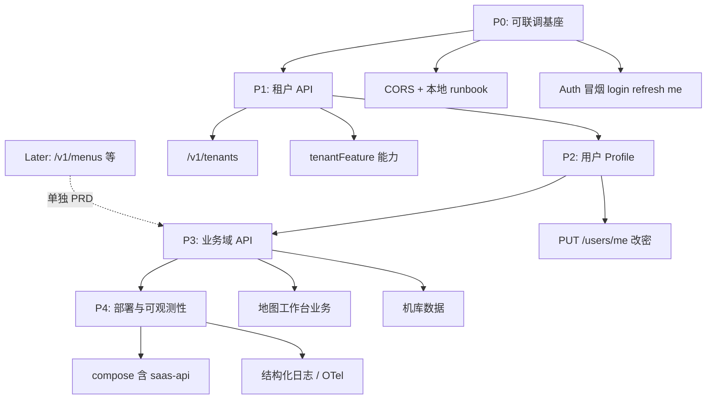

# services/ 后端开发计划

> 状态：Living doc · 2026-06-09（更新：菜单 / RuoYi 旧功能不在范围）  
> 关联：[backend-integration.md](./backend-integration.md)、[auth-rbac.md](./auth-rbac.md)、[java-backend-index](../../.cursor/skills/java-backend-index/SKILL.md)

## 范围说明

**当前 `services/` 计划只覆盖新 SaaS 能力，暂不承接旧系统迁移：**

- 不做 RuoYi `getRouters` / 动态菜单的 SaaS 替代
- 不做 `bootstrap-authenticated-app` 从 RuoYi 切到 SaaS 的整链迁移
- **`/v1/menus` 本期不排期** — 前端侧栏继续用 `mock-nav-items` + 本地 registry；登录仍可走 RuoYi

后续若需要服务端导航，再单独开 PRD 设计新契约（不必兼容 RuoYi `MenuRoute`）。

---

## 一、总体定位

`services/` 是 map-design 的 **SaaS 目标后端**，与前端 `@repo/api-client`（`/v1`、Bearer JWT、标准 HTTP 响应）对接，**不**走 RuoYi envelope。

当前前端仍以 `@repo/ruoyi-api` 为主；`services` 处于 **Auth MVP 已完成、业务 API 未启动** 阶段。

```
map-design/
├── services/
│   ├── pom.xml                 # Maven 父工程（仅 saas-api 模块）
│   ├── docker-compose.dev.yml  # PostgreSQL 16 + Redis 7
│   └── saas-api/               # 主 API 服务 (:8082)
```

---

## 二、已完成能力（Phase 0 · Auth MVP）

| 维度 | 状态 | 说明 |
| --- | --- | --- |
| 脚手架 | ✅ | Java 21、Spring Boot 3.3.6、Maven 多模块 |
| 数据库 | ✅ | Flyway V1–V3：基线表、auth 表、4 角色种子 |
| 认证接口 | ✅ | `POST /v1/auth/login`、`/refresh`、`/logout` |
| 用户会话 | ✅ | `GET /v1/users/me` |
| 安全 | ✅ | JWT access/refresh、Spring Security 6、`JwtAuthFilter` |
| RBAC | ✅ | `PLATFORM_ADMIN` / `TENANT_ADMIN` / `MEMBER` / `VIEWER` |
| 多租户（应用层） | 🟡 部分 | `TenantContext` + MyBatis-Plus 租户拦截（仅 `sys_user`） |
| Refresh 存储 | ✅ | dev 用 Redis，test 用 InMemory |
| 错误体 | ✅ | RFC 7807 `ProblemDetail` |
| OpenAPI | ✅ | SpringDoc 已配置 |
| 测试 | ✅ | `mvn -pl saas-api test` 全部通过（H2 + MockMvc） |
| 开发种子 | ✅ | `scripts/seed-demo-dev.sql`（`admin@demo.local` / `password`） |

### 与前端契约对齐

- `@repo/auth` 的 `loginResponseSchema`（`accessToken`、`refreshToken`、`expiresIn`、`user.name/roles/tenant`）与后端 DTO 一致
- `apps/web` 已配置 `VITE_API_URL` + vite `/v1` 代理 → `:8082`
- **登录链路尚未切换**：`saas-auth-ruoyi` 仍走 RuoYi `/login`

### 本地验证命令

```bash
# 依赖
docker compose -f services/docker-compose.dev.yml up -d

# 启动 API
mvn -f services/pom.xml -pl saas-api spring-boot:run -Dspring-boot.run.profiles=dev

# 种子数据（首次）
docker exec -i services-postgres-1 psql -U saas -d saas < services/saas-api/scripts/seed-demo-dev.sql

# 冒烟
curl http://localhost:8082/actuator/health
curl -X POST http://localhost:8082/v1/auth/login \
  -H 'Content-Type: application/json' \
  -d '{"email":"admin@demo.local","password":"password","tenantId":"demo"}'

# 测试
mvn -f services/pom.xml -pl saas-api test
```

---

## 三、缺口与风险

| 缺口 | 影响 | 优先级 |
| --- | --- | --- |
| ~~**CORS**~~ | ✅ `CorsConfig` + `SecurityConfig.cors()`；`/v1/**` 允许 `saas.cors.allowed-origins` | — |
| **租户 API 缺失** | TeamSwitcher、`tenantFeature` 门控仍靠 mock | P1 |
| **PostgreSQL RLS 未做** | ADR-0004 仍为 Proposed，仅应用层 `tenant_id` 过滤 | P1 |
| **用户 Profile / 改密** | SaaS 侧尚无 profile 写接口（旧 RuoYi profile 不在迁移范围） | P2 |
| **`/v1/admin/**` 空壳** | Security 已配置 `hasRole("PLATFORM_ADMIN")`，无 Controller | P2 |
| **业务 API 为零** | 地图、专题、机库等无后端 | P3 |
| **Docker 全栈未含 saas-api** | `deploy/docker-compose` 仅 saas-web + cloud-uav | P2 |
| **Testcontainers** | 测试用 H2，与生产 PG 行为可能有差异 | P3 |
| ~~**`SessionDto.expiresAt`**~~ | ✅ 取自 JWT `exp`，毫秒时间戳 | — |

### 本期明确不做（Later）

| 项 | 说明 |
| --- | --- |
| **`/v1/menus`** | 不替代 RuoYi；导航由前端 mock / registry 承担 |
| **RuoYi bootstrap 迁移** | 登录、菜单、profile 整链切换不在本期 |
| **OAuth2/OIDC** | 远期；当前 Email/Password + JWT 足够 |

---

## 四、开发路线总览



---

## 五、迭代任务清单

### Sprint A · P0 — 本地可联调（约 2–3 天）

**目标：** 前端配置 `VITE_API_URL` 后，能完成 SaaS 登录 + refresh + `/users/me`。

| # | 任务 | 产出 | Skill |
| --- | --- | --- | --- |
| A-01 | ~~实现 CORS 配置 Bean~~ ✅ | `CorsConfig` + `CorsProperties` | `java-rest-api` |
| A-02 | ~~补充 `local-dev.md` services 启动步骤~~ ✅ | [local-dev.md](../runbooks/local-dev.md#saas-api) | `java-spring-boot-scaffold` |
| A-03 | ~~端到端冒烟~~ ✅ | [saas-api-auth-smoke.md](../runbooks/saas-api-auth-smoke.md) + `pnpm smoke:saas-api` | `webapp-testing` |
| A-04 | ~~修复 `SessionDto.expiresAt`~~ ✅ | JWT `exp` → 毫秒 epoch | `java-rest-api` |

**验收：**

- [x] `pnpm smoke:saas-api` 通过（login → me → refresh → me）
- [x] 独立页 `/dev/saas-auth-smoke`（`VITE_API_URL=/v1`）可验证 `@repo/auth` + `api-client`
- [x] **不要求**替换现有 RuoYi 登录页

---

### Sprint B · P1 — 租户 API（约 1 周）

**目标：** 为新功能提供租户上下文与能力门控；导航仍由前端 mock 承担。

| # | 任务 | 产出 | 说明 |
| --- | --- | --- | --- |
| B-01 | ~~`GET /v1/tenants`~~ ✅ | `TenantsController` + 同邮箱多租户成员 | TeamSwitcher 数据源 |
| B-02 | ~~`GET /v1/tenants/{id}/features`~~ ✅ | `TenantFeaturesResponse` + 成员校验 | 对接 `tenantFeature` 门控 |
| B-03 | ~~Flyway `V4__tenant_features.sql`~~ ✅ | `sys_tenant_feature` 表 | 与 B-02 一并交付 |
| B-04 | 敲定 [ADR-0004](../adr/0004-tenant-isolation-strategy.md) | JWT `tenant_id` claim 定稿 | 文档 Accepted |
| B-05 | PostgreSQL RLS 策略（`sys_user` 起步） | Flyway `V5__rls.sql` | 可选与本 Sprint 并行 |

**验收：**

- [ ] TeamSwitcher 可拉取真实租户列表
- [ ] `filterNavByTenant` 可接 `tenantFeature` API
- [x] MockMvc 覆盖 tenants + features

---

### Sprint C · P2 — 用户 Profile（约 3–5 天）

**目标：** SaaS 用户自助能力；与 RuoYi profile **并行存在**，不做迁移切换。

| # | 任务 | 产出 |
| --- | --- | --- |
| C-01 | `PUT /v1/users/me` — 更新 displayName 等 | 用户资料写接口 |
| C-02 | `POST /v1/users/me/password` | 改密 |
| C-03 | 前端可选：Account Sheet 增加 SaaS profile 入口 | 仅新 API 消费方，不动 RuoYi 链路 |

**验收：**

- [ ] Bearer token 下可更新 profile / 改密
- [ ] 现有 RuoYi 登录与菜单行为不变

---

### Sprint D · P3 — 业务域与部署（按产品优先级）

与 [产品路线图](../product/roadmap.md) 对齐：

| 业务 | 后端任务 | 前端依赖 |
| --- | --- | --- |
| 租户能力门控 | B-02 features API | `filterNavByTenant` 接真实数据 |
| 机库 Dock | `/v1/uav/*` 机库/直播元数据 | uav-workspace |
| 地图插件 | `/v1/layers`、`/v1/projects` 等 | Phase C MapProvider |
| Admin App | `/v1/admin/tenants` CRUD | apps/admin scaffold |

**部署：**

- [ ] `deploy/docker-compose.yml` 增加 `saas-api` 服务
- [ ] Nginx 增加 `/v1` 反代
- [ ] 构建时注入 `VITE_API_URL`

---

## 六、与前端路线图对齐

| 前端 roadmap 项 | 后端依赖 | 建议顺序 |
| --- | --- | --- |
| 租户能力门控 | `/v1/tenants/{id}/features` | Sprint B |
| Phase C MapProvider | 无硬依赖（插件本地） | 可并行 |
| 机库 Dock 真实数据 | `/v1/uav/*` | Sprint D |
| 侧栏 / 菜单 | **无**（继续 mock-nav + registry） | 不在 services 范围 |
| SaaS Auth 新接口联调 | Sprint A 完成 | **当前重点** |

---

## 七、建议立即开工的 3 件事

1. ~~**A-01 CORS**~~ ✅ 已完成
2. ~~**A-03 Auth 冒烟**~~ ✅ 已完成
3. **B-01 `/v1/tenants` + features** — 解锁租户能力门控（Sprint A 已完成）

---

## 八、技术债备忘（不阻塞当前迭代）

- `SysUserRole` 缺 `@TableId` 警告（MyBatis-Plus）
- MapStruct 已在 POM 声明但未使用
- 测试环境 H2 与生产 PG 差异（后续引入 Testcontainers）
- OAuth2/OIDC 为远期目标（X-01），当前 Email/Password + JWT 足够

---

## 九、参考

| 文档 / Skill | 说明 |
| --- | --- |
| [backend-integration.md](./backend-integration.md) | API 双轨与迁移路径 |
| [auth-rbac.md](./auth-rbac.md) | 角色矩阵与 Session 流 |
| [multi-tenancy.md](./multi-tenancy.md) | 租户隔离策略 |
| [ADR-0005](../adr/0005-ruoyi-transitional-backend.md) | RuoYi 过渡策略 |
| `java-backend-index` | Skill 路由与目录约定 |
| `java-auth-security` | JWT / RBAC 实现清单 |
| `java-rest-api` | REST 端点与 OpenAPI 规范 |
