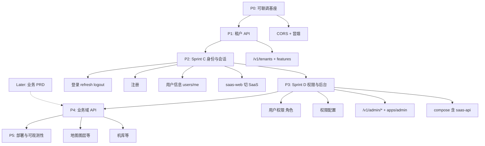

# services/ 后端开发计划

> 状态：Living doc · 2026-06-09（更新：Sprint C/D 聚焦身份·权限·后台基础，业务域 API 后移）  
> 关联：[backend-integration.md](./backend-integration.md)、[auth-rbac.md](./auth-rbac.md)、[java-backend-index](../../.cursor/skills/java-backend-index/SKILL.md)

## 范围说明

**Sprint C / D 范围：平台基础能力，不设计具体业务模块**（地图图层、机库、专题等一律后移）。

| 阶段 | 主题 | 包含 |
| --- | --- | --- |
| **Sprint C** | 身份与会话 | 登录、**注册**、用户信息（读/写/改密）、saas-web 切 SaaS 会话 |
| **Sprint D** | 权限与后台 | 用户权限、权限配置、**`/v1/admin/*` 后台管理**、部署基座 |

**Sprint C 起 saas-web 不再依赖 RuoYi 会话：**

- **登录 / 注册 / 刷新 / 登出** → `/v1/auth/*`
- **用户信息** → `GET/PUT /v1/users/me`、`POST /v1/users/me/password`
- **Bootstrap** → `users/me` + mock-nav + `filterNavByTenant`（**非** RuoYi `getInfo`/`getRouters`）

**仍不做（Sprint C/D 内）：**

- **`/v1/menus`**、RuoYi 动态菜单
- **业务域 API**：`/v1/layers`、`/v1/uav/*`、地图/机库/专题等（单独 Sprint，待基础盘稳定后）

后续业务模块按产品 PRD 排期，不挤占 C/D 容量。

---

## 一、总体定位

`services/` 是 map-design 的 **SaaS 目标后端**，与前端 `@repo/api-client`（`/v1`、Bearer JWT、标准 HTTP 响应）对接，**不**走 RuoYi envelope。

当前前端**仍临时**走 RuoYi 登录与 bootstrap。`services` 处于 **Auth MVP + 租户 API 已完成**；下一步 **C/D 补齐注册、权限、后台管理**，**暂不启动**地图/机库等业务 API。

```
map-design/
├── services/
│   ├── pom.xml                 # Maven 父工程（仅 saas-api 模块）
│   ├── docker-compose.dev.yml  # PostgreSQL 16 + Redis 7
│   └── saas-api/               # 主 API 服务 (:8082)
```

---

## 二、已完成能力（Phase 0 · Auth MVP）


| 维度         | 状态    | 说明                                                           |
| ---------- | ----- | ------------------------------------------------------------ |
| 脚手架        | ✅     | Java 21、Spring Boot 3.3.6、Maven 多模块                          |
| 数据库        | ✅     | Flyway V1–V3：基线表、auth 表、4 角色种子                               |
| 认证接口       | ✅     | `POST /v1/auth/login`、`/refresh`、`/logout`                   |
| 用户会话       | ✅     | `GET /v1/users/me`                                           |
| 安全         | ✅     | JWT access/refresh、Spring Security 6、`JwtAuthFilter`         |
| RBAC       | ✅     | `PLATFORM_ADMIN` / `TENANT_ADMIN` / `MEMBER` / `VIEWER`      |
| 多租户（应用层）   | 🟡 部分 | `TenantContext` + MyBatis-Plus 租户拦截（仅 `sys_user`）            |
| Refresh 存储 | ✅     | dev 用 Redis，test 用 InMemory                                  |
| 错误体        | ✅     | RFC 7807 `ProblemDetail`                                     |
| OpenAPI    | ✅     | SpringDoc 已配置                                                |
| 测试         | ✅     | `mvn -pl saas-api test` 全部通过（H2 + MockMvc）                   |
| 开发种子       | ✅     | `scripts/seed-demo-dev.sql`（`admin@demo.local` / `password`） |


### 与前端契约对齐

- `@repo/auth` 的 `loginResponseSchema`（`accessToken`、`refreshToken`、`expiresIn`、`user.name/roles/tenant`）与后端 DTO 一致
- `apps/web` 已配置 `VITE_API_URL` + vite `/v1` 代理 → `:8082`
- **登录 / bootstrap 待 Sprint C 切换**：当前仍走 RuoYi；目标为 SaaS `/v1/auth/login` + mock-nav bootstrap

### 本地验证命令

```bash
# 依赖
docker compose -f services/docker-compose.dev.yml up -d

# 启动 API
mvn -f services/pom.xml -pl saas-api spring-boot:run -Dspring-boot.run.profiles=dev

# 种子数据（首次）
docker exec -i services-postgres-1 psql -U saas -d saas < services/saas-api/scripts/seed-demo-dev.sql

# 冒烟
curl http://localhost:8082/actuator/health
curl -X POST http://localhost:8082/v1/auth/login \
  -H 'Content-Type: application/json' \
  -d '{"email":"admin@demo.local","password":"password","tenantId":"demo"}'

# 测试
mvn -f services/pom.xml -pl saas-api test
```

---

## 三、缺口与风险


| 缺口                             | 影响                                                                               | 优先级 |
| ------------------------------ | -------------------------------------------------------------------------------- | --- |
| ~~**CORS**~~                   | ✅ `CorsConfig` + `SecurityConfig.cors()`；`/v1/`** 允许 `saas.cors.allowed-origins` | —   |
| ~~**租户 API 缺失**~~              | ✅ `/v1/tenants` + `/features`；前端接真实 API 待联调                                      | —   |
| ~~**PostgreSQL RLS 未做**~~      | ✅ `sys_user` RLS（`V5__rls.sql` + `TenantRlsDataSource`）                           | —   |
| **工作台会话仍走 RuoYi**           | Sprint C：登录、注册、用户信息、bootstrap 切 SaaS                                      | P2  |
| **注册 / 用户资料写接口**            | Sprint C：`POST /v1/auth/register`、`PUT /v1/users/me`、改密                         | P2  |
| **RBAC / 权限配置 / 后台管理**       | Sprint D：`sys_permission`、角色绑定、`/v1/admin/*`、apps/admin 对接                    | P2  |
| `**/v1/admin/`** 空壳**          | Security 已有 `PLATFORM_ADMIN` 占位；Controller 与 Admin UI 排 Sprint D                 | P2  |
| **业务域 API**                    | 地图、机库、专题等 — **Sprint C/D 不做**，待基础能力验收后另开迭代                                    | Later |
| **Docker 全栈未含 saas-api**       | `deploy/docker-compose` 仅 saas-web + cloud-uav                                   | P2  |
| **Testcontainers**             | 测试用 H2，与生产 PG 行为可能有差异                                                            | P3  |
| ~~`**SessionDto.expiresAt`**~~ | ✅ 取自 JWT `exp`，毫秒时间戳                                                             | —   |


### 本期明确不做（Later）


| 项 | 说明 |
| --- | --- |
| **`/v1/menus`** | 无 SaaS 菜单 API；侧栏 mock / registry |
| **地图 / 机库 / 专题等业务 API** | Sprint C/D **不设计**；基础盘（登录·注册·权限·后台）完成后再开 |
| **OAuth2/OIDC** | 远期；C/D 用 Email/Password + JWT |
| **邮箱验证 / 邀请注册** | 可做为 Sprint C 拉伸项，非阻塞首版注册 |


---

## 四、开发路线总览




---

## 五、迭代任务清单

### Sprint A · P0 — 本地可联调（约 2–3 天）

**目标：** 前端配置 `VITE_API_URL` 后，能完成 SaaS 登录 + refresh + `/users/me`。


| #    | 任务                                    | 产出                                                                                   | Skill                       |
| ---- | ------------------------------------- | ------------------------------------------------------------------------------------ | --------------------------- |
| A-01 | ~~实现 CORS 配置 Bean~~ ✅                 | `CorsConfig` + `CorsProperties`                                                      | `java-rest-api`             |
| A-02 | ~~补充 `local-dev.md` services 启动步骤~~ ✅ | [local-dev.md](../runbooks/local-dev.md#saas-api)                                    | `java-spring-boot-scaffold` |
| A-03 | ~~端到端冒烟~~ ✅                           | [saas-api-auth-smoke.md](../runbooks/saas-api-auth-smoke.md) + `pnpm smoke:saas-api` | `webapp-testing`            |
| A-04 | ~~修复 `SessionDto.expiresAt~~` ✅       | JWT `exp` → 毫秒 epoch                                                                 | `java-rest-api`             |


**验收：**

- [x] `pnpm smoke:saas-api` 通过（login → me → refresh → me）
- [x] 独立页 `/dev/saas-auth-smoke`（`VITE_API_URL=/v1`）可验证 `@repo/auth` + `api-client`
- [x] A 阶段仅要求冒烟与 `/dev/saas-auth-smoke`；**主登录页切换排 Sprint C**

---

### Sprint B · P1 — 租户 API（约 1 周）

**目标：** 为新功能提供租户上下文与能力门控；导航仍由前端 mock 承担。


| #    | 任务                                                      | 产出                              | 说明                    |
| ---- | ------------------------------------------------------- | ------------------------------- | --------------------- |
| B-01 | ~~`GET /v1/tenants`~~ ✅                                 | `TenantsController` + 同邮箱多租户成员  | TeamSwitcher 数据源      |
| B-02 | ~~`GET /v1/tenants/{id}/features`~~ ✅                   | `TenantFeaturesResponse` + 成员校验 | 对接 `tenantFeature` 门控 |
| B-03 | ~~Flyway `V4__tenant_features.sql~~` ✅                  | `sys_tenant_feature` 表          | 与 B-02 一并交付           |
| B-04 | ~~敲定 [ADR-0004](../adr/0004-tenant-isolation-strategy.md)~~ ✅ | JWT `tenant_id` claim 定稿        | 文档 Accepted           |
| B-05 | ~~PostgreSQL RLS 策略（`sys_user` 起步）~~ ✅                    | `migration-postgresql/V5__rls.sql` | 补充说明见 [tenant-rls-b05.md](./supplements/tenant-rls-b05.md) |


**验收：**

- [x] TeamSwitcher 可拉取真实租户列表
- [x] `filterNavByTenant` 可接 `tenantFeature` API
- [x] MockMvc 覆盖 tenants + features

---

### Sprint C · P2 — 身份与会话基础（约 1–2 周）

**目标：** 完成 **登录、注册、用户信息** 与 saas-web 会话切 SaaS；**不涉及**业务域模块与后台权限配置（留 Sprint D）。

**原则：** 先打通「谁能登录、谁能注册、谁能改自己的资料」；侧栏仍 mock-nav。

#### 后端（saas-api）

| # | 任务 | 产出 |
| --- | --- | --- |
| C-01 | 登录（已有，补 OpenAPI/测试） | `POST /v1/auth/login`、`/refresh`、`/logout` |
| C-02 | **注册** | `POST /v1/auth/register`（email + password + tenant slug；首版可无邮箱验证） |
| C-03 | **用户信息 · 读** | `GET /v1/users/me`（SessionDto 含 roles、tenant、expiresAt） |
| C-04 | **用户信息 · 写** | `PUT /v1/users/me`（displayName 等可改字段） |
| C-05 | **改密** | `POST /v1/users/me/password`（旧密码 + 新密码） |

#### 前端（saas-web）

| # | 任务 | 产出 |
| --- | --- | --- |
| C-06 | 登录页切 SaaS | `routes/login.tsx` → `/v1/auth/login`；`VITE_API_URL` + refresh/logout |
| C-07 | **注册页** | `routes/register.tsx`（或等价入口）→ `/v1/auth/register` |
| C-08 | Bootstrap 去 RuoYi | `GET /v1/users/me`；移除 `getUserInfo` / `getMenuRouters` |
| C-09 | 侧栏 mock bootstrap | `mock-nav-items` + `filterNavByTenant`（features API） |
| C-10 | Account / 用户信息 UI | 读写信走 `/v1/users/me*` |
| C-11 | TeamSwitcher | `GET /v1/tenants`；切换租户 = 重新登录 |
| C-12 | 清理 RuoYi 会话依赖 | 下线 bootstrap 对 `ruoyi-api`、`ruoyi-profile-store` 的会话路径 |

**验收：**

- [ ] 可注册、登录、刷新、登出（SaaS JWT）
- [ ] 可查看与更新当前用户信息、改密
- [ ] saas-web 主路径**不**调用 RuoYi 登录 / `getInfo` / `getRouters` / profile
- [ ] `pnpm smoke:saas-api` 与 `pnpm --filter @repo/saas-web validate` 通过

---

### Sprint D · P3 — 权限与后台管理基础（约 1–2 周）

**目标：** **用户权限、权限配置、平台/租户后台管理** 最小可用；**仍不做**地图、机库、专题等业务 API。

#### 后端（saas-api）

| # | 任务 | 产出 |
| --- | --- | --- |
| D-01 | 权限模型 | Flyway：`sys_permission`、`sys_role_permission`（或等价）；种子基础权限码 |
| D-02 | **用户权限** | JWT / `users/me` 返回有效权限集；`@PreAuthorize` 与权限码对齐 |
| D-03 | **权限配置 API** | `PLATFORM_ADMIN`：`GET/PUT /v1/admin/roles/{id}/permissions` 等 |
| D-04 | 租户管理 | `GET/POST/PATCH /v1/admin/tenants`（列表、创建、启停/计划） |
| D-05 | 用户管理 | `GET /v1/admin/users`、租户内成员邀请/禁用（最小 CRUD） |
| D-06 | 租户管理员能力 | `TENANT_ADMIN`：`/v1/admin/tenants/{id}/members` 成员与角色分配 |

#### 前端

| # | 任务 | 产出 |
| --- | --- | --- |
| D-07 | **apps/admin** 脚手架 | 登录（SaaS）、布局、路由；对接 `/v1/admin/*` |
| D-08 | 后台基础页 | 租户列表、用户列表、角色/权限配置 UI（表格 + 表单） |
| D-09 | saas-web 权限门控 | `requireRole` / 权限码与 Sprint D API 一致；去掉 RuoYi 权限转换依赖 |
| D-10 | 部署基座 | `deploy/docker-compose` 含 `saas-api`；Nginx `/v1` 反代；`VITE_API_URL` 注入 |

**验收：**

- [ ] `PLATFORM_ADMIN` 可管理租户、查看用户、配置角色权限
- [ ] `TENANT_ADMIN` 可管理本租户成员与角色（范围内）
- [ ] 普通用户权限仅来自 SaaS，不依赖 RuoYi `getInfo` 权限串
- [ ] Admin 与 saas-api 本地 Docker 栈可联调

---

### Sprint E · Later — 业务域 API（单独排期）

**不在 Sprint C/D 设计或实现。** 待身份、权限、后台基础验收后，按 [产品路线图](../product/roadmap.md) 拆 PRD：

| 域 | 示例 API | 前端 |
| --- | --- | --- |
| 地图工作台 | `/v1/layers`、`/v1/projects` | MapProvider / 插件 |
| 机库 | `/v1/uav/*` | uav-workspace |
| 其它专题 | 按 PRD | mock-nav 已有入口 |

---

## 六、与前端路线图对齐


| 前端 / 产品项 | 后端依赖 | 建议顺序 |
| --- | --- | --- |
| 租户能力门控 | `/v1/tenants/{id}/features` | Sprint B ✅ |
| 登录 · 注册 · 用户信息 | `/v1/auth/*`、`/v1/users/me*` | **Sprint C** |
| 权限 · 后台管理 | `/v1/admin/*`、权限表 | **Sprint D** |
| 侧栏 / 菜单 | mock-nav（无 `/v1/menus`） | Sprint C 前端 |
| Phase C MapProvider | 插件本地，无硬依赖 | Sprint E 前可并行 UI |
| 机库 / 地图业务数据 | `/v1/uav/*`、`/v1/layers` 等 | **Sprint E（Later）** |


---

## 七、建议立即开工的 3 件事

1. ~~**A-01 CORS**~~ ✅ 已完成
2. ~~**A-03 Auth 冒烟**~~ ✅ 已完成
3. **Sprint C** — 登录、注册、用户信息 + saas-web 切 SaaS（Sprint B 已完成）
4. **Sprint D** — 用户权限、权限配置、`/v1/admin/*` + apps/admin（**不做业务域 API**）

---

## 八、技术债备忘（不阻塞当前迭代）

- `SysUserRole` 缺 `@TableId` 警告（MyBatis-Plus）
- MapStruct 已在 POM 声明但未使用
- 测试环境 H2 与生产 PG 差异（后续引入 Testcontainers）
- OAuth2/OIDC 为远期目标（X-01），当前 Email/Password + JWT 足够

---

## 九、参考


| 文档 / Skill                                            | 说明                  |
| ----------------------------------------------------- | ------------------- |
| [backend-integration.md](./backend-integration.md)    | API 双轨与迁移路径         |
| [auth-rbac.md](./auth-rbac.md)                        | 角色矩阵、Sprint C/D 目标 |
| [apps.md](./apps.md)                                  | web / admin 路由与 Sprint |
| [multi-tenancy.md](./multi-tenancy.md)                | 租户隔离策略              |
| [ADR-0005](../adr/0005-ruoyi-transitional-backend.md) | RuoYi 过渡与下线节奏       |
| `java-backend-index`                                  | Skill 路由与目录约定       |
| `java-auth-security`                                  | JWT / RBAC 实现清单     |
| `java-rest-api`                                       | REST 端点与 OpenAPI 规范 |
| `saas-auth-ruoyi`                                     | saas-web 会话迁移前端清单  |

---

## 十、执行指引（由你指定开工项）

文档已对齐：**Sprint C/D = 平台基础；Sprint E = 业务域（Later）**。实现顺序由你指定，可用任务编号点名，例如「先做 C-02 + C-06」或「只做 D 后端」。

### 任务索引（可复制）

| 编号 | Sprint | 简述 |
| --- | --- | --- |
| C-01～C-05 | C | 后端：登录补全、**注册**、`users/me` 读写改密 |
| C-06～C-12 | C | 前端：登录/注册页、bootstrap 去 RuoYi、Account、TeamSwitcher |
| D-01～D-06 | D | 后端：权限表、权限 API、`/v1/admin/*` 租户/用户/成员 |
| D-07～D-10 | D | 前端：apps/admin、权限门控、Docker 部署 |
| E-* | Later | 地图、机库、专题等业务 API — **未排细项** |

### 建议默认顺序（仅供参考，非强制）

1. **C-02** 注册 API → **C-04/C-05** 用户写接口 → **C-06/C-07** 登录/注册页  
2. **C-08～C-12** bootstrap 与 RuoYi 清理  
3. **D-01～D-06** 权限与 admin API → **D-07～D-10** Admin 与部署  

你指定后，按编号在对应 Skill（`java-rest-api`、`java-auth-security`、`saas-auth-ruoyi`、`saas-fsd-feature`）下实现即可。


