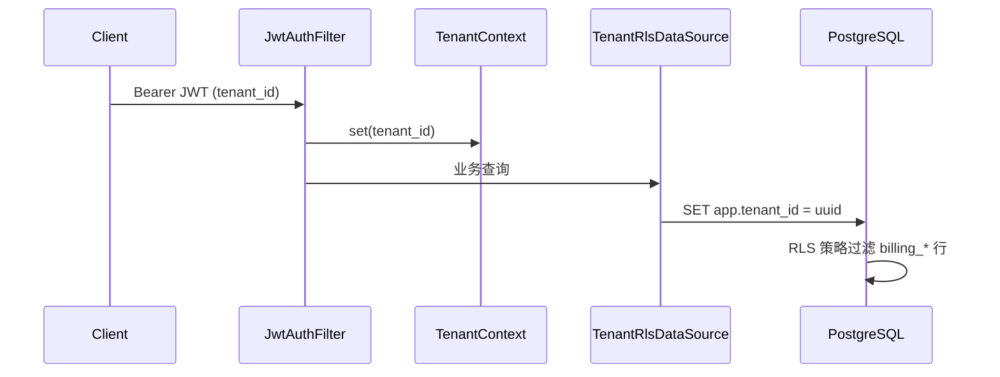

# 补充材料：billing-api PostgreSQL RLS 说明

> 关联：[billing-service.md](../billing-service.md) §Sprint F 安全与稳定性改进、[tenant-rls-b05.md](./tenant-rls-b05.md)、[ADR-0004](../../adr/0004-tenant-isolation-strategy.md)

## 一句话

**billing-api 在独立 PostgreSQL 库（或与 saas 共享 PG）上为 `billing_*` 及 membership 镜像表启用 RLS**，使数据库层强制按 JWT `tenant_id` 过滤行；internal/admin/webhook/定时 Job 通过受控 Bypass 跨租户操作。与 saas-api B-05 模式一致，会话变量同为 `app.tenant_id` / `app.bypass_tenant_rls`。

---

## 作用范围

Flyway `migration-postgresql/V12__billing_tenant_rls.sql` 对下列表启用 `FORCE ROW LEVEL SECURITY`：

| 表 | 说明 |
| --- | --- |
| `billing_wallet` | 租户/用户钱包 |
| `billing_ledger` | 账本流水 |
| `billing_recharge_order` | 充值订单 |
| `billing_consumption_record` | 消费记录 |
| `billing_signup_bonus_pending` | 注册赠送 outbox |
| `billing_notification` | 站内通知 |
| `billing_invoice_request` | 发票申请 |
| `billing_coupon_redemption` | 优惠券兑换 |
| `billing_wire_transfer_request` | 对公转账申请 |
| `sys_tenant_feature` | 租户功能镜像（membership） |
| `sys_user` | 仅当尚无 saas-api `sys_user_tenant_access` 策略时补建 |

策略函数 `billing_tenant_rls_predicate(tenant_col)` 与 saas-api 语义相同：匹配 `app.tenant_id` 或 `app.bypass_tenant_rls = on`。

---

## 请求路径



### 租户用户 API（`/v1/billing/*`）

JWT 经 `JwtAuthFilter` 写入 `TenantContext` → 连接借出时 `SET app.tenant_id` → 应用层 Service 仍带 `tenant_id` 条件，数据库 RLS 再筛一遍。

### Bypass 路径（跨租户受信）

| 场景 | 机制 |
| --- | --- |
| `/internal/**` | `TenantRlsScopeFilter` → `TenantRlsBypass` |
| `/v1/admin/billing/**` | 同上（平台 Admin） |
| `/v1/billing/webhooks/**` | 同上（支付回调） |
| 定时 Job | 代码内 `TenantRlsBypass.run(...)`（订单过期、退款补偿、membership sync 等） |

前端**无法**通过 header 触发 Bypass；仅服务端显式开启。

---

## 配置

| 项 | 默认 | 说明 |
| --- | --- | --- |
| `billing.tenant-rls.enabled` | `true`（dev/docker） | 关闭时不包装 DataSource、不加载 PG 迁移 |
| `BILLING_TENANT_RLS_ENABLED` | Docker env 映射上述开关 | 见 [docker-deployment.md](../../runbooks/docker-deployment.md) |
| Flyway | `classpath:db/migration,classpath:db/migration-postgresql` | H2/test profile **不**加载 `V12` |

| Profile | RLS | 迁移 |
| --- | --- | --- |
| dev + PostgreSQL | 开 | V12 自动应用 |
| test（H2） | 关 | 仅 `db/migration` |
| docker | 开（可 env 关闭） | V12 |

---

## 与 saas-api RLS 的关系

| 维度 | saas-api（B-05） | billing-api（sec RLS） |
| --- | --- | --- |
| 迁移 | `V5__rls.sql` | `V12__billing_tenant_rls.sql` |
| 表 |  primarily `sys_user` | `billing_*` + 镜像表 |
| 共享 PG | 各自进程、各自 `TenantRlsDataSource` | 若同库，`sys_user` 跳过重复建策略 |
| 会话变量 | `app.tenant_id` / `app.bypass_tenant_rls` | **相同** |

billing-api **不**拦截 `suspended` 租户充值/扣费；停用仅在 saas-api 登录层拒绝（见 PRD）。

---

## 验证

**冒烟（RLS 开启）：**

```bash
pnpm dev:services          # 或 --no-infra 若 PG 已在跑
pnpm smoke:billing-api     # 24 步（mock），含 membership 内网探活
```

**数据库：**

```sql
SELECT relname, relrowsecurity, relforcerowsecurity
FROM pg_class
WHERE relname LIKE 'billing_%'
ORDER BY relname;

SELECT polname, tablename FROM pg_policies
WHERE tablename LIKE 'billing_%';
```

**单测：**

```bash
mvn -f services/pom.xml -pl billing-api test -q "-Dtest=TenantRlsBypassTest"
```

---

## 代码与迁移索引

| 类型 | 路径 |
| --- | --- |
| Flyway（仅 PG） | `services/billing-api/src/main/resources/db/migration-postgresql/V12__billing_tenant_rls.sql` |
| 连接包装 | `.../config/TenantRlsDataSource.java` |
| 条件装配 | `.../config/TenantRlsDataSourceConfiguration.java` |
| Bypass | `.../security/TenantRlsBypass.java` |
| HTTP Bypass 入口 | `.../security/TenantRlsScopeFilter.java` |
| 租户上下文 | `.../security/TenantContext.java` |
| 配置 | `application.yml` → `billing.tenant-rls.enabled` |
