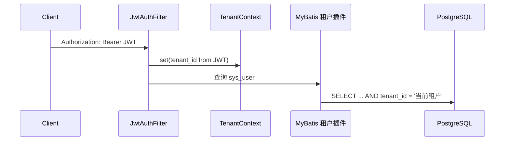
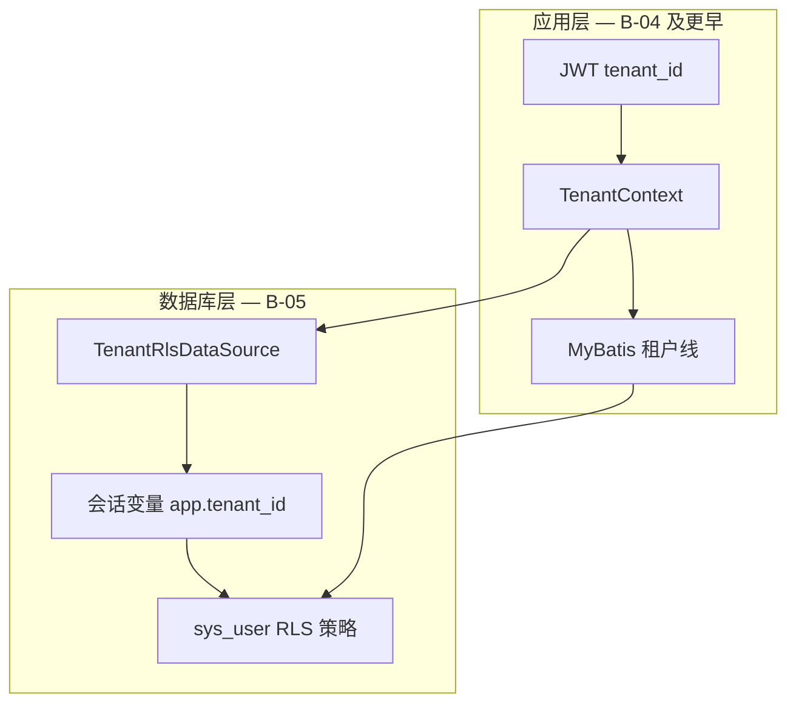

# 补充材料：B-05 PostgreSQL RLS 说明

> 关联：[services-development-plan.md](../services-development-plan.md) Sprint B-05、[multi-tenancy.md](../multi-tenancy.md)、[ADR-0004](../../adr/0004-tenant-isolation-strategy.md)

## 一句话

**B-05 在数据库里为 `sys_user` 增加行级安全（RLS）**，使 PostgreSQL 自动只返回当前租户的用户行；即使 Java 应用漏写 `WHERE tenant_id = ?`，或有人直连数据库，也无法轻易看到其他租户数据。这是对应用层租户过滤的**纵深防御**，不改变对外 API 行为。

---

## B-05 之前：只有应用层隔离

租户隔离主要靠 Java 栈内的三层机制：



| 层级 | 组件 | 作用 |
| --- | --- | --- |
| 认证 | `JwtAuthFilter` | 从 JWT 解析 `tenant_id` |
| 上下文 | `TenantContext` | 请求级 ThreadLocal 保存租户 UUID |
| 查询 | `SaasTenantLineHandler` | 对 `sys_user` 等表白名单自动追加 `tenant_id` 条件 |

这在**正常开发路径**下有效，但安全仍完全依赖「应用别写错」：

| 风险 | 举例 |
| --- | --- |
| 代码漏过滤 | 新 Mapper 未走租户插件 |
| 手写 SQL 疏漏 | 忘记租户条件或误用 `@InterceptorIgnore` |
| 直连数据库 | `psql` 连库可查全表 |
| 协作成本 | 规则分散在多处，难以统一审计 |

---

## B-05 之后：数据库强制执行

在 PostgreSQL 上对 `sys_user` 启用 **RLS（Row Level Security）**：

```sql
-- 迁移：db/migration-postgresql/V5__rls.sql（简化理解）
ALTER TABLE sys_user ENABLE ROW LEVEL SECURITY;
ALTER TABLE sys_user FORCE ROW LEVEL SECURITY;

-- 策略：仅当会话变量匹配时才可见该行
-- tenant_id = current_setting('app.tenant_id')::uuid
-- 或 app.bypass_tenant_rls = 'on'（受信服务端路径）
```

`FORCE ROW LEVEL SECURITY` 表示连表所有者（`saas` 连接用户）也受策略约束，不能仅靠 owner 身份绕过。

可类比为：**文件柜本身上了锁**——前台系统（Java）有 bug 时，柜子这层仍在。

---

## 双层防护总览



| 层 | 职责 | 能否单独依赖 |
| --- | --- | --- |
| 应用层 | 业务校验、跨租户 API 权限、MyBatis 自动 WHERE | 可以跑通功能，但防不住疏漏 |
| 数据库层 RLS | 最后一道数据访问闸门 | **不能**替代业务逻辑（见下方 Bypass） |

两层使用**同一** `tenant_id` UUID（ADR-0004 定稿），语义一致。

---

## 会话变量与连接包装

每次从连接池取出连接、执行 SQL 前，`TenantRlsDataSource` 设置 PostgreSQL 会话变量：

| 会话变量 | 设置时机 | 含义 |
| --- | --- | --- |
| `app.tenant_id` | 已认证请求（JWT 含租户） | 当前活跃租户 UUID |
| `app.bypass_tenant_rls = on` | 受信服务端白名单路径 | 临时跳过 RLS |
| （均未设置） | 无租户、非 bypass | RLS 默认**看不到** `sys_user` 行 |

连接归还池时，Hikari `connectionInitSql` 会 `RESET` 上述变量，避免线程池串租户。

配置开关：

| Profile | `saas.tenant-rls.enabled` | Flyway `migration-postgresql` |
| --- | --- | --- |
| dev（PostgreSQL） | `true` | 加载，含 `V5__rls.sql` |
| test（H2 内存库） | `false` | **不加载**（H2 不支持该 RLS 方案） |

---

## 典型请求路径

### 已登录：例如 `GET /v1/users/me`

```
JWT tenant_id = demo 租户 UUID
  → JwtAuthFilter → TenantContext
  → 借连接 → SET app.tenant_id = '<uuid>'
  → 查 sys_user
  → 应用层 WHERE tenant_id = ...（MyBatis）
  → 数据库层 RLS 再筛一遍
```

### 未登录：`POST /v1/auth/login`

此时还没有 JWT，`TenantContext` 为空。若直接查 `sys_user`，RLS 会返回 0 行。

因此登录走 **`TenantRlsBypass`**：连接上 `SET app.bypass_tenant_rls = 'on'`，由服务端按邮箱 + slug 解析用户，**不**信任客户端指定租户 UUID。

---

## Bypass 白名单（服务端受信路径）

| 场景 | 实现 | 原因 |
| --- | --- | --- |
| 登录 `findForLogin` | `TenantRlsBypass.call(...)` | 尚无 JWT；需按邮箱跨租户匹配 slug |
| 租户列表 `findTenantsByUserEmail` | `TenantRlsBypass.call(...)` | 同邮箱多租户成员汇总 |
| Token 刷新 `refresh` | `TenantContext.withTenant(parsed.tenantId(), ...)` | 刷新端点不经 JwtAuthFilter，用 refresh token 内租户查用户 |

Bypass **仅**在服务端代码显式开启，前端无法通过 header 触发。

---

## 对使用与开发的影响

| 问题 | 答案 |
| --- | --- |
| 接口行为变了吗？ | **没有**。login / me / tenants / features 与 B-05 前一致 |
| 作用范围？ | 目前仅 **`sys_user`**；其他业务表随 Sprint 扩展 |
| 单元测试？ | H2 不加载 V5，MockMvc 测试不受影响 |
| 本地 dev？ | 启动 `saas-api`（PostgreSQL）后 Flyway 自动应用 V5 |
| 和 B-04 关系？ | B-04 定 JWT `tenant_id` 从哪来；B-05 定数据库如何强制使用该 ID |

验证 RLS 已启用（本地 Docker Postgres）：

```sql
SELECT relrowsecurity, relforcerowsecurity
FROM pg_class WHERE relname = 'sys_user';

SELECT polname FROM pg_policy
WHERE polrelid = 'sys_user'::regclass;
```

端到端：`pnpm smoke:saas-api`（login → me → refresh）应仍通过。

---

## 与 Sprint B 其他任务的关系

| 任务 | 与 B-05 关系 |
| --- | --- |
| B-04 ADR-0004 | 定稿 `tenant_id` 来源；RLS 策略读取同一 UUID |
| B-01 `/v1/tenants` | 跨租户成员查询依赖 Bypass + 业务校验 |
| B-02 `/features` | 不直接查 `sys_user` RLS；租户访问权仍在 Service 层校验 |
| 后续业务表 | 可复制「`tenant_id` 列 + 应用层插件 + RLS 策略」模式 |

---

## 代码与迁移索引

| 类型 | 路径 |
| --- | --- |
| Flyway（仅 PG） | `services/saas-api/src/main/resources/db/migration-postgresql/V5__rls.sql` |
| 连接包装 | `.../config/TenantRlsDataSource.java` |
| 条件装配 | `.../config/TenantRlsDataSourceConfiguration.java` |
| Bypass 标记 | `.../security/TenantRlsBypass.java` |
| 租户上下文 | `.../security/TenantContext.java` |
| 应用层租户线 | `.../config/SaasTenantLineHandler.java` |
| 配置 | `application.yml` → `saas.tenant-rls.enabled`、`flyway.locations` |

---

## 后续扩展

新增带 `tenant_id` 的业务表时建议：

1. Flyway 建表含 `tenant_id UUID NOT NULL`
2. `SaasTenantLineHandler.TENANT_TABLES` 注册表名（应用层）
3. 新 Flyway 迁移：`ENABLE ROW LEVEL SECURITY` + 与 `sys_user` 同模式的策略
4. 跨租户读仍需 Service 层权限校验 + 必要时 Bypass

Platform Admin **impersonation**（`act_as_tenant`）未实现；落地时需单独审计策略，不可长期依赖 Bypass。
