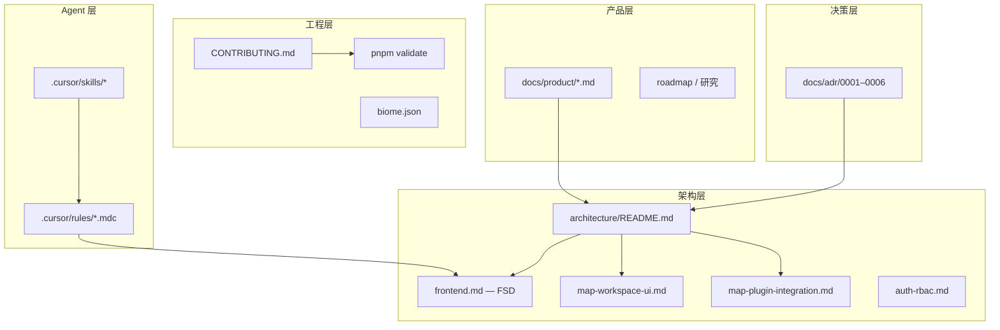

# map-design 项目标准分析

> **文档类型**：项目标准基线（Standards Baseline）  
> **版本**：v1.0  
> **日期**：2026-06  
> **受众**：产品、前端工程、设计、Agent Skill 编排  
> **来源**：`docs/architecture/`、`docs/adr/`、`docs/CONTRIBUTING.md`、`.cursor/rules/`、代码库现状

---

## Problem Statement

map-design 是 SaaS 地图工作台前端 monorepo，活跃开发集中在 `@repo/saas-web`，同时承载共享 packages、Cloud UAV 远程插件与三 App 拆分规划。标准分散在架构文档、ADR、Cursor Rules 与 Skill 中，新成员或写 PRD 时容易：

- 混淆两类「插件」（Map Tool Plugin vs Cloud ESM）与两种「Drawer」（L4 条带 vs Vaul Sheet）
- 违反 FSD 依赖方向或在 `apps/web` 重复造 shadcn 组件
- 将 RuoYi 过渡实现与目标 SaaS `/v1` API 混为一谈
- 在规格中写出无法映射到 `pnpm validate` 的验收标准

若不将现有标准收敛为可引用的基线，规格与实现之间会产生重复沟通、架构漂移与范围蔓延。

---

## Goals

1. **统一术语**：PRD、代码、文档对菜单 kind、UI 载体、API 双轨使用同一套定义。
2. **可执行验收**：每条 Must-Have 标准可映射到目录路径、命令或文档锚点。
3. **边界清晰**：明确活跃范围（saas-web）、禁止依赖（遗留 Vue 栈）、Non-Goals（i18n、后端大改）。
4. **规格 → 工程 handoff**：定稿 PRD 后可直接路由到对应实现 Skill（`saas-fsd-feature`、`map-workspace-ui` 等）。
5. **Agent 可消费**：Cursor Rules / Skills 与本文档章节一一对应，减少 Agent 即兴发挥。

---

## Non-Goals

| 非目标 | 理由 |
| --- | --- |
| 重写全部架构文档 | 本文是索引与决策摘要，细节仍以 `docs/architecture/` 为准 |
| 规定后端 RuoYi 改造方案 | 见 ADR-0005；前端仅封装 `@repo/ruoyi-api` |
| 覆盖遗留 `apps/yunyan-*` Vue 栈规范 | 与本 monorepo 隔离，Cloud UAV 宿主集成除外 |
| 定义 i18n / 多语言标准 | 当前未规划，UI 固定中文 |
| 一次性补齐 Marketing / Admin 实现标准 | 两 App 仍为占位，仅保留 ADR 级方向 |

---

## 标准体系总览



---

## User Stories

### 产品经理 / 写规格

- **As a** 产品经理，**I want** 一份带术语表与 Non-Goals 的标准基线，**so that** 新 PRD 不会提出与 monorepo 约束冲突的需求。
- **As a** 产品经理，**I want** 验收标准能映射到 FSD 路径与 `validate` 命令，**so that** 工程可直接拆解任务而无需二次翻译。

### 前端工程师

- **As a** 前端工程师，**I want** 明确的 FSD 分层与依赖方向，**so that** 新增 feature 不会引入循环依赖或违反 Public API 导出。
- **As a** 前端工程师，**I want** 地图工作台 UI 载体与 bridge 契约文档，**so that** 侧栏、Dock、浮层改动不会混用 Vaul 与 L4 条带。
- **As a** 前端工程师，**I want** shadcn 唯一实例与主题 token 规则，**so that** 浅色/深色模式表现一致。

### 设计 / QA

- **As a** 设计师，**I want** 知道工作台 L1–L4 层级与 presentation 类型，**so that** 交互稿与实现载体一致。
- **As a** QA，**I want** 登录守卫与 URL 深链行为的明确标准，**so that** 测试用例覆盖鉴权失败与工具状态恢复。

---

## Requirements

### Must-Have（P0）— 工程与仓库

| ID | 标准 | 验收标准 |
| --- | --- | --- |
| **E-01** | Monorepo 布局 | 根目录含 `apps/`、`packages/`、`cloud/`、`docs/`；包名 `@repo/*` |
| **E-02** | 依赖边界 | App → packages 单向；禁止 SaaS 代码 import `@taiyi/*`（cloud 宿主联调除外） |
| **E-03** | 工具链 | Biome 统一 lint/format；`pnpm --filter @repo/saas check` 通过 |
| **E-04** | 活跃 App | 功能默认落在 `@repo/saas-web`（`apps/web`） |
| **E-05** | 提交与文档 | Conventional Commits；架构变更同步 `docs/architecture/` 或 `docs/adr/` |

### Must-Have（P0）— 前端技术栈

| ID | 标准 | 验收标准 |
| --- | --- | --- |
| **F-01** | 技术选型 | React 19、TS、React Router 7.16、Vite 8、Tailwind v4 |
| **F-02** | FSD 分层 | `routes` / `layouts` / `features` / `entities` / `widgets` / `shared` |
| **F-03** | 依赖方向 | widgets → features → entities → shared；低层不得引用高层 |
| **F-04** | Public API | 切片经 `index.ts` 导出；禁止跨切片 deep import 内部文件 |
| **F-05** | 路由守卫 | 受保护页使用 `layouts/app-layout` 的 `clientLoader` + `auth.requireAuthenticated` |
| **F-06** | 状态分工 | UI 状态 Zustand；服务端数据 TanStack Query；表单 RHF + Zod |
| **F-07** | SPA | Web/Admin `ssr: false`，产出 `build/client/` |
| **F-08** | 合并门禁 | `pnpm --filter @repo/saas-web validate`（typecheck + lint + test）通过 |

### Must-Have（P0）— UI 与主题

| ID | 标准 | 验收标准 |
| --- | --- | --- |
| **U-01** | shadcn 唯一实例 | 仅 `packages/ui`；禁止在 `apps/web` 单独 `shadcn init` |
| **U-02** | 组件选型顺序 | 先 `@repo/ui` → 无则 `ui:add` → 最后自定义（须说明原因） |
| **U-03** | 主题机制 | `html.dark` class + `ThemeProvider`；禁止组件内直接 toggle `documentElement` |
| **U-04** | Token 优先级 | 语义 token → 品牌 token → `dark:` 修饰 → 禁止裸 hex 无 token |
| **U-05** | 语言 | UI 固定中文，无 i18n 层 |

### Must-Have（P0）— 地图工作台

| ID | 标准 | 验收标准 |
| --- | --- | --- |
| **M-01** | 导航 kind | `map-tool` / `map-dock-module` / `map-module` / `route` / `external` 定义于 `entities/navigation` |
| **M-02** | 点击分发 | 经 `createNavSelectHandler` → `useMapWorkspaceStore`；页脚通知/账号不经 `onNavSelect` |
| **M-03** | presentation | `movable-panel` / `anchor` / `drawer` / `dock` 映射到对应 widget，见 `map-workspace-ui.md` |
| **M-04** | 两种 Drawer 分离 | 地图 L4 条带 = 自定义 `<aside>` 无遮罩；账号/通知 = Vaul `@repo/ui` 有遮罩 |
| **M-05** | 互斥域 | `mapInteraction`（`activeMapTool`）与 `drawer`（`activeDrawerTool`）互斥；`panel` 可并行 |
| **M-06** | 新增菜单清单 | mock 项 → toolMeta → 载体选择 → 可选 URL 深链（`workspace-url.ts`） |
| **M-07** | 快捷工具条 | 高频 `map-tool` 走 `MapQuickToolbar`；catalog 项须先在 `mock-nav-items` 存在 |

### Must-Have（P0）— 认证与 API

| ID | 标准 | 验收标准 |
| --- | --- | --- |
| **A-01** | 当前认证 | RuoYi 登录 + `@repo/auth` Session（`storageKeyPrefix: 'saas-web'`） |
| **A-02** | Bootstrap | 登录后 `getInfo` + `getRouters`；401/403 → `clearAppSession` → `/login` |
| **A-03** | API 双轨 | 当前 `@repo/ruoyi-api`；目标 `@repo/api-client` SaaS `/v1`；App 层组装，packages 不交叉依赖 |
| **A-04** | RBAC | 权限以服务端为准；前端 `requireRole` / `hasRole` 仅 UX |
| **A-05** | 多租户（前端） | `TenantProvider` + mock `filterNavByTenant`；后端 tenant API 未接通 |

### Must-Have（P0）— 地图插件

| ID | 标准 | 验收标准 |
| --- | --- | --- |
| **P-01** | 插件分类 | Map Tool Plugin（saas-web + bridge）≠ Cloud UAV ESM（yunyan-web 宿主） |
| **P-02** | Bridge 契约 | `startMapTool` / `stopMapTool` / `showDrawerTool` / `hideDrawerTool` |
| **P-03** | Registry | `pluginToolId` 与 `map-plugin-registry` 对齐；DEV 未知 ID 警告 |
| **P-04** | URL 同步 | Store ↔ `?tool=` 等 search params；单测覆盖 `workspace-url` / `workspace-store` |
| **P-05** | 接入状态 | 当前 noop bridge；真实 MapProvider 注入为 Phase C |

### Nice-to-Have（P1）— 产品与流程

| ID | 标准 | 说明 |
| --- | --- | --- |
| **PM-01** | PRD 命名 | `docs/product/YYYY-MM-slug.md` |
| **PM-02** | 规格章节 | Problem / Goals / Non-Goals / Stories / P0·P1·P2 / Metrics / Open Questions |
| **PM-03** | 路线图 | `docs/product/roadmap.md` 或分期文件 |
| **PM-04** | 研究合成 | `docs/product/research/` |
| **PM-05** | Git 提交建议 | Skill `/git-commit` 或 `generate-commit-message.mjs` |

### Future Considerations（P2）

| ID | 方向 | 设计预留 |
| --- | --- | --- |
| **X-01** | OAuth2/OIDC + SaaS `/v1` | `@repo/api-client` refresh 重试已就绪 |
| **X-02** | Marketing / Admin scaffold | ADR-0002/0003 三 App + SPA 策略 |
| **X-03** | Playwright E2E | Vitest 已覆盖单元；E2E 规划中 |
| **X-04** | OpenTelemetry + Sentry | 结构化日志字段 `tenantId` / `userId` / `traceId` |
| **X-05** | `@repo/config` / `types` / `utils` | README 规划包，待 scaffold |
| **X-06** | settings / `:orgSlug` 路由 | feature 已有，路由未注册 |

---

## 架构决策摘要（ADR）

| ADR | 决策 | 对规格的影响 |
| --- | --- | --- |
| 0001 | 产品线可置于父仓 `saas/` 子目录 | 文档中 `saas/` 指逻辑根，本仓即根 |
| 0002 | Marketing / Web / Admin 三 App | PRD 须标明目标 App |
| 0003 | Web/Admin SPA，Marketing 可 SSR | 不假设 SSR 能力 |
| 0004 | 共享 DB + RLS + `tenant_id`（Proposed） | 租户标识方案仍开放 |
| 0005 | RuoYi 过渡后端 | 登录/菜单规格以 RuoYi 为准直至迁移 ADR |
| 0006 | Cloud ESM 优于 Module Federation | Cloud UAV 规格写动态 `import()`，不写 MF |

---

## 术语表（写 PRD 必用）

| 术语 | 定义 | 勿与…混淆 |
| --- | --- | --- |
| **NavMainItemKind** | 侧栏菜单行为类型 | Collapsible 分组标题 |
| **MapToolPresentation** | map-tool 的 UI 载体形态 | NavMainItemKind 本身 |
| **L4 条带 Drawer** | 地图列右侧无遮罩条带 | Vaul Account/Notification Sheet |
| **Map Tool Plugin** | packages-map 地图工具，经 bridge | Cloud UAV 远程模块 |
| **pluginToolId** | 与 map-core 常量对齐的工具 ID | mock 菜单 `id` |
| **coordinatorGroup** | `mapInteraction` / `drawer` 互斥域 | `panel` 并行浮层 |
| **API 双轨** | ruoyi-api（现）/ api-client（目标） | 同一 endpoint 混用两客户端 |
| **Public API** | 切片 `index.ts` 导出 | 内部 `lib/` 深路径 |

---

## 规格 → 实现路由表

| PRD 涉及内容 | 实现位置 | Skill / 文档 |
| --- | --- | --- |
| 新业务能力 | `app/features/<name>/` | `saas-fsd-feature` |
| 侧栏 / Dock / 浮层 / 快捷条 | `widgets/` + `map-workspace` store | `map-workspace-ui` |
| shadcn 组件 | `packages/ui` | `repo-ui-package` |
| 主题 / 深色模式 | `globals.css` + 语义 class | `saas-theme-mode` |
| 登录 / 守卫 / bootstrap | `layouts/` + `shared/auth` | `saas-auth-ruoyi` |
| MapProvider / bridge | `map-plugin-bridge.ts` | `map-plugin-integration` |
| Cloud 机库模块 | `cloud/uav` | `cloud-uav-esm-plugin` |
| 单测 | `*.test.ts` 邻文件 | `webapp-testing` |

**PRD 验收标准模板（推荐）**：

```markdown
- [ ] 路由/切片：`app/features/<x>/` 或 `mock-nav-items` 变更
- [ ] UI 载体：presentation = movable-panel | drawer | …
- [ ] `pnpm --filter @repo/saas-web validate` 通过
- [ ] 浅/深色模式下目视检查（若涉 UI）
```

---

## Success Metrics

### Leading（标准 adoption）

| 指标 | 目标（建议） | 测量方式 |
| --- | --- | --- |
| PRD 引用标准章节 | 100% 新 PRD 链接本文或子架构 doc | `docs/product/` 评审 |
| validate 通过率 | PR 合并前 100% green | CI / 本地 validate |
| 架构 doc 同步率 | 架构 PR 100% 更新 `docs/` | PR checklist |
| shadcn 违规 | 0 次在 `apps/web` 新增 primitive 副本 | code review / grep |

### Lagging（质量与效率）

| 指标 | 目标（假设） | 测量方式 |
| --- | --- | --- |
| 规格返工次数 | 较基线下降 30% | 迭代回顾 |
| 地图 UI 载体 bug | L4/Vaul 混用类 defect = 0 | QA 回归 |
| 新人上手时间 | 能独立提 PR ≤ 3 天 | onboarding 反馈 |

---

## Open Questions

| 问题 | 负责人 | 阻塞？ |
| --- | --- | --- |
| 租户标识最终方案（JWT / Header / 子域 / 路径） | 工程 + 后端 | 是（多租户 PRD） |
| ADR-0004 租户隔离是否 Accepted | 架构 | 是（数据类规格） |
| MapProvider Phase C 时间表与 packages-map 仓库边界 | 工程 | 是（真实插件 PRD） |
| Marketing SSR vs SPA 最终确认 | 产品 + 工程 | 否（占位 App） |
| Playwright E2E 纳入 validate 的时机 | 工程 | 否 |
| settings / `:orgSlug` 路由注册优先级 | 产品 | 否 |

---

## Timeline Considerations

| 阶段 | 焦点 | 标准重心 |
| --- | --- | --- |
| **现在** | saas-web 地图工作台 + RuoYi 过渡 | M-* / F-* / U-* / A-* P0 |
| **下一迭代** | map-plugin-bridge 真实接入 | P-* Phase C 验收标准 |
| **中期** | SaaS `/v1` 迁移 | A-03 切换至 api-client |
| **远期** | Admin + Marketing scaffold | ADR-0002/0003 扩展 |

硬依赖：真实地图插件依赖父 monorepo `packages-map` 与 MapProvider，不在本仓单独定义引擎 API。

---

## 附录：关键命令与路径

```bash
# 开发
pnpm --filter @repo/saas-web dev

# 合并门禁
pnpm --filter @repo/saas-web validate
pnpm --filter @repo/saas check

# UI
pnpm --filter @repo/ui ui:add <component>

# Cloud UAV
pnpm --filter @repo/cloud-uav dev
```

| 资源 | 路径 |
| --- | --- |
| 总架构 | [docs/architecture/README.md](../architecture/README.md) |
| 贡献规范 | [docs/CONTRIBUTING.md](../CONTRIBUTING.md) |
| 产品上下文 | [.cursor/skills/saas-product/references/map-design-product.md](../../.cursor/skills/saas-product/references/map-design-product.md) |
| ADR 索引 | [docs/adr/README.md](../adr/README.md) |
| 本地开发 | [docs/runbooks/local-dev.md](../runbooks/local-dev.md) |

---

## 修订记录

| 版本 | 日期 | 说明 |
| --- | --- | --- |
| v1.0 | 2026-06 | 首版：汇总 architecture、ADR、CONTRIBUTING、Rules/Skills |
