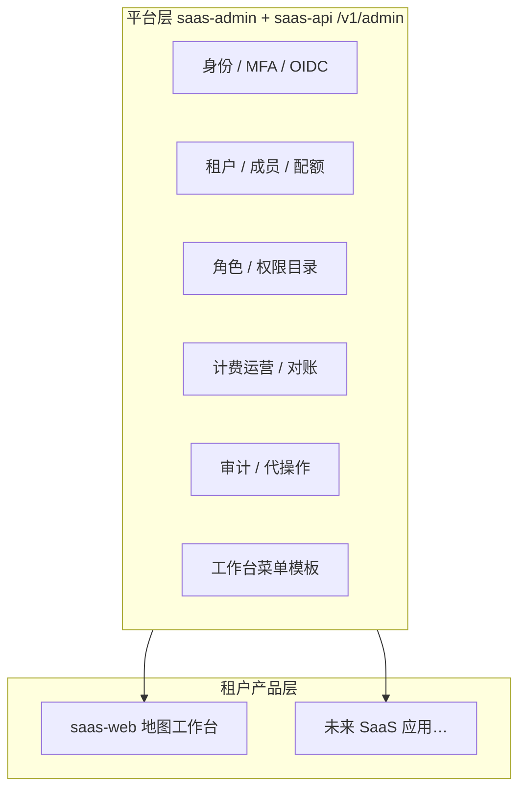

# Admin 多 SaaS 基础平台演进

> 状态：Living doc · 2026-06  
> 关联：[apps/admin/README.md](../../apps/admin/README.md)、[platform-foundation-backlog.md](../architecture/supplements/platform-foundation-backlog.md)、[multi-tenancy.md](../architecture/multi-tenancy.md)

`@repo/saas-admin` 是 map-design monorepo 的**平台运营层**：服务多个租户产品（当前主产品为 saas-web 地图工作台），负责身份/RBAC/租户/计费/审计/菜单模板等**横切能力**，而非业务域（地图、机库 → Sprint E）。

---

## 1. 定位与边界

| 层 | 职责 | 不在范围 |
| --- | --- | --- |
| **Admin** | 全平台运维、跨租户只读/写（含 impersonation）、计费与合规 | 地图插件、机库业务 UI |
| **saas-web** | 租户成员日常使用、tenantFeature 门控 | 平台级租户 CRUD |
| **yunyan-admin** | 若依 Vue 遗留 | 与 saas-admin 无代码共用 |

---

## 2. 参考案例（多租户 B2B SaaS 平台后台）

按能力域对照业界产品，供 IA 与优先级参考（非逐像素抄 UI）。

| 参考产品 | 可借鉴点 | map-design 现状 |
| --- | --- | --- |
| **[Stripe Dashboard](https://dashboard.stripe.com/)**（Connect / Billing） | 计费概览、对账差异、运维告警、退款/调账审计 | ✅ 计费 11 Tab + 日对账 Job + ops alert + Admin 横幅 |
| **[AWS Organizations + IAM Identity Center](https://aws.amazon.com/organizations/)** | 组织/账户层级、SCP 式能力边界、CloudTrail 审计、跨账户操作 | 🟡 租户 + feature catalog；缺「组织树 / SCP 式策略包」 |
| **[Auth0 / Okta Admin](https://auth0.com/docs)** | 租户级 SSO、MFA 策略、IdP 连接、用户生命周期 | 🟡 平台 OIDC 登录 + 用户 IdP 绑定；缺**租户级 SAML/OIDC 配置** |
| **[Clerk / WorkOS](https://workos.com/docs)** | Organizations、Invitation、Directory Sync、Audit Log API | ✅ 成员邀请/配额；🟡 缺 SCIM/目录同步 |
| **[Vercel Teams](https://vercel.com/docs/accounts/team-members-and-roles)** | Team 成员、Role、Usage/Billing 一体 | ✅ 成员 + Plan 配额；缺 Usage 趋势大盘 |
| **[Supabase Dashboard](https://supabase.com/dashboard)** | Project（≈租户）生命周期、只读配置、Health | ✅ `/system` flags + ping；缺依赖拓扑图 |
| **[Retool / 内部 Admin 模板](https://retool.com/)** | 快速 CRUD、审计、权限细分 | ✅ 四主表 + RBAC；可复用 Admin 壳接新业务 |

**结论**：map-design Admin 在「运维控制台 UX + 计费对账 + 审计 + 代操作 + MFA」上已接近 Stripe/AWS 运维子集；下一阶段应补 **租户生命周期 / 企业 SSO / 可观测与合规 / 菜单与能力的多产品扩展**。

---

## 3. 能力成熟度（2026-06）

| 域 | 已交付 | 缺口 |
| --- | --- | --- |
| **身份** | 登录、OIDC、MFA TOTP、恢复码 | 租户级 SSO 配置、会话/device 管理 |
| **租户** | CRUD、停用、feature、配额、存储估算 | 试用/到期、自助注册审核、组织层级 |
| **成员** | 邀请（邮箱/链接）、角色、seat 门控 | SCIM、批量导入、离职转交 |
| **RBAC** | 权限目录、系统/租户角色、Transfer | 权限模板包、变更审批流 |
| **计费** | 钱包/SKU/订单/对账/告警 | live 对公认款、发票平台、用量定价 |
| **审计** | 列表/导出/详情、计费写操作 | 保留策略、SIEM 推送、告警规则 |
| **代操作** | impersonation + MFA + banner | 时效/scope 限制 UI、操作录像 |
| **菜单** | 平台模板 CRUD、拖拽排序 | **租户覆盖**、菜单 RBAC（FND-08 Later） |
| **质量** | Vitest、mock/real E2E 部分覆盖 | 审计 E2E、CI 门禁、typecheck 全绿 |

---

## 4. 演进路线图（Phase 5+）

按 **一个 PR 一个 commit** 推进；优先级：文档/质量 → 平台缺口 → 企业特性。

### Phase 5A · 文档与质量（Now）

| PR | 内容 | 类型 |
| --- | --- | --- |
| 5A-1 | 本文档 + `apps.md` 同步 FND-07 ✅ 状态 | docs | ✅ |
| 5A-2 | 审计日志 mock E2E（筛选 + 导出按钮） | test | ✅ |
| 5A-3 | `requireAdminPermissions` 对 `PLATFORM_ADMIN` 与成员页一致兜底 | fix | ✅ |
| 5A-4 | Admin E2E 纳入 CI（mock project smoke） | chore | ✅ |

### Phase 5B · 平台可观测与运维

| PR | 内容 |
| --- | --- |
| 5B-1 | `/system` 展示 saas-api ↔ billing-api 依赖健康（对齐 FND-05） | ✅ |
| 5B-2 | 概览 MetricCard：近 7 日活跃租户 / 新增用户（API + UI） | ✅ |
| 5B-3 | 运维 runbook 链接从 `/system` 直达（已有 flags 列表增强） | ✅ |

### Phase 5C · 租户生命周期

| PR | 内容 |
| --- | --- |
| 5C-1 | 租户 `plan` / `trialEndsAt` 字段 + Admin 展示与编辑 |
| 5C-2 | 停用租户自动化（成员 session 撤销 Job） |
| 5C-3 | 租户 onboarding 状态（pending / active / suspended）看板 |

### Phase 5D · 企业 SSO 与合规

| PR | 内容 |
| --- | --- |
| 5D-1 | 租户级 OIDC 连接配置（Admin CRUD + saas-web 登录入口） |
| 5D-2 | 审计日志 Webhook / SIEM 导出（除 CSV 外） |
| 5D-3 | 数据导出请求（GDPR 式租户数据包，骨架 API） |

### Phase 5E · 多产品扩展（FND-08 Later）

| PR | 内容 |
| --- | --- |
| 5E-1 | 租户菜单覆盖（inherit 平台模板 + diff） |
| 5E-2 | 菜单项 RBAC（permission 门控） |
| 5E-3 | 附件/存储计量 Admin 页（对接 FND-08g 估算 API） |

---

## 5. 架构原则（演进时遵守）

1. **Admin API 统一前缀** `/v1/admin/*`；计费走 billing-api `/v1/admin/billing/*`。
2. **PLATFORM_ADMIN** 跨租户写须 **impersonation**（[ADR-0007](../adr/0007-platform-admin-impersonation.md)），禁止客户端伪造 tenant header。
3. **UI**：Shell/表单用 `@repo/ui`；Table/Tree/Date 用 `shared/ant/*`（[frontend.md](../architecture/frontend.md)）。
4. **新产品接入**：注册 tenantFeature + 菜单段/项 + 权限 catalog，无需 fork Admin 壳。
5. **每个 PR**：`pnpm --filter @repo/saas-admin validate` + 相关 `mvn test`；E2E 变更跑 `test:e2e`。

---

## 6. 验收节奏

| 阶段 | 标志 |
| --- | --- |
| **基础平台**（当前） | P0–P4 + FND-07/08 核心 ✅ |
| **Phase 5A** | 演进文档 + 审计 E2E + CI smoke ✅ |
| **Phase 5B** | /system 可观测 + runbook 直达 ✅ |
| **Phase 5C** | 租户生命周期可运维 |
| **Phase 5D–E** | 企业客户 SSO + 多产品菜单差异化 |
