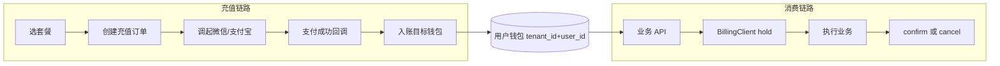
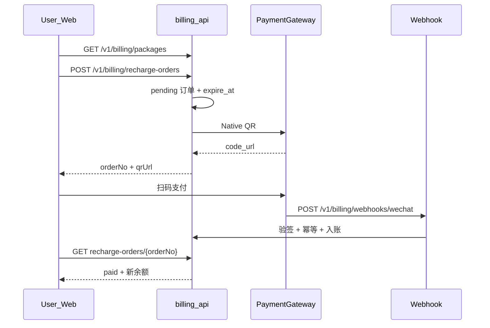
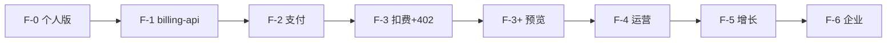

# 充值/积分功能 PRD（Sprint F · P4）

> 状态：F-1～F-3+、F-2/F-5 主体、F-4 退款骨架 **已落地**（2026-06-14）；**安全/限流/观测加固** ✅（2026-06-15）；F-4 对账/通知/发票、F-5 优惠券、F-6 对公 **待办**  
> 架构摘要：[billing-service.md](../architecture/billing-service.md)  
> 后端排期：[services-development-plan.md](../architecture/services-development-plan.md) §Sprint F

## 定位与约束

| 项 | 决策 |
| --- | --- |
| 计费模型 | **纯预付费积分**；所有可计费能力统一扣积分 |
| 支付渠道 | **微信支付 + 支付宝**（Native/扫码为主，H5 为辅） |
| 钱包模型 | **用户钱包**：租户内 **1 用户 1 钱包**（含 `TENANT_ADMIN`）；**无租户共享池** |
| 充值入账 | 支付成功 → **充值发起人** `(tenant_id, user_id)` 对应钱包 |
| 消费扣费 | **操作发起人**对应钱包扣费（谁点的谁扣） |
| 流水可见性 | 默认仅看**本人**钱包与流水；`TENANT_ADMIN` 可审计租户内成员用量汇总（`GET /v1/billing/team/usage`，F-3） |
| **目标客户** | **首期**：个人版 + 小团队（成员各自充值消费）；**B2B 企业统一采购** → F-2 起 Platform Admin 调账 SOP，F-5 划拨，F-6 对公 |
| 与 `sys_tenant.plan` | **解耦**：plan 管能力门控（403）；积分管额度（402）；UI **必须区分**两种错误（见 §5.3） |
| **个人版** | 不加入团队也可注册、登录、充值（隐式 personal 租户） |
| **多产品共用** | 平台 **统一钱包**；`product_code` 做价目/流水/报表归因，**不按产品拆钱包** |
| **部署形态** | **F-1 起独立 `billing-api` 微服务**（`:8083`）；saas-api 经 `BillingClient` HTTP 扣费 |
| 体验积分 | personal **500 点** / organization **1000 点**（规则见 §1.2；Admin 可配置） |
| 积分有效期 | 首期 **永久有效**；退款 F-4 原路退回 |
| 排期 | **F-0** → **F-1** → **F-2** → **F-3** → **F-3+** → **F-4～F-6** |



---

## 一、领域模型

### 1.1 核心表（billing-api Flyway `V1__billing_wallet.sql` 起）

| 表 | 用途 | 关键字段 |
| --- | --- | --- |
| `billing_wallet` | 钱包账户 | `id`、`tenant_id`、`user_id`（同租户唯一）、`balance`、`frozen_balance`、`version`；约束 `UNIQUE(tenant_id, user_id)` |
| `billing_ledger` | 不可变账本 | `wallet_id`、`entry_type`、`amount`、`balance_after`、`idempotency_key` UNIQUE |
| `billing_recharge_package` | 充值 SKU | `code`、`points`、`price_cents`、`currency`(CNY)、`status` |
| `billing_recharge_order` | 充值订单 | `order_no`、`tenant_id`、`user_id`、`wallet_id`、`package_id`、`channel`、`status`、`provider_trade_no` |
| `billing_consumption_rule` | 扣费价目 | `code`、`product_code`、`points_per_unit`、`unit_label` |
| `billing_consumption_record` | 消费单据 | `product_code`、`rule_code`、`quantity`、`points`、`status`、`biz_ref` |
| `billing_product` | 产品目录 | `code`（`map-workspace` \| `saas-admin` \| `uav-cloud` \| …）、`name`、`status` |

**钱包解析（`BillingWalletService`）：**

- 充值、扣费、查余额均解析为 **`(JWT tenant_id, JWT user_id)`** 对应钱包
- 全角色（`TENANT_ADMIN` / `MEMBER` / `VIEWER`）规则相同：**谁充值进谁钱包，谁操作扣谁钱包**
- personal 与 organization 租户均按上述规则；差异仅在 `tenant_kind` 与 features 门控

**设计要点：**

- 余额变更只通过 ledger + wallet 更新；禁止无流水改 balance
- 所有写操作带 `idempotency_key`；wallet 乐观锁 `version`
- 全表 `tenant_id` + RLS
- **钱包不按产品拆分**；`product_code` 仅标记消费来源

### 1.2 积分单位与体验积分（signup-bonus）

- 内部整数「点」（`BIGINT`）；1 元 = N 点由 SKU 定义
- 入账方式：ledger `adjust`，remark=`signup_bonus`

**触发时机（统一）：** 用户 **邮箱验证成功** 且 `sys_user.status=active` 后，saas-api 调用 `POST /internal/v1/billing/signup-bonus`（**幂等**）。

**幂等键：** `signup-bonus:{tenantId}:{userId}` — 同一用户同一租户只赠一次。

| 租户类型 | 赠送对象 | 默认点数 | 说明 |
| --- | --- | --- | --- |
| `personal` | 该用户本人 | 500 | `register-personal` 确认邮箱后 |
| `organization` | **首个激活的 `TENANT_ADMIN`**（组织注册 confirm 的那位） | 1000 | **仅一次/租户**；后续邀请加入的 MEMBER/VIEWER **不自动赠送** |
| 邀请加入 | — | 0 | 需 Platform Admin 调账、F-5 划拨或成员自助充值 |

**失败补偿：** billing-api 返回非 2xx 时，saas-api 写入 `billing_signup_bonus_pending`  outbox 表（或复用 email outbox 同类机制），定时 Job 重试直至成功或人工介入。

配置项：`billing.signup-bonus.personal`、`billing.signup-bonus.organization`（`application.yml`）。

### 1.3 个人版（隐式 personal 租户）

**数据（saas-api Flyway `V17__personal_tenant.sql`，F-0）：**

| 变更 | 说明 |
| --- | --- |
| `sys_tenant.tenant_kind` | `organization`（默认）\| `personal` |
| 约束 | 同一邮箱全局最多 1 个 personal 租户 |
| personal features | 默认地图基础；不含机库、高速预警等（见 §10.2） |

**Auth API（F-0 · saas-api）：**

| API | 说明 |
| --- | --- |
| `POST /v1/auth/register-personal` | 创建 personal 租户 + MEMBER |
| `POST /v1/auth/login` | 仅 personal 时可免 slug |
| `GET /v1/tenants` | 含「个人空间」 |

---

## 二、充值流程（微信/支付宝）

### 2.1 用户侧时序



### 2.2 订单状态机

`pending` → `paid` / `expired` / `cancelled`；`paid` → `refunding` / `refunded`（F-4）

### 2.3 支付网关

- `WechatNativeGateway`、`AlipayPrecreateGateway`
- `MockPaymentGateway`（测试 profile）
- 密钥 env 注入，不进仓库

### 2.4 Webhook 安全

- **Token（骨架/开发）**：`X-Billing-Webhook-Token`，配置 `billing.webhook.token`；验签关闭时仍建议保留
- **验签模式**（`billing.webhook.signature-verify-enabled=true` 时按渠道生效）：

| 渠道配置 | 模式值 | 验签方式 |
| --- | --- | --- |
| `billing.webhook.wechat-signature-mode` | `hmac`（默认） | `X-Billing-Webhook-Signature` = HMAC-SHA256 hex(body) |
| 同上 | `wechat_v3` | `Wechatpay-Signature` + `Wechatpay-Timestamp` + `Wechatpay-Nonce`；平台公钥 PEM |
| `billing.webhook.alipay-signature-mode` | `hmac` | 同上 HMAC |
| 同上 | `alipay_rsa` | `Alipay-Signature` = RSA-SHA256 base64(body)；支付宝公钥 PEM |

- **业务校验**：`priceCents` 与订单一致；幂等 `providerTradeNo` / 订单状态；同事务入账
- **限流**：Webhook 按来源 IP 令牌桶（默认 120/min）；超限 **429** + `Retry-After`
- **冒烟**：`services/billing-api/scripts/smoke-billing.mjs` 支持 `BILLING_WEBHOOK_SIGNATURE_MODE=off|hmac|wechat_v3|alipay_rsa`

### 2.5 限流与滥用防护（billing-api）

| 场景 | 配置前缀 | 默认 |
| --- | --- | --- |
| Webhook 回调 | `billing.rate-limit.webhook` | 120 次/IP/分钟 |
| 充值下单 | `billing.rate-limit.recharge` | 20 次/用户/小时 |
| Admin 调账 | `billing.rate-limit.admin` adjust | 30 次/操作人/小时 |
| Admin 退款 | 同上 refund | 10 次/操作人/小时 |

测试 profile 可设 `billing.rate-limit.enabled=false` 以免干扰集成测试。

### 2.6 错误体与观测

- 业务/API 错误统一 **RFC 7807** `application/problem+json`（含 `AuthException`、Jakarta 校验、402 余额不足、429 限流）
- **Micrometer** 计数器：`billing.recharge.completed`、`billing.adjust.applied`、`billing.refund.completed`、`billing.hold.created`、`billing.hold.confirmed`、`billing.wallet.low_balance`（可用余额 crossing 低于 `billing.low-balance.threshold`，默认 50，与 saas-web 顶栏一致）

---

## 三、消费扣费（BillingClient）

各产品后端 **只经** `billing-core` 的 `BillingClient`（HTTP → billing-api）：

```java
Optional<String> hold(SaasPrincipal principal, String productCode, String ruleCode,
    long quantity, String idempotencyKey, String bizRef);
void confirm(String holdId);
void cancel(String holdId);
EstimateResult estimate(SaasPrincipal principal, String productCode, String ruleCode, long quantity);
```

**两阶段扣费：**

1. **Hold**：`balance -= amount`，`frozen += amount`
2. **Confirm**：`frozen -= amount`，ledger `debit`
3. **Cancel**：解冻

余额不足 → **402** + ProblemDetail（`insufficient_balance`）

**Hold 超时（必做）：** 默认 **30 分钟** 未 confirm/cancel 自动 cancel 解冻；billing-api 每 **5 分钟** 扫描过期 hold。配置：`billing.hold.ttl-minutes=30`。

**扣费价目：** 首期不预置业务 rule。F-3 使用种子 rule **`billing.smoke.consume`**（1 点/次，仅 `dev`/`staging` profile 或 internal 调用）验证 hold 链路；正式业务 rule 随产品 PRD 登记。

---

## 四、API 契约

宿主：**billing-api**（用户/Admin/Webhook）；**internal API** 供 saas-api 与未来产品。

### 4.1 租户侧（JWT）

| 方法 | 路径 | 权限 |
| --- | --- | --- |
| GET | `/v1/billing/consumption-rules` | `billing:wallet:read` |
| GET | `/v1/billing/estimate` | `billing:wallet:read` |
| GET | `/v1/billing/wallet` | `billing:wallet:read` |
| GET | `/v1/billing/ledger` | `billing:ledger:read` |
| GET | `/v1/billing/packages` | `billing:recharge:create` |
| POST | `/v1/billing/recharge-orders` | `billing:recharge:create` |
| GET | `/v1/billing/recharge-orders` | `billing:recharge:create` |
| GET | `/v1/billing/recharge-orders/{orderNo}` | `billing:recharge:create` |
| POST | `/v1/billing/recharge-orders/{orderNo}/cancel` | `billing:recharge:create` |
| GET | `/v1/billing/team/usage?from&to&productCode` | `billing:usage:read`（**仅 `TENANT_ADMIN`**，当前 JWT 租户） |

**规则：**

- 创建充值订单时 `user_id`、`wallet_id` 固定为 **当前 JWT 用户**（与角色无关）
- `GET /wallet`、`GET /ledger` 仅返回 **本人** 钱包；不可查他人余额
- **`VIEWER` 默认不绑定** `billing:recharge:create`（见 §4.5）
- `TENANT_ADMIN` 通过 **`GET /v1/billing/team/usage`** 查看本租户成员消费汇总（不含他人余额明细，仅用量/点数）

### 4.2 平台 Admin（`/v1/admin/billing/*`）

| 方法 | 路径 | 说明 |
| --- | --- | --- |
| GET | `/v1/admin/billing/wallets` | `?tenantId&userId&page` 用户钱包列表 |
| GET | `/v1/admin/billing/tenants/{tenantId}/ledger` | `?userId&entryType&page` 租户积分流水 |
| POST | `/v1/admin/billing/tenants/{tenantId}/adjust` | `{ userId, amount, remark, idempotencyKey }` |
| GET | `/v1/admin/billing/adjust-records` | 平台人工调账记录（`platform-admin` SKU） |
| POST | `/v1/admin/billing/recharge-orders/{orderNo}/refund` | 已支付订单退款（`admin:billing:refund`） |
| GET/POST/PATCH | `/v1/admin/billing/packages` | SKU CRUD |
| GET | `/v1/admin/billing/recharge-orders` | 全平台订单 |
| GET | `/v1/admin/billing/stats` | 平台汇总统计 |
| GET | `/v1/admin/billing/reconciliation/daily` | `?date` UTC 日对账（订单 vs 流水） |
| GET | `/v1/admin/billing/usage` | `?tenantId&…` 跨租户用量（PLATFORM_ADMIN） |

### 4.3 Webhook（无 JWT）

| POST | `/v1/billing/webhooks/wechat` | Token + 可选验签（§2.4） |
| POST | `/v1/billing/webhooks/alipay` | 同上 |

### 4.4 内部 API（m2m，`X-Service-Token` + 可选透传 `Authorization`）

Header **`X-Billing-Caller-Service`**：白名单校验（默认 `saas-api`），配置 `billing.internal.allowed-callers`。

| 方法 | 路径 | 说明 |
| --- | --- | --- |
| POST | `/internal/v1/billing/hold` | 冻结扣费 |
| POST | `/internal/v1/billing/hold/{id}/confirm` | 确认 |
| POST | `/internal/v1/billing/hold/{id}/cancel` | 取消 |
| GET | `/internal/v1/billing/estimate` | 预估 |
| POST | `/internal/v1/billing/signup-bonus` | `{ tenantId, userId, tenantKind }`；幂等见 §1.2 |

### 4.5 权限码（`saas-api` Flyway `V18__billing_permissions.sql` 种子；JWT `permissions` claim）

| 码 | scope | 默认绑定角色 | 说明 |
| --- | --- | --- | --- |
| `billing:wallet:read` | tenant | TENANT_ADMIN, MEMBER, VIEWER | 读本人钱包/价目/estimate |
| `billing:ledger:read` | tenant | TENANT_ADMIN, MEMBER, VIEWER | 读本人流水 |
| `billing:recharge:create` | tenant | **TENANT_ADMIN, MEMBER** | 自助充值；**不含 VIEWER** |
| `billing:usage:read` | tenant | **TENANT_ADMIN** | 本租户成员用量汇总 |
| `admin:billing:read` | platform | PLATFORM_ADMIN | 平台账单只读 |
| `admin:billing:adjust` | platform | PLATFORM_ADMIN | 平台人工调账 |
| `admin:billing:refund` | platform | PLATFORM_ADMIN | 充值订单退款 |
| `admin:billing:packages:write` | platform | PLATFORM_ADMIN | SKU CRUD |

**JWT 权限刷新：** 部署 `V18` 后，已有 session 可能缺 `billing:*`。saas-api 在 permission 变更或 billing 上线时递增 JWT `perm_epoch`；客户端 403 且 `perm_epoch` 过期时引导 **重新登录**（或 refresh 重签）。

**调账审计：** Platform Admin 调账、SKU 变更写入 `sys_admin_audit_log`（billing-api 共用 PG 直写，或 HTTP 回调 saas-api audit 端点 — **实现选一，F-1 定稿**）。

---

## 五、前端交付

### 5.1 saas-web — `apps/web/app/features/billing/`

| 组件 | 说明 |
| --- | --- |
| `BillingWalletCard` | 顶栏余额；TeamSwitcher 切换后 invalidate |
| `BillingPricingTable` | 价目 Tab |
| `RechargePackagesPage` / `RechargeCheckout` | 充值 + QR 轮询 |
| `BillingLedgerTable` | **我的**流水 |
| `InsufficientBalanceDialog` | **F-3** 全局 402 弹窗 → `/billing` |
| `BillingCostPreview` | F-3+ 扣费操作前预览 |
| `BillingUsageSummary` | **F-3** 租户管理员用量 Tab（`/team/usage`） |

路由：`/billing`（`workspace:use` + `billing:wallet:read`）

**F-0：** `/register?mode=personal`、Marketing `/pricing` 导流、personal 导航门控

### 5.3 错误态与 plan 门控（P0）

| HTTP | 含义 | 前端行为 |
| --- | --- | --- |
| **403** + feature/plan | 能力未开通（`TenantFeatureCatalog`） | 「当前套餐/版本不含此功能」→ 升级/联系管理员 |
| **402** + `insufficient_balance` | 积分不足 | `InsufficientBalanceDialog` → 充值页；文案「**将从您个人账户扣费**」 |
| **403** + suspended（saas-api） | 租户停用 | 登录与 workspace 受限；**billing-api 不拦截**充值与扣费 |

api-client 层统一 ProblemDetail 解析；地图/机库插件 **禁止** 各自解析 402。

### 5.2 apps/admin

`apps/admin/app/features/billing/`：概览 / 用户钱包 / **积分流水** / 消费汇总 / 充值 SKU / 充值订单 / 人工调账；`tenantId`+`userId` URL 筛选联动；调账/退款二次确认；按 `admin:billing:*` 分 Tab 可见性。

---

## 六、与现有架构衔接

| 现有能力 | 衔接 |
| --- | --- |
| 个人版 Auth | F-0 saas-api；邮箱验证成功后调 signup-bonus（§1.2） |
| `tenant_id` + RLS | billing-api 共用 PG，billing_* RLS |
| `sys_tenant.plan` | features 门控（403）；额度看积分（402）；§5.3 |
| Sprint E 业务 API | saas-api `BillingClient.hold` → 402 透传 |
| Nginx | `/v1/billing*` → :8083 |
| `sys_tenant.status=suspended` | **不拦截** billing-api 充值与扣费；停用仅限制登录/workspace（见 auth-rbac） |

---

## 七、分期实施（F-0 ～ F-6）



### F-0 · 个人版（saas-api，约 1 周）

- `V17__personal_tenant.sql`；register-personal；Marketing 导流
- **验收**：个人注册→验证→登录

### F-1 · billing-api 微服务 + 钱包（约 1.5 周）

- `billing-core` + `billing-api` 脚手架；compose/Nginx/Vite 路由
- saas-api `RestBillingClient` wiring；saas-api `V18__billing_permissions.sql`
- Flyway `V1__billing_wallet.sql`；signup-bonus + pending 重试 Job
- Web/Admin 余额、价目、顶栏；`packages/api-client` billing schema
- **验收**：billing-api health；用户钱包隔离；signup-bonus 幂等；TeamSwitcher 切换余额刷新

### F-2 · 在线支付（约 2 周）

- PaymentGateway；Webhook；充值 UI
- **B2B 过渡：** Platform Admin 调账 SOP（误充/赠送/企业预付）；充值页文案「积分进入**您个人账户**」
- **验收**：沙箱入账；回调幂等；Admin 可调账入账

### F-3 · 跨服务扣费 + 402 UX（约 1～1.5 周）

- `BillingClient` hold/confirm/cancel + estimate；hold TTL Job（§三）
- 冒烟 rule **`billing.smoke.consume`** + internal E2E
- saas-web：**`InsufficientBalanceDialog`** + api-client 402 全局拦截（§5.3）
- **`GET /v1/billing/team/usage`** + `BillingUsageSummary`（租户管理员）
- **验收**：hold/confirm/cancel；402 弹窗可达 `/billing`；team usage 仅 TENANT_ADMIN

### F-3+ · 扣费预览（3–5 天）

- `BillingCostPreview`；顶栏低余额样式；Sprint E 业务 API 接入时复用

### F-2.5 · 移动支付（P1）

- 微信 H5/JSAPI；支付宝手机网站

### F-4 · 运营财务

- **充值退款**（骨架 ✅）：`POST /v1/admin/billing/recharge-orders/{orderNo}/refund`（`admin:billing:refund`）；`paid`→`refunding`→`refunded`；扣回积分 + mock 网关原路退；审计 `billing.recharge.refund`
- **日对账**（骨架 ✅）：`GET /v1/admin/billing/reconciliation/daily?date=`（UTC 自然日；对比 paid 订单 vs `recharge` 流水、refunded 订单 vs `refund` 流水）
- 通知；发票

### F-5 · 增长管控

- 优惠券；充值策略；`members_can_recharge`（默认 **true**；**false** 时成员仅能通过 **Platform Admin 调账** 或 **TENANT_ADMIN 划拨** 获得积分）
- `POST /v1/admin/billing/transfer`（TENANT_ADMIN → 成员，P2）；`packages/billing-client`

### F-6 · 企业采购

- 对公转账；可选 billing 独立 DB

---

## 八、风险与对策

| 风险 | 对策 |
| --- | --- |
| 支付回调丢失 | 轮询 + 查单 Job |
| F-2 有支付、F-4 才退款 | F-2 验收含 Platform Admin **调账冲正** SOP |
| 并发超扣 | 乐观锁 + 冻结 |
| hold 后 saas-api 崩溃 | hold **30min** TTL + 5min 扫描 Job（§三） |
| 跨服务延迟 | 同机房 internal API；业务 `try/finally` 确保 cancel |
| JWT 密钥不一致 | 共用 `JWT_SECRET` |
| 旧 session 无 billing 权限 | JWT `perm_epoch` + 引导重新登录（§4.5） |
| signup-bonus 跨服务失败 | pending 表 + 重试 Job（§1.2） |
| internal API 泄露 | 内网 + `BILLING_INTERNAL_TOKEN` + **Caller 白名单**（§4.4）；hold 必带真实 principal |
| Webhook 伪造/刷量 | Token + 可选 RSA/HMAC 验签（§2.4）+ IP 限流（§2.5） |
| Admin 误操作/滥用 | 调账/退款限流 + 二次确认 UI + 调账金额 Jakarta 上限 |
| 退款 stuck `refunding` | 补偿 Job 回滚 + 审计 |
| saas-api → billing 瞬态故障 | `RestBillingClient` 502/503/504 退避重试 |
| Flyway 冲突 | billing 表仅 billing-api；权限 V18 仅 saas-api |
| suspended 租户与计费 | **解耦**：允许充值与扣费；登录停用由 saas-api 负责（见 auth-rbac） |
| B2B 无法统一买单 | §10.4；F-2 Admin 调账；F-5/F-6 划拨与对公 |
| plan 与 402 混淆 | §5.3 区分 403/402 文案与组件 |

---

## 九、关键文件（实现时）

**billing-api / billing-core**

- `services/billing-core/` — `BillingClient`、DTO
- `services/billing-api/` — Spring Boot、Flyway、Controllers、PaymentGateway
- `deploy/Dockerfile.billing-api`、`deploy/docker-compose.yml`

**saas-api**

- `services/saas-api/.../V17__personal_tenant.sql`
- `services/saas-api/.../V18__billing_permissions.sql`
- `services/saas-api/.../PersonalRegistrationService.java`
- `services/saas-api/.../infrastructure/billing/RestBillingClient.java`

**前端**

- `packages/api-client` — billing schema
- `apps/web/app/features/billing/`
- `apps/admin/app/routes/billing.tsx`

---

## 十、产品决策

### 10.1 已拍板决策

| # | 问题 | 决策 |
| --- | --- | --- |
| 1 | 个人版能力 | 地图基础；不含机库、高速预警 |
| 2 | 有效期/退款 | 首期永久；F-4 原路退 |
| 3 | 成员自助充值 | F-5 `members_can_recharge`，默认 **true**；关后靠调账/划拨 |
| 4 | 个人→团队积分 | 默认不自动迁移 |
| 5 | 注册赠送 | personal 500；org **首个 TENANT_ADMIN** 1000；邀请成员不送 |
| 6 | 多产品计费 | 统一钱包 + product_code |
| 7 | 部署 | F-1 起 billing-api 微服务 |
| 8 | 插件/能力扣费清单 | **首期不做**；价目随产品 PRD 再登记 |
| 9 | 钱包模型 | **用户钱包**；谁充值谁消费；**无租户共享池** |
| 10 | VIEWER 充值 | **默认不可充值**（不绑 `billing:recharge:create`） |
| 11 | signup-bonus | 邮箱验证成功后；幂等键 per tenant+user（§1.2） |
| 12 | 402 UX | **F-3** 同迭代交付 InsufficientBalanceDialog |
| 13 | 权限种子 | **saas-api** `V18__billing_permissions.sql` |

### 10.4 目标客户与 B2B 说明

| 客群 | 首期支持 | 说明 |
| --- | --- | --- |
| 个人版 / 自由职业 | ✅ 主路径 | 注册→赠送→自助充值→自用 |
| 小团队 | ✅ | 成员各自充值；管理员操作扣管理员账户 |
| 中大型企业统一采购 | ⚠️ 有限 | 无共享池；依赖 Platform Admin 调账（F-2）、划拨（F-5）、对公（F-6） |

Marketing `/pricing` 须同时说明：**积分按用户账户**、企业批量需求联系销售/对公。

### 10.2 个人版 features 白名单

| feature | 个人版 |
| --- | --- |
| 地图基础工具 | ✅ |
| `custom.highway-alert` | ❌ |
| `custom.live-share` | ❌ |
| uav-workspace | ❌ |

### 10.3 MoSCoW 速查

| 优先级 | 缺口 | 归属 |
| --- | --- | --- |
| P0 | 价目/402 弹窗/顶栏刷新/403·402 区分/获客 | F-0、F-1、**F-3** |
| P1 | 体验积分/通知/移动支付/team usage | F-1、F-4、F-2.5、**F-3** |
| P2 | 退款/优惠券/用户间划拨 | F-4、F-5 |
| P3 | 对公/plan 联动 | F-6 |

---

## 十一、架构决策（billing-api 微服务先行）

详见 [billing-service.md](../architecture/billing-service.md)。

| 阶段 | 形态 |
| --- | --- |
| F-0 | saas-api 个人版 |
| F-1～F-4 | billing-api + billing-core；saas-api 消费 BillingClient |
| F-5 | packages/billing-client TS SDK |
| F-6 | 可选 billing 独立 DB |

**新产品接入：** 依赖 billing-core → 配置 base-url → hold/confirm；无需 fork 钱包或直连 PG。

---

## 十二、实施清单

| ID | 任务 |
| --- | --- |
| f-arch-billing-ms | F-1 前：billing-core + billing-api 脚手架；compose/Nginx；JWT 同密钥 |
| f0-personal-auth | tenant_kind + register-personal + features 白名单 |
| f0-personal-ui | 个人注册/登录 + Marketing 导流 |
| f1-schema-ledger | billing-api Flyway + 用户钱包 + signup-bonus + pending Job |
| f1-billing-client | BillingClient + RestBillingClient + hold TTL Job |
| f1-api-client | api-client + Web/Admin 余额 UI |
| f2-payment-gateway | 微信/支付宝 + Webhook + Admin 调账 SOP |
| f2-recharge-ui | 充值 UI + 「个人账户」文案 |
| f3-consumption-sdk | smoke rule + hold E2E + **402 弹窗** + team/usage |
| f3-plus-workspace-ux | BillingCostPreview + 低余额样式 |
| f-permissions-audit | saas-api V18 权限 + perm_epoch + 调账 audit |
| f4-ops-finance | 退款/对账/通知/发票 |
| f25-mobile-pay | H5/JSAPI |
| f5-growth-control | 优惠券/用户间划拨 + billing-client TS |
| f6-enterprise | 对公转账 + 可选独立 DB |
| f-sec-hardening | Webhook 验签/限流、Internal Caller、RFC7807、Micrometer、Admin ledger UI、冒烟/单测 ✅（2026-06-15） |
