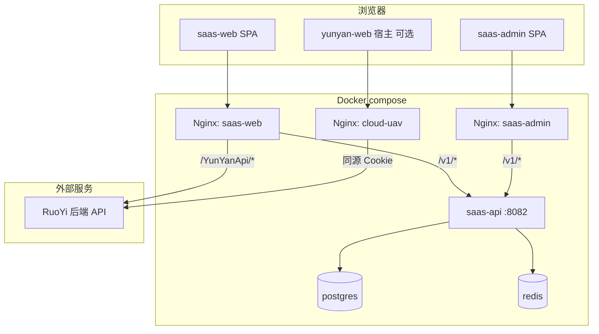
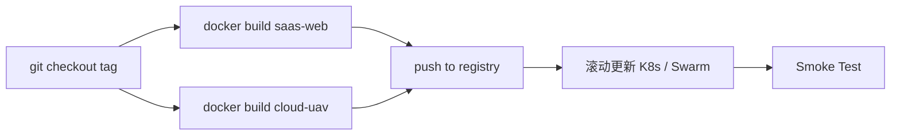

# Docker 部署方案

> 基于 `map-design` monorepo 当前实现（2026-06）编写。配套配置文件见仓库根目录 [`deploy/`](../../deploy/)。  
> **Agent Skill**：`.cursor/skills/docker-deploy/` — 一键 `node .cursor/skills/docker-deploy/scripts/deploy.mjs up`。

## 1. 项目分析

### 1.1 仓库概览

| 维度 | 说明 |
| --- | --- |
| 类型 | pnpm workspace 前端 monorepo |
| Node | ≥ 20.19.0 |
| 包管理 | pnpm 9.15.0 |
| 后端依赖 | **saas-api**（`:8082` `/v1`）+ **RuoYi API**（过渡，`/YunYanApi` 反代） |
| 渲染模式 | Web 为 React Router 7 **纯 SPA**（`ssr: false`） |

### 1.2 可部署单元

| 单元 | 包名 | 构建命令 | 产物目录 | 当前状态 |
| --- | --- | --- | --- | --- |
| **租户 Web 工作台** | `@repo/saas-web` | `pnpm --filter @repo/saas-web build` | `apps/web/build/client/` | **主交付物** |
| **运营后台** | `@repo/saas-admin` | `pnpm --filter @repo/saas-admin build` | `apps/admin/build/client/` | Sprint D ✅ |
| **SaaS API** | `services/saas-api` | `mvn -pl saas-api package` | JAR → Docker | Sprint D ✅ |
| **机库云插件** | `@repo/cloud-uav` | `pnpm --filter @repo/cloud-uav build` | `cloud/uav/dist/` | 供 Vue 宿主加载 |
| Marketing | `@repo/saas-marketing` | — | — | 仅占位 README |

共享 packages（`ui`、`auth`、`api-client`、`ruoyi-api`）为库代码，**不单独部署**，随 App 构建打入静态 bundle。

### 1.3 运行时依赖关系



**关键结论：**

1. **D-10** 起 compose 含 `postgres`、`redis`、`saas-api`、`saas-web`、`saas-admin`、`cloud-uav`。
2. 前端构建注入 `VITE_API_URL=/v1`；Nginx 同源反代至 `saas-api:8082`。
3. RuoYi 仍通过 `/YunYanApi` 反代（过渡）；生产必须在 Nginx 层复现 Vite dev proxy。
4. `cloud-uav` 为 ESM 远程模块，base 固定 `/yunyan-cloud-uav/`，通常由 **Vue 宿主**加载；也可独立容器部署。

---

## 2. 部署架构选型

### 2.1 推荐：分镜像 + 统一网关（生产）

```
                    ┌─────────────────┐
   app.example.com  │  Ingress / LB   │
                    └────────┬────────┘
                             │
              ┌──────────────┼──────────────┐
              ▼              ▼              ▼
        saas-web:80   cloud-uav:80   RuoYi 后端
        (SPA)         (/yunyan-cloud-uav/)
```

| 服务 | 镜像 | 端口 | 域名示例 |
| --- | --- | --- | --- |
| saas-web | `map-design/saas-web:latest` | 80 | `app.example.com` |
| cloud-uav | `map-design/cloud-uav:latest` | 80 | 同域路径或 `cdn.example.com` |
| API 代理 | 内置于 saas-web Nginx | — | `/YunYanApi` → RuoYi |

### 2.2 备选：单机 docker-compose（预发 / 演示）

使用 [`deploy/docker-compose.yml`](../../deploy/docker-compose.yml) 一键启动 Web + Cloud UAV + 可选统一入口网关。

### 2.3 不推荐

- 在容器内跑 `vite dev` / `react-router dev`（仅开发用途）。
- 将 RuoYi 后端塞入同一 compose（后端不在本仓库，应独立部署）。

---

## 3. 构建说明

### 3.1 saas-web

```bash
# 仓库根目录
cp .env.example .env.production
# 编辑 .env.production（见 §5）

docker build -f deploy/Dockerfile.saas-web \
  --build-arg BUILD_MODE=production \
  -t map-design/saas-web:latest .
```

构建阶段在 monorepo 根执行 `pnpm install` + `pnpm --filter @repo/saas-web build`，产物复制到 `nginx:alpine`。

`build:airace` 模式用于连接特定 RuoYi 环境（加载 `.env.airace`），可通过 `BUILD_MODE=airace` 切换。

### 3.2 cloud-uav

```bash
docker build -f deploy/Dockerfile.cloud-uav \
  -t map-design/cloud-uav:latest .
```

产物为 `dist/assets/*.js` + CSS，Nginx 以 `/yunyan-cloud-uav/` 为前缀托管。

---

## 4. 环境变量

### 4.1 构建时（Vite 注入）

| 变量 | 必填 | 说明 |
| --- | --- | --- |
| `VITE_API_URL` | Docker 生产 | 设为 `/v1`（`deploy/env/*.production`）；Nginx 反代 saas-api |
| `VITE_APP_URL` | 否 | 前端自身 URL（OAuth 回调等，规划中） |
| `VITE_MAP_ENGINE_READY` | 否 | 设为 `true` 时跳过 map-plugin-bridge 开发桩 |

`VITE_APP_BASE_HOST` **仅用于 dev proxy**，不参与生产 bundle；生产 RuoYi 地址通过 Nginx `RUOYI_API_UPSTREAM` 配置。

### 4.2 运行时（Nginx 容器）

| 变量 | 默认值 | 说明 |
| --- | --- | --- |
| `RUOYI_API_UPSTREAM` | `https://www.airace.com.cn` | saas-web `/YunYanApi` 反代目标（**不含**路径后缀） |
| `SAAS_API_UPSTREAM` | `http://saas-api:8082` | saas-web / saas-admin `/v1` 反代目标（compose 内网） |
| `BILLING_API_UPSTREAM` | `http://billing-api:8083` | `/v1/billing*` 反代至 billing-api（compose 内网） |

Cloud UAV 静态服务无运行时 env。

### 4.3 运行时（billing-api / saas-api 容器）

compose 通过 [`deploy/.env.docker.example`](../../deploy/.env.docker.example) 注入；**`BILLING_INTERNAL_TOKEN` 须在 saas-api 与 billing-api 一致**。

| 变量 | 默认（compose） | 说明 |
| --- | --- | --- |
| `BILLING_INTERNAL_TOKEN` | `docker-billing-internal-token-change-me` | saas-api → billing-api m2m |
| `SAAS_BILLING_ENABLED` | `true` | docker profile 启用 BillingClient |
| `SAAS_BILLING_API_BASE_URL` | `http://billing-api:8083` | saas-api 内网地址 |
| `BILLING_WEBHOOK_TOKEN` | 见 example | Webhook 骨架 Token |
| `BILLING_WEBHOOK_SIGNATURE_VERIFY_ENABLED` | `false` | 生产建议 `true` |
| `BILLING_WEBHOOK_WECHAT_SIGNATURE_MODE` | `hmac` | `hmac` / `wechat_v3` |
| `BILLING_WEBHOOK_ALIPAY_SIGNATURE_MODE` | `hmac` | `hmac` / `alipay_rsa` |
| `BILLING_WEBHOOK_*_SECRET` / `*_PUBLIC_KEY_PEM` | 空 | 验签密钥；PEM 可用 `\n` 单行 |
| `BILLING_MOCK_PAYMENT` | `true` | compose 演示 mock-pay；**生产 false** |
| `BILLING_RATE_LIMIT_ENABLED` | `true` | Webhook/充值/Admin 限流 |
| `BILLING_LOW_BALANCE_THRESHOLD` | `50` | 低余额 Micrometer crossing |
| `BILLING_API_PORT` | `8085` | 宿主机直连调试（避免与 Admin `:8083` 冲突） |

冒烟（充值 + 发票/优惠券/对公 + 验签模式）：`node services/billing-api/scripts/smoke-billing.mjs`（见 PRD §2.4）。

**billing 独立库（可选）**：`docker compose -f deploy/docker-compose.yml -f deploy/docker-compose.billing-db.yml up -d`；首次启动后 `billing-db-sync` 从 saas 库复制 `sys_user` / `sys_tenant_feature` 镜像。见 [billing-service.md](../architecture/billing-service.md) §独立 PostgreSQL。

---

## 5. Nginx 要点

### 5.1 saas-web SPA Fallback

```nginx
location / {
  try_files $uri $uri/ /index.html;
}
```

### 5.2 RuoYi API 反向代理

与本地 Vite 行为对齐：浏览器请求 `/YunYanApi/captchaImage`，Nginx 原样转发至 `{RUOYI_API_UPSTREAM}/YunYanApi/captchaImage`（**不剥离** `/YunYanApi` 前缀）。

```nginx
location /YunYanApi {
  proxy_pass ${RUOYI_API_UPSTREAM};
  proxy_set_header Host $proxy_host;
  proxy_set_header X-Real-IP $remote_addr;
  proxy_set_header X-Forwarded-For $proxy_add_x_forwarded_for;
  proxy_set_header X-Forwarded-Proto $scheme;
}
```

### 5.3 cloud-uav 静态资源缓存

| 资源 | 策略 |
| --- | --- |
| `registry.js`、`{moduleId}.js`（无 hash） | `Cache-Control: no-cache` |
| `assets/*-[hash].js` / `.css` | `Cache-Control: public, max-age=31536000, immutable` |

---

## 6. 快速启动（docker compose）

```bash
cd deploy
cp .env.docker.example .env
# 编辑 RUOYI_API_UPSTREAM

docker compose up -d --build
```

| 访问 | URL |
| --- | --- |
| Web 工作台 | http://localhost:8084 |
| 运营后台 | http://localhost:8083/login |
| 运营后台 API 反代 | http://localhost:8083/v1/admin/ping |
| SaaS API（直连调试） | http://localhost:8082/actuator/health |
| Billing API（直连调试） | http://localhost:8085/actuator/health |
| Cloud UAV registry | http://localhost:8081/yunyan-cloud-uav/assets/registry.js |
| 统一网关（可选 profile） | http://localhost:9080 |

验证：

```bash
node .cursor/skills/docker-deploy/scripts/deploy.mjs smoke
# 或
curl -I http://localhost:8084/v1/ping
curl -I http://localhost:8084/
curl -I http://localhost:8083/
curl -s http://localhost:8083/v1/admin/ping
```

`smoke` 含 **saas-admin SPA** 与 **`/v1/admin/ping`** 反代检查。若本机已跑 `mvn spring-boot:run` 占用 8082，在 `deploy/.env` 将 `SAAS_API_PORT=18082`（容器内仍 8082，仅宿主机映射改端口）。

首次启动后 `saas-api-seed` 会执行 `seed-demo-dev.sql`。演示账号：

| 应用 | URL | 账号 |
| --- | --- | --- |
| Web / Admin | 见上表 | `admin@demo.local` / `password` / 租户 `demo` |

---

## 7. 部署流程（生产）



### 7.1 发布前检查

- [ ] `pnpm --filter @repo/saas-web validate` 通过
- [ ] `RUOYI_API_UPSTREAM` 指向目标环境且网络可达
- [ ] TLS 证书已配置（Ingress 或前置 LB）
- [ ] Cookie 域与 `app.example.com` 一致（RuoYi 需允许该域或走同源代理）

### 7.2 Smoke Test

- [ ] `GET /` 返回 200 + `index.html`
- [ ] `GET /YunYanApi/captchaImage` 返回验证码 JSON/图片
- [ ] 登录流程：验证码 → RSA 登录 → 跳转 `/`
- [ ] `GET /yunyan-cloud-uav/assets/registry.js` 返回 ESM（若部署 UAV）
- [ ] 深链 `/login` 刷新不 404（SPA fallback）

---

## 8. CI/CD 建议

### 8.1 GitHub Actions 示例阶段

1. **lint/test**：`pnpm install` → `pnpm --filter @repo/saas-web validate`
2. **build image**：matrix 构建 `saas-web`、`cloud-uav`
3. **push**：`ghcr.io/<org>/saas-web:${{ github.sha }}`
4. **deploy**：触发 Argo CD / 手动 approve 滚动更新

### 8.2 镜像标签策略

| 标签 | 用途 |
| --- | --- |
| `:latest` | 最新 main（仅 dev/staging） |
| `:sha-<git-sha>` | 可追溯发布 |
| `:v1.2.3` | SemVer 正式发布 |

---

## 9. 安全与运维

| 项 | 建议 |
| --- | --- |
| HTTPS | 强制 TLS；HSTS |
| CSP | 允许 `/yunyan-cloud-uav/` 脚本域；限制 `script-src` |
| Cookie | Web 与 Admin **不共用** session cookie（见 [deployment.md](./deployment.md)） |
| 密钥 | **不要**将 RuoYi 凭据打入前端镜像；RSA 公钥由 RuoYi 后端提供 |
| 资源 | Nginx 单副本内存 ~64MB；按 QPS 水平扩展无状态副本 |
| 日志 | Nginx access/error log 接入 ELK；按 `X-Request-Id` 关联 |
| 健康检查 | `GET /` 或 `GET /index.html` → 200 |

---

## 10. 未来扩展

| 阶段 | 变更 |
| --- | --- |
| Marketing / Admin scaffold 完成后 | 新增 `Dockerfile.saas-marketing`、`Dockerfile.saas-admin` |
| SaaS `/v1` API 上线 | 构建时注入 `VITE_API_URL`；Nginx 增加 `/v1` 反代或直连 API 网关 |
| map-plugin 静态资源 | 可增加第三个静态镜像或 CDN 路径 |
| SSR 启用 | 需 Node 运行时镜像（当前 `ssr: false`，不适用） |

---

## 11. 文件索引

| 文件 | 说明 |
| --- | --- |
| [`deploy/Dockerfile.saas-web`](../../deploy/Dockerfile.saas-web) | Web 多阶段构建 |
| [`deploy/Dockerfile.cloud-uav`](../../deploy/Dockerfile.cloud-uav) | Cloud UAV 多阶段构建 |
| [`deploy/docker-compose.yml`](../../deploy/docker-compose.yml) | 本地/预发编排 |
| [`deploy/nginx/saas-web.conf.template`](../../deploy/nginx/saas-web.conf.template) | Web Nginx 模板 |
| [`deploy/nginx/cloud-uav.conf`](../../deploy/nginx/cloud-uav.conf) | UAV 静态 Nginx |
| [`deploy/nginx/gateway.conf`](../../deploy/nginx/gateway.conf) | 统一入口（可选） |
| [`deploy/.env.docker.example`](../../deploy/.env.docker.example) | Compose 环境变量示例 |
| [`deployment.md`](./deployment.md) | 通用部署 Runbook |
